# 战略与产品管理手册

> 以西门子数字工业（Siemens Digital Industries）一类工业企业为参照，把「公司怎么运转」和「产品经理怎么把战略落到产品组合、路线图、年度经营计划」写成可对照执行的手册。
>
> 文中收入、销量、成本、份额等数字均为**教学用示意**，用来把算法和决策逻辑讲清楚，不是西门子公开财报或内部目标。方法可以迁移到变频器、人机界面、工控机、工业软件，也可按规模裁剪后用于国内工业品或企业软件团队。
>
> **用语：** 正文优先用中文。年度经营计划、平均成交价、物料清单在第 1 章首次出现后会简写为 AOP、ASP、BOM；产品需求文档的教学编号仍写作 PRD-CX300-OPC-V1。其余对照[附录 A](#附录-a-术语表)。「档位隔离」就是高低档不要互相抢生意；「通过评审」就是上一阶段没评过，不能进入下一阶段。

---

## 如何使用本手册

本手册按「先建立共同语言，再落到年度数字，再落到产品经营，再落到产品经理的具体图，最后回到战略生成」排列。建议按下面路径读，不必从头到尾一次读完。

| 你的角色 | 建议先读 | 读完应能做到 |
|---|---|---|
| 初次接触体系的产品经理 | 第 1 章 → 第 3 章 → 第 4 章 → 第 5 章 | 分清层次，知道六张图怎么被会议和客户输入推着转，并知道写需求还缺什么 |
| 要亲手做组合 / 换代 / 版本规划的产品经理 | 第 4 章 + 附录 B.5～B.7 | 用同一条产品线把高低搭配、生命周期、功能版本、盈利矩阵对上 |
| 要建立产品部运转机制、或觉得「写了职责没人做」的负责人 | 第 5.2～5.4 节 | 能用日历、入口队列、评审证据和客户配额推动产品经理，而不是靠自觉 |
| 刚接手产品线、或第一次要把六张图画出来的产品经理 | 第 5.1 节 → 第 4 章图 → 第 5.4 节一份产品需求文档 | 能按盘点 / 出门 / 收口 / 一份需求的顺序，让图从草稿变成可以定稿 |
| 要建立公司经营节奏、或觉得「目标分解了但没人被推着干」的负责人 | 第 1.11 节 + 第 2 章 | 能用 AOP 签字、季度经营会、滚动预测和资源后果驱动事业部 / 国家 / 销售，并接到产品日历 |
| 要从经营图落到产品需求的产品经理 | 第 5.4 节 + 附录 B.8～B.9 | 能分清「投资决策」和「产品需求」，并列出写需求前还缺的输入 |
| 要报明年目标的产品经理 / 销售总监 | 第 2 章 + 第 4 章换代与年度经营计划衔接 + 附录 A | 能把一个收入数字拆成假设、证据和风险，且新旧产品不重复计算 |
| 事业部 / 产品线负责人 | 第 1 章四个闭环 + 第 3 章组合评审 + 第 4 章盈利矩阵 + 第 6 章 | 能主持投资、停投、持续降本、退市的取舍 |
| 想理解「国家和企业为何都在做规划」 | 第 6 章，尤其 6.8～6.10 | 能分清五年规划与年度驱动，说清条块如何配合，并知道欧美为何没有一本「十五五」 |
| 总部 / 总经理：要把五年战略切成各事业部的钱 | 第 6.4 节 + 第 2.3 节 | 能拿出一页不相等的事业部投资上限、点名停投和当年自上而下目标 |
| 先判断自己公司处在哪一段、该不该照抄后面的体系 | 下一节「先定位置」+ 附录 C | 能说出冲突现在由谁裁，以及不该跳过、不该停住的各是什么 |

每一节尽量按同一结构写：**是什么 → 为什么这样设计 → 怎么做 → 做到什么算合格**。章末有检查单，附录有术语、模板和中小企业裁剪建议。读第 1 章之前，先用下一节判断：你要的是「先做出能卖的东西」，还是「把翻译节点立住」，还是「把整台机器装上」。

第 2～3 章举例时会用市场上熟悉的西门子型号名（S7-1200 / 1500 等）便于想象量级；第 4 章起改用 **CX 教学线**把六张图画死。两套名字是同一套算法，不要加总，也不要把 CX 当成西门子真实目录。

---

## 先定位置：公司长大，换的不是主角，是裁冲突的装置

常有一种整齐的说法：初创靠研发驱动（先做出能卖的东西）→ 有规模后产品经理变成核心 → 再大就靠销售 + 产品 + 研发那一套系统。**方向对，这样说会用错方法。** 更真实的说法是：

**企业长大，换的不是「谁最重要」，而是「能做、能卖、该投」这三件事打架时，由谁来裁、用什么装置来裁。** 圆心一直是第 1.2 节的三个数（收入、利润、现金流）；研发、产品经理、经营系统都是不同阶段的裁法，谁都不是新主人。

```text
活下来          能重复卖        多产品 / 多区域
创始人裁        产品经理翻译      经营系统裁
订单检验        范围和投资        同一套数字和日历
```

**第一段：活下来——不是「研发驱动」，是「有没有人付钱」。**

要先做出有人肯重复付钱的东西，这是真的。把它叫成研发驱动，就不真了。纯研发驱动很容易做成没人买的样品；另一端是创始人接所有定制，永远长不成产品。这一段真正的裁断人是**创始人**（往往同时是第一个销售、第一个工程师、第一个产品经理）。检验标准是订单和复购，不是技术先进。有的工业创业其实从第一天就是销售带着项目走，研发在后面补货——这也正常，并不比「先做平台」低一等。

**第二段：开始重复——产品经理是翻译节点，不是公司的新核心。**

客户多了、要做第二代或第二条线、销售开始说「产品不行」、研发开始说「需求天天变」：这时需要专人把客户声音翻译成**投资决策**（做什么、不做什么、何时做、按什么价卖）。产品经理站在这个接口上，所以看起来像核心。他不是新老板。销售仍要对订单负责，研发仍要对可行和交付负责。产品经理若把自己活成「核心」，常见两种病：变成最大客户的代言人，或变成给研发补丁的文员——第 5 章写的就是怎么避免这两种滑落。

**第三段：再大——系统不是替代产品经理，是不让任何一岗单独驱动公司。**

多产品、多国家、要同时对收入、利润、现金负责时，一个国家的大幅折扣会伤另一个国家的价格档，一条产品线的「再加一个功能」会挤掉换代窗口。这时只靠个别能力强的人不够，要靠第 1 章那套经营系统：同一份 AOP、同一套日历、过不了评审就不能往下走。销售、产品、研发、供应链、财务都是齿轮。产品经理仍然关键，只是变成机器上的一个齿轮（第 1.11 节、第 5.2 节），不再靠「找一个很强的产品经理救场」。

| 阶段 | 冲突由谁裁 | 这一段合法的主业 | 停在这里的病 | 跳到下一段太早的病 |
|---|---|---|---|---|
| 活下来 | 创始人（兼销售 / 研发 / 翻译） | 做出能重复卖的东西，用订单检验 | 样品公司；或定制作坊，长不成产品 | 照抄西门子的门、日历、组合评审，会议比客户多 |
| 开始重复 | 产品经理做翻译和分配 | 范围、定价、换代、路线图；不让只增不减的想做清单淹没研发 | 产品经理变成文员或大客户代言人；销售和研发仍各报各的数 | 还没有一张量价表，先上全套 PLM |
| 多产品 / 多区域 | 经营系统（目标 + 流程 + 数据） | AOP、阶段门、同一套数、折扣打进下一档要升级 | 只招更多产品经理，没有日历和后果，局部最优 | — |

三句判断，用来给自己公司定位：

1. 销售和研发打架时，是创始人当场拍板，还是有人能拒绝一个功能并写出替代？前者还在第一段，后者至少进了第二段。
2. 一个「这次特殊价」或「再加一个很小的需求」，能否不经配置器和入口队列就进研发或进合同？还能，就还没进第三段。
3. 收入、库存、管道是不是同一套数？不是，规模再大也只是「很多人各自驱动」，不是系统驱动。

读法因此不同：第一段优先附录 C 和第 2 章量价，先活下来；第二段读第 4～5 章，把翻译节点立住；第三段从第 1 章读起，再往下拆。**不要用后一段的组织，去解决前一段还没发生的冲突。**

---

## 第一章 经营系统：大公司如何真正运转

### 1.1 先纠正一个常见错觉

上一节说的是公司长大换装置、不换主角。进了第三段之后，还有一个岗位错觉：在西门子、ABB、施耐德、罗克韦尔、博世这类公司里工作几年，人很容易只看见自己那一块：产品经理觉得世界围着路线图转，销售觉得世界围着订单转，研发觉得世界围着需求转。从岗位上看，这都不错；从 CEO 往下看，这些只是同一台机器上的齿轮。

真正难复制的，不是某一款 PLC 或某一套软件，而是整套**经营系统（Business Operating System）**：统一的经营目标、跨部门流程、以及让数据保持一致的信息系统。组织架构只回答「谁向谁汇报」；真正决定公司每天怎么动的，是流程和数据。

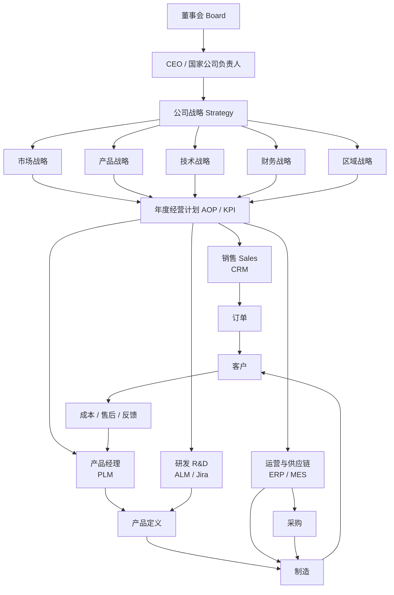

下文把「年度经营计划」简称为 AOP，把「平均成交价」简称为 ASP，把「物料清单」简称为 BOM。其余对照[附录 A](#附录-a-术语表)。

读这张图时抓住三件事：

1. 战略先于部门。销售、产品、研发、供应链都从同一份 AOP 接到任务，而不是各自立一套目标。
2. 产品是中间枢纽。订单来自销售，制造来自供应链，但「卖什么、按什么成本卖」由产品定义决定。
3. 客户用完之后，数据必须回到产品经理。没有这一跳，路线图就会变成研发只增不减的想做清单。

### 1.2 真正驱动系统的只有三个数

工业企业可以有几十个部门、上百条产品线，顶层目标却非常集中：

| 目标 | 英文 | 它约束什么 | 典型失真 |
|---|---|---|---|
| 收入 | Revenue | 公司能否长大、份额能否保住 | 只冲出货、不顾价格和结构 |
| 利润 | Profit / EBIT / 毛利率 | 长大是否值钱 | 只保毛利、错过该投的新品 |
| 现金流 | Cash Flow | 长大是否可持续 | 账面盈利、库存和应收把现金吃掉 |

其他指标——订单、预测、库存、份额、NPS、人员流失——都是为了提前看见这三个数会不会出问题。产品经理降 BOM、销售追销售机会、供应链压库存、财务卡回本周期，说到底是在同一张损益表和现金流量表上工作。

**原理：** 如果部门 KPI 不能回溯到收入、利润、现金流之一，这个 KPI 多半会把组织拉向局部最优。例如研发以「代码行数」考核，供应链以「库存周转」单独考核且不看缺货损失，销售以「合同额」考核却不管折扣——系统就会各跑各的。

软件占比、新品收入占比这类**结构指标**经常出现在 CEO 计分卡上（第 1.11 节），它们不是第四个并列目标，而是为了保护**未来的**收入质量和利润结构——硬件可以靠降价把今年收入做上去，结构坏了，后年三个数一起坏。

### 1.3 第一层：CEO 看的经营驾驶舱

CEO 不天天看某个 CPU 型号。他看的是能往下钻取的十几个数。教学用驾驶舱可以理解成下面这样：

| 类别 | 典型指标 | 往下钻到哪 | 产品经理为什么要关心 |
|---|---|---|---|
| 增长 | Revenue、Order Intake、Backlog | 国家 → 事业部 → 产品线 → 区域 → 销售 → 客户 | 你的产品线是收入机器的哪一段 |
| 盈利 | 毛利率、EBIT | 产品利润 → 材料 / 制造 / 物流 / 售后成本 | 持续降本、定价、配置器折扣都在这里显现 |
| 现金 | Cash、Inventory | 工厂、渠道、重点项目 | 预测虚高会直接变成库存 |
| 未来 | 销售机会、滚动预测 | 商机、概率、预计成交月 | 失单会改你的路线图 |
| 市场 | Market Share、NPS | 产品族、行业、区域 | 份额掉了要分清是产品空档还是销售覆盖 |
| 组织 | Employee Engagement、流失率 | 部门、地区 | 关键岗位空了，交付和上市会一起滑 |

KPI 必须能层层分解，否则「这个季度收入少了」会停在口号上。一条合格的分解链路像这样：

```text
Revenue 下滑
  → 定位到 PLC 产品线
    → 再定位到汽车行业销量下降
      → 再定位到德国汽车资本开支收缩
        → 再决定：是调滚动预测、调产能，还是加快非汽车行业的路线图
```

**做到什么算合格：** 任何一个顶层偏差，能在两到三次下钻后落到「哪个产品 × 哪个行业 × 哪个区域 × 哪一类客户」，并且能指出该谁行动。

### 1.4 第二层：KPI 如何分解——以收入和毛利为例

收入分解是「谁对哪一块数字负责」。教学示意：

```text
CEO：Revenue 10,000 M€
 └── 工业自动化事业部：3,000 M€
      └── PLC 事业部：1,000 M€
           └── 中国区：200 M€
                └── 华东：80 M€
                     └── 销售经理：20 M€
                          └── 销售 A：5 M€
```

毛利分解方向不同，它不是按人拆，而是按成本结构拆：

```text
毛利率 45%
 └── 产品利润
      ├── 材料成本（BOM）     → 采购、持续降本、设计选型
      ├── 制造成本            → 工厂、工时、一次通过率
      ├── 物流成本            → 包装、运输、区域仓
      └── 售后成本            → 返修、质量、备件策略
```

于是同一张毛利表会同时驱动：产品经理启动持续降本、采购压供应商、研发改设计、制造减工时、售后降返修。**这不是五个独立项目，而是一个毛利目标的五条抓手。**

**操作要点：**

1. 收入 KPI 必须拆到销售个人或明确的渠道单元，否则区域经理会「平均摊派」。
2. 毛利 KPI 必须拆到产品族甚至主力型号，否则降本会打在已经没量的老产品上。
3. 软件、服务、备件要单独列。把它们混进硬件收入，会掩盖「硬件降价、软件没跟上」的结构恶化。

### 1.5 销售系统：从线索到复购

销售不是「把东西卖出去」这一下，而是一条可被 CRM 管住的价值链：


常见系统是 Salesforce、SAP CRM、Microsoft Dynamics。销售每天要维护的最小字段通常包括：客户、预计金额、成交概率、预计成交时间、失单原因、竞争对手。系统据此计算：

```text
加权滚动预测 = Σ (商机金额 × 成交概率)
示例：100万 × 80% + 200万 × 50% + 500万 × 20% = 280万
```

CEO 看的「未来两三个季度收入」，很大一部分就是这样加总出来的，而不是财务用去年增长率乘出来的。

**产品经理必须从 CRM 里读的三张表：**

| 数据 | 用来干什么 | 不读会怎样 |
|---|---|---|
| 销售机会 / 滚动预测 | 验证明年销量假设 | 立项论证里的量是拍的 |
| 失单及原因 | 决定路线图上什么功能 | 功能清单来自研发兴趣或个别大客户 |
| 折扣与配置 | 看真实 ASP 和竞争压力 | 定价和持续降本方向与市场脱节 |

### 1.6 产品、研发、供应链如何被同一条数据驱动

产品经理的职责远大于写需求。完整清单是：市场与竞争、路线图、需求与优先级、生命周期、价格与利润、持续降本、上市、退市。他在系统里的位置是「把客户声音翻译成投资决策」：

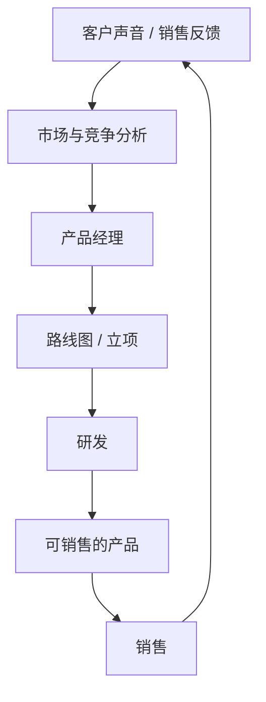

研发不是「想到什么做什么」。它接收的是已经通过评审的投资：

```text
路线图 → 需求包 → 功能 → 需求条目 → 任务 → 迭代
```

研发侧 KPI 通常是按时交付、缺陷率、质量、测试覆盖、安全漏洞、研发效率，而不是代码量。供应链侧 KPI 是 OTD（按时交付率）、库存、采购成本、交付周期、供应风险。两边通过同一份销量预测对接：

```text
产品经理计划明年卖 10 万台
  → 供应链做预测、采购、备料、排产
  → 销售滚动预测若虚高，库存爆炸
  → 销售滚动预测若虚低，缺货、丢单、份额被抢
```

**原理：** 预测错误的代价不在预测会议里显现，而在仓库和客户交期上显现。所以滚动预测必须同时被销售、产品、供应链、财务签字，而不能只由其中一方「报喜」。

### 1.7 端到端数据流：公司其实只有一条主线

把各部门的系统串起来，得到的不是四套平行系统，而是一条连续数据流：

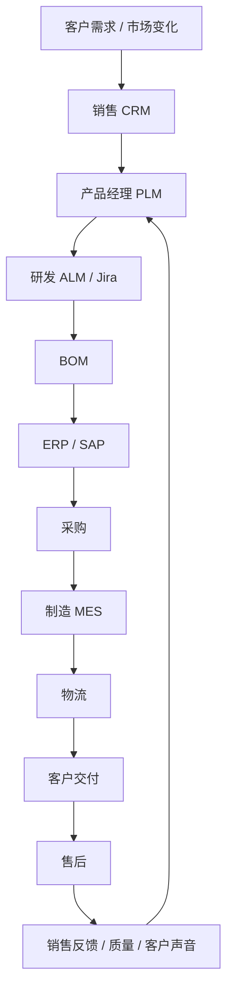

闭环一句话：**市场需求经销售进入产品规划，研发形成产品定义，供应链完成交付，客户使用后的反馈再回到规划。** 任何一跳断裂，公司表面上仍在运转，实际上已经在用过时假设做投资。

### 1.8 真正驱动公司的不是组织，而是流程

组织架构解决汇报线；跨部门流程解决「一个新产品怎样从想法变成可重复销售的东西」。典型分阶段评审如下：

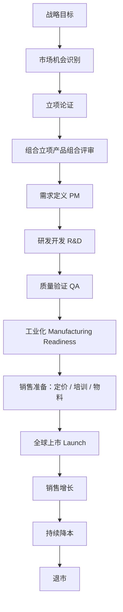

每个阶段门（Gate）都是一次共同决策：产品、研发、质量、采购、制造、销售、财务同时在场。过不了评审，就不能进入下一阶段。这看起来慢，实际是在用前期的否决权换后期的返工。图上画成方框，是为了好读；门的含义是「共同签字，不是自动流入下一站」。

**为什么大公司爱开评审会：** 不是文化爱好，而是复杂度管理。任何一个部门单独拍板，都会把风险转嫁给其他部门——例如产品经理承诺一个没有认证路径的功能，或销售承诺一条没有产能的交期。

### 1.9 四个嵌套闭环：比部门更重要的管理对象

观察这类工业企业，真正被管理的不是几十个部门，而是四个互相嵌套的闭环。

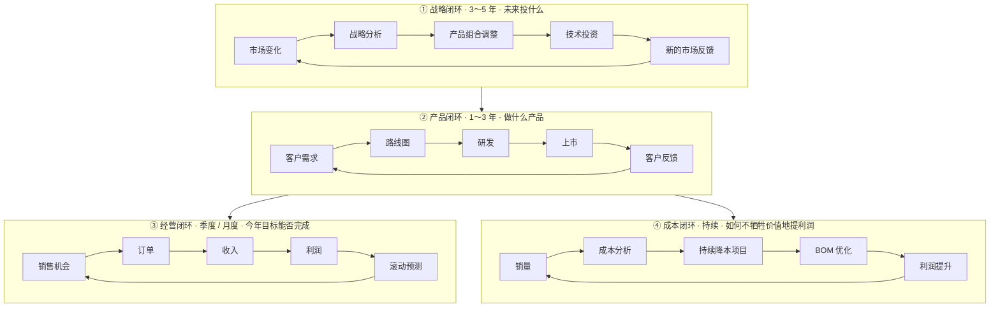

四个闭环的时钟不同，所以会议和文件也不同：战略会不能拿来改本季度折扣，经营例会不能拿来推翻平台架构。**把四种问题塞进同一次会，是中小企业最常见的管理混乱。**

### 1.10 三者关系：目标、流程、系统

把子系统连在一起的不是软件本身，而是三层对齐：

```text
经营目标（What）     每个部门要达成什么
        ↓
业务流程（How）     跨部门如何协作
        ↓
数字系统（With What） 数据如何自动、一致地流转
```

| 层 | 例子 | 失败形态 |
|---|---|---|
| 目标 | 收入增长、毛利率提升、软件占比提高 | 部门 KPI 互相打架 |
| 流程 | 产品开发（PLM）、订单到回款（Order-to-Cash）、采购到付款（Procure-to-Pay） | 靠微信和个人记忆推进 |
| 系统 | CRM、PLM、ALM、ERP、MES、BI | 各系统数字对不上，开会先对表 |

一句话收束本节之前的层次：**战略决定方向，KPI 把目标逐级分解**——但分解完还不会自动发生。下一节写公司怎样用日历、问责和后果，把收入、利润、现金流从墙上的数字变成每周有人被推着干活。产品线如何被同一套节奏驱动，见第 5.2 节。第一次怎么把图画出来，见第 5.1 节。

<a id="sec-111"></a>
### 1.11 公司层面：经营目标靠什么驱动，而不是靠动员

第 5.2 节写的是产品经理这一岗怎样被推着转。公司层面是同一类装置，只是对象换成 **事业部 / 国家 / 销售 / 供应链 / 财务**，目标换成第 1.2 节的三个数：收入、利润、现金流。岗位说明书和年会讲话都驱动不了数十个国家同时动作；能驱动的是：**锁定的经营日历 + 有名有姓的问责 + 完不成会改资源的后果 + 同一套数字。**

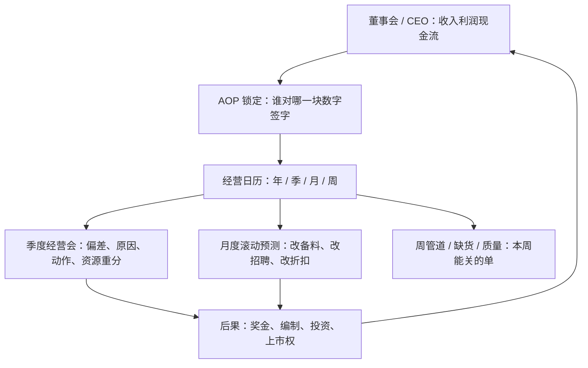

**1. 先把目标变成「谁签字、签哪一块」**

公司目标若不拆到人，就只是愿望。拆法与第 1.4 节一致，这里补上**问责含义**：

| 层级 | 签什么（教学） | 完不成时第一问谁 | 他不能拿来当借口的 |
|---|---|---|---|
| CEO / 集团 | 收入、EBIT、现金、软件占比 | 董事会 | 「市场不好」——要同时交出份额和结构 |
| 事业部负责人 | 本事业部收入、毛利、新品贡献 | CEO | 「研发没做完」——要同时管路线图窗口 |
| 国家公司负责人 | 本国订单、收入、折扣、库存 | 事业部 + 区域 CEO | 「总部没货」——要早在预测里暴露 |
| 销售负责人 | 管道、赢单率、ASP | 国家公司 | 「产品不行」——失单必须编码，见附录 B.3 |
| 产品线负责人 / 高级产品经理 | 本品线量价、毛利、上市日、持续降本 | 事业部 | 「销售不会卖」——上市准备和能承诺清单是产品责任 |
| 供应链 | OTD、库存周数、长周期物料 | 事业部 | 「预测老变」——冻结窗口内的变更要带补偿 |
| 财务 | 预测质量、毛利桥、现金 | CEO | 「业务太乐观」——有权把无证据的量踢出承诺 |

签字不是「同意这个百分比」，而是同意第 2 章那套**假设**。假设破了，要在滚动预测里改数，并改动作，而不是到年底再解释。

跨国公司里同一块收入常常被**签两次**：事业部对全球产品线的量价和毛利负责，国家公司（国家公司）对本国订单、折扣、库存和客户覆盖负责。这不是重复劳动，而是矩阵：事业部决定卖什么、按什么成本卖，国家公司决定在本地卖给谁、以什么折扣卖出去。冲突的裁法要写死，否则两边都有理由完不成——

| 冲突 | 谁先说话 | 谁不能单独改 |
|---|---|---|
| 本国要大幅折扣才能赢单，事业部要守档位保护价 | 国家公司提例外，事业部 / 定价权审批 | 国家公司不得在配置器外私自改价目 |
| 本国要一款本地定制，事业部要平台统一 | 事业部组合会决定做 / 不做 / 用配置覆盖 | 国家公司不得直接向研发下定制 |
| 全球预测与本国预测对不上 | 先对表（第 1.11 节第 5 点），再改承诺 | 不许各用各的数向 CEO 汇报 |

没有这张裁断表，第 1.4 节那种「收入按人拆」会在国家和产品线之间撕开。

**2. 公司经营日历：会不是沟通，是强制动作的节拍**

AOP 只是年头的基准（第 2 章）。真正全年驱动靠下面这张日历。和产品部日历（第 5.2 节）是嵌套关系：公司会决定「这块数字要补上」；产品会决定「用上市、持续降本还是砍范围来补」。

| 节奏 | 会议 | 必须回答 | 会后 72 小时必须发生的事 | 开完没有动作的失败形态 |
|---|---|---|---|---|
| 年 | AOP 批准 | 明年三个数和结构指标签死 | 分解到月、到产品线、到国家；编制和产能按此备 | 年底才发现「大家都觉得那是别人的数」 |
| 季 | 季度经营会 QBR | 相对 AOP 的偏差、原因、能否追上、追不上改什么资源 | 书面动作清单：谁、做什么、到哪天、影响多少钱 | 开成战略务虚会，折扣和备料都不动 |
| 月 | 滚动预测 | 未来 3～6 个月收入/毛利/库存还信不信 | 预测变了则改采购、加班、招聘冻结或投放 | 只改幻灯片上的滚动预测 |
| 周 | 管道与履约 | 本周能关哪些单、哪些单缺货、哪些单在降价 | 缺货升级到供应；价格例外走授权；失单进编码 | 周会变成诉苦会 |

季度经营会建议固定六段（可压缩到 2 小时，超时就说明在混开战略会）：

1. **例外仪表盘**（15 分钟）：只讲相对 AOP 偏了的数，不念已经达标的页。
2. **偏差归因**（20 分钟）：量、价、结构、汇率、一次性项目，必须拆开（第 2.8、2.14 节）。
3. **管道质量**（15 分钟）：承诺 / 可控 / 管道三层，禁止把低概率大单算进必成。
4. **产品与上市**（15 分钟）：承诺级新品是否仍在图 4 的日期上；延期则 AOP 新品贡献打折。
5. **成本与现金**（15 分钟）：持续降本、库存、应收；利润好看但现金差要单列。
6. **决议**（15 分钟）：补缺口的动作、停掉的动作、下次检查的证据。无日期的「再看看」不许写进纪要。

**3. 完不成必须有后果，否则日历是假的**

驱动靠后果，不靠气氛。后果要对准「还能改的资源」，不是只对准人品：

| 偏差（示意） | 经营上的合法动作 | 不合法的动作 |
|---|---|---|
| 收入落后，管道真实 | 加销售覆盖、加快已通过评审产品的上市准备、有限度的价格授权 | 让产品经理把 V2.0 功能塞进 V1.0 换窗口 |
| 收入落后，管道掺水 | 把无证据的量踢出承诺，按保守数备料 | 逼供应按乐观数备货，把问题变成库存 |
| 毛利落后 | 启动/加速持续降本、收紧折扣、推软件附件 | 全面降价换收入 |
| 新品贡献落空 | 上市日整体后移并改 AOP；或砍范围保日期 | 未认证先宣布可售 |
| 现金差、账面利润尚可 | 压库存、收应收、砍渠道压货 | 用渠道压货把收入做进本季 |

人事后果（奖金、晋升、编制）跟在资源动作后面，而不是代替资源动作。只扣奖金、不改预测和备料，公司仍会按错的数运转。

**4. 用一个事业部缺口，看驱动怎样传到产品经理**

教学：自动化事业部二季度收入相对 AOP 差 4%。季度经营会不是骂一圈，而是强制拆因并派动作——

```text
收入差 4%
 ├─ 量：汽车 OEM 下滑  → 市场图层改 AOP 假设（第 2.6 节）
 ├─ 价：折扣超授权    → 销售负责人收回折扣；档位保护价差见第 4.4 节，授权阶梯见第 4.10 节
 ├─ 结构：软件附件率低 → 产品经理本季上市准备只推已发布的许可，不承诺 V2.0
 └─ 上市：CX-300 认证可能晚  → 图4 日期重锁；新品贡献打折；CX-100 持续降本加码保毛利
```

传到产品线，就是第 5.2 节那张产品日历被**公司日历拉动**：组合评审本季只减不加（认证风险），入口队列里「再塞 AI」一律拒绝，计分卡上看毛利和上市日，而不是需求条数。**产品经理不是另外一套动力系统，是公司经营机器上的一个齿轮。**

**5. 同一套数字，否则驱动会空转**

公司会、产品会、供应会若各用各的收入和库存，会议越多越吵。最低要求：

- 收入、订单、管道出 CRM，规则统一（加权方法见第 1.5、2.5 节）；
- 成本、库存、OTD 出 ERP；
- 产品量价与切换量出产品线 AOP 表（第 2.14 节），且与 CRM 对得上；
- 仪表盘（第 1.3、3.12 节）只展示上述来源，不开第三套 Excel 作为「会议专用数」。

对不上的数，先对表，再谈缺口。用两套数并行，是最常见的假驱动。

**6. 和产品经理机制如何嵌套**

| 公司层（本节） | 产品层（第 5.2 节） |
|---|---|
| AOP / QBR / 月预测 | 产品经营包、版本冻结、上市门 |
| 「这块收入/毛利要补上」 | 用上市、持续降本、砍范围、改档位规则来补，并带证据 |
| 无证据的量踢出承诺 | 无失单/拜访证据的功能不得升 P0 |
| 完不成改资源 | 认证延期则整体后移，不许用功能清单补偿 |

做到什么算公司驱动已经立住：一个并不「特别有危机感」的事业部负责人，只要按日历开会、按签字认账、按偏差改资源和预测，三个数仍会被往前推。这和产品岗「不靠觉悟」是同一条原则，只是半径更大。

### 1.12 本章检查单

- [ ] 能画出本公司从战略到售后的主数据流，并标出断裂点
- [ ] 每个核心部门的 KPI 都能回溯到收入、利润、现金流之一
- [ ] 收入能下钻到产品 × 区域 × 客户，毛利能下钻到成本结构
- [ ] CRM 里的失单原因是结构化字段，而不是自由文本垃圾场
- [ ] 新产品必须过商业论证和组合评审，不能「先做了再补材料」
- [ ] 战略、产品、经营、成本四类问题分会讨论，不混在一次会里
- [ ] AOP 拆到有名有姓的签字人；完不成先改资源与预测，而不是只做动员
- [ ] 事业部和国家矩阵的冲突有书面裁断（折扣、定制、两套预测）
- [ ] 季度经营会有书面动作清单（谁、做什么、到哪天、影响多少钱）
- [ ] 滚动预测变化会改备料 / 招聘 / 折扣，而不只改幻灯片
- [ ] 经营会、产品会、供应会用同一套收入和库存数

---

## 第二章 年度经营计划：数字从哪里来

<a id="sec-21"></a>
### 2.1 AOP 是什么，不是什么

很多外企一年最重要的事不是「再立一个新品」，而是制定 **年度经营计划**。AOP 是全年资源配置的基准：收入、毛利、现金流、研发投入、库存、区域目标。几乎所有部门的预算、招聘、产能和路线图节奏都围着它转。AOP 怎样被签下来，见本章；签完以后怎样用季度会和滚动预测继续推着组织跑，见第 1.11 节。

AOP **不是**：

- CEO 一句话定下的增长率；
- 用去年收入乘一个百分比；
- 做完就锁死、年底再看的任务书。

AOP **是**：

- 自上而下（自上而下目标）的战略意图；
- 自下而上（自下而上）的产品与销售证据；
- 财务、供应链、产能约束；
- 经过 3～6 个月、多轮质询后的平衡结果；
- 一份关于「未来一年经营假设」的模型，随后用滚动预测不断修正。

教学示意：一份 2027 AOP 可能长这样——

| 项目 | 目标（示意） | 它会迫使谁行动 |
|---|---|---|
| Revenue | +8% | 销售覆盖、价格、新品贡献 |
| 毛利率 | +2pt | 持续降本、折扣治理、结构升级 |
| Software Revenue | +15% | 产品附带率、订阅包装、销售激励 |
| Service Revenue | +20% | 装机量运营、服务产品化 |
| R&D Cost | -5% | 平台化、停投、外包策略 |
| Inventory | -10% | 预测质量、渠道库存、安全库存策略 |

这几个数字会贯穿全年。后面每一节都在回答：它们是怎么算出来的。

### 2.2 典型时间表（可按公司财政年度平移）

| 时间 | 动作 | 主要产出 |
|---|---|---|
| T-6 个月 | 总部发布战略边界与初步自上而下目标 | 增长区间、必须提高的结构指标（如软件占比） |
| T-5 | 事业部 / 产品线做自下而上初稿 | 分产品销量 × 价格、新品贡献、持续降本承诺 |
| T-4 | 销售用 CRM 对表；市场用行业增速修正 | 加权销售机会、行业调整说明 |
| T-3 | 供应链给产能与长周期物料约束 | 「能做多少」而不是「想卖多少」 |
| T-2 | 财务 Challenge，多轮退回 | 证据包、敏感度、风险清单 |
| T-1 | CEO / 董事会博弈与批准 | 锁定 AOP，分解到月 / 季 |
| 全年 | 月度滚动预测 + 季度经营评审 | 修正资源，而不是等到年底发现偏离 |

### 2.3 第一层：自上而下——总部先给战略边界

董事会先看市场和竞争，而不是先看自己想增长多少。教学用判断如下：

| 市场 | 预计增长（示意） |
|---|---|
| 全球自动化 | +6% |
| 中国 | +4% |
| 印度 | +12% |
| 北美 | +8% |
| 欧洲 | +3% |

再看主要对手的公开指引或第三方估计（示意）：Rockwell +7%，ABB +5%，Schneider +8%。一条常见的总部逻辑是：**不能持续低于市场增长率，否则份额在缩小。** 于是出现第一个自上而下目标：市场 +6%，公司要 +8%。

这只是边界，不是计划。此时还没有人证明做不做得到。自上而下目标的正当用途是提出「必须回答的问题」，例如：多出来的 2 个点来自份额、新品、软件还是新区域？正当用途不是把 8% 直接摊到每个销售头上。

和第五章、第六章的接口：五年战略先锁定结构；**第 6.4 节**把结构切成各事业部不相等的投资上限、停投名单和当年自上而下目标。本节的公司 +8% 必须能被那张事业部表解释（谁高于公司、谁低于公司）。自下而上（下一节）负责证明或证伪。证伪了，要么加行动解除约束（第 2.11 节），要么下调承诺，不能靠摊派把五年战略「落实」成假数。各事业部都摊到同一个 +8%，等于总部没有配置。

### 2.4 第二层：自下而上——收入是每个产品加出来的

真正复杂的工作在产品线。产品经理不是报一个百分比，而是按型号、区域、价格一项项加。

**单产品算法（老产品）：**

```text
预测销量 = 今年销量
         × (1 + 分区域市场增速)
         × (1 + 份额变化)
         ± 客户库存调整
         ± 渠道库存调整
         − 即将淘汰的量

预测收入 = 预测销量 × 预计 ASP
```

教学示例：某入门 PLC（市场上可对照 S7-1200 一类；第 4 章教学线改称 CX-50，算法相同，不要把两套名字加总）今年 50 万台。分区域：中国 +5%、德国 +2%、美国 +10%、印度 +20%，加权后约 57 万台。今年 ASP 400€，明年竞争加压到 390€，则收入约 2.22 亿€。对中端、HMI、Servo、Drive、IPC、软件、服务重复同一过程，加总得到事业部收入。

**原理：** 一个事业部级百分比无法被执行，也无法被挑战。只有拆到产品，财务才能问「印度 +20% 的客户是谁」，供应链才能问「57 万台的 MCU 从哪来」。

### 2.5 第三层：销售预测——CRM 加权销售机会

销售比产品经理更接近具体客户。CRM 里每一条重点商机都应有金额、概率、时间。教学示例：

| 客户 | 金额 | 概率 | 加权 |
|---|---|---|---|
| Volkswagen | 3,000 万€ | 80% | 2,400 万€ |
| Tesla | 5,000 万€ | 40% | 2,000 万€ |
| Foxconn | 2,000 万€ | 70% | 1,400 万€ |
| **合计** | | | **5,800 万€** |

全国（或全球）销售加总，得到区域滚动预测。它用来**校验**产品经理的自下而上，而不是替代它。两者常见分歧：

- 产品经理按市场模型偏乐观，销售按在手项目偏保守——要核对「模型里的量」有没有对应到可点名的客户；
- 销售把低概率大单算进必成——财务应要求按概率分层，分开看，不要加总成一个「明年能拿下」：

| 层 | 典型含义（团队内要统一定义） | 能不能进 AOP 承诺 |
|---|---|---|
| **承诺 Commit** | 高概率、客户/项目可点名、本季或明确月份能关 | 可以 |
| **可控 Upside / Best Few** | 有路径，但缺一两个条件（认证、预算、第二轮招标） | 最多进可控，不进必成 |
| **管道（销售机会）** | 早期商机或低概率大单 | 只作覆盖率检查，禁止加进必成 |

没有这三层，第 1.5 节的加权预测会被「一个 20% 的 500 万」抬成假信心。

### 2.6 第四层：市场预测——按行业而不是按国家平均

市场部门提供的是行业图层。教学示意：汽车 −5%，锂电 +20%，数据中心 +30%，食品 +3%。若某 PLC 主力在汽车，原来的 +8% 可能要改成 +4%。

**操作要点：** 不要用「中国自动化 +4%」直接套在所有产品上。产品有行业结构，行业有资本开支周期。产品经理应维护一张「产品收入的行业分布」，每年更新，否则行业图层没有入口。

### 2.7 第五层：新品贡献——路线图必须进入 AOP

很多人只预测老产品。增长里很大一块其实来自路线图上将要上市的东西。教学示例：

| 新品 | 上市时点 | 首年量 | ASP | 收入贡献 |
|---|---|---|---|---|
| AI PLC | Q2 | 5,000 台 | 1,200€ | 600 万€ |
| Cloud 订阅 | 全年 | — | — | 300 万€ |
| 软件包 | 全年 | — | — | 900 万€ |
| **合计** | | | | **1,800 万€** |

新品预测比老产品更易虚高。最低要求是：上市月、可供货区域、销售培训完成时间、替代的老产品量（避免重复计算）四项写清。没有这四项，财务有权把新品贡献从 AOP 里剔除或打折。

### 2.8 第六层：价格——收入是量 × 价，不是量

```text
Revenue = Volume × Price
```

竞争加剧时硬件可能降 2%，软件可能涨 5%，结构变化会改总收入和总毛利。产品经理必须显式给出 ASP 假设，并说明：清单价、平均折扣、配置结构（高端型号占比）、软件附带率各贡献多少。只报销量、不报价格，等于只报了一半故事。

教学拆法（一台中端，数字示意）：

```text
清单价              500€
− 平均折扣 12%      −60€
= 硬件成交价        440€
+ 软件许可附带      +40€   （附带率 40% × 许可 100€；未附带的 60% 计 0）
= 整单 ASP          480€
```

AOP 里硬件收入和软件收入必须分列：480€ 是「客户眼里的整单」，不是把软件再加进硬件价里报一次。第 2.12 节公式里的「软件订阅」若已含在整单 ASP 中，加总时只留一行。

### 2.9 第七层：供应链——「想卖」必须变成「能做」

销售要 100 万台，供应链可能说：芯片、PCB 或工厂产能只有 70 万。此时应改滚动预测，或单独立项解决供应（第二供应商、提前备料、改设计），并把解决动作的时间和风险写进 AOP。假装产能足够，是把问题从计划会转移到明年的缺货和空运费上。

### 2.10 第八层：财务 Challenge——没有证据就退回

财务出场不是「砍一刀」，而是要求每条假设可被检验。对「AI PLC 首年 2 万台」这类句子，标准质询是：

1. 依据是什么：市场模型、类比产品、还是在手意向？
2. 客户是谁：能否点名前 20 名？
3. 竞品同类产品卖多少？
4. 有没有 PO、LOI，或至少有试点纪要？
5. 上次类似新品首年预测 vs 实际差多少？这次为何会更好？

滚动预测的标准是 **基于证据**，不是乐观。证据不足时，正确做法是降低计入 AOP 的量，同时把高情景留在「上行机会」里，而不是为了过会把数字做圆。

### 2.11 第九层：博弈——很多数字是讨论出来的

教学场景：事业部报 +5%，CEO 问市场是 +7%，差距从哪来。事业部说芯片产能不够。CEO 要求采购上第二供应商。滚动预测被改成 +7%，但必须附带采购里程碑：哪个月 qualified、失败则回到 +5%。

你会看到：最终数字既不是纯计算，也不是纯命令，而是「假设 + 解除约束的行动」绑定后的结果。**没有行动承诺的上调，只是把缺口藏进明年。**

### 2.12 把收入写成一条可审计的公式

```text
Revenue 滚动预测
  = Σ（老产品销量 × 预计 ASP）
  + Σ（新品销量 × 预计 ASP）
  + 服务收入
  + 软件订阅收入
  ± 汇率
  ± 渠道库存调整
  ± 一次性大项目
```

每一项背后还应再拆一层责任单元，否则「软件收入」会变成没人认领的桶：

```text
Revenue
 ├── Installed Base（存量增补 / 替换）
 ├── New Customers
 ├── Key Accounts
 ├── OEM
 ├── Distribution（渠道）
 ├── Direct Sales
 ├── Projects（项目型）
 ├── Digital Services
 ├── Software Subscription
 └── Spare Parts
```

### 2.13 AOP 是基准，滚动预测才是经营

AOP 锁定之后，跨国公司几乎都会做滚动预测。教学示意：

```text
1 月基准  10.0 B€
2 月汽车行业下滑        → 9.8 B€
4 月  AI 产品超预期       → 10.2 B€
7 月欧洲下降            → 10.0 B€
```

经营管理的要点是：数字变了，**资源跟着变**——招聘、备料、广告、产线加班，而不是只改幻灯片上的预测。AOP 用来衡量「我们相对年初承诺做得怎样」；滚动预测用来决定「从今天起钱和人该怎么重新布置」。

三个数里，现金最容易在 AOP 里被漏写。收入和毛利好看、库存和应收上升，现金仍可能变差。产品经理改现金的抓手不是「关心财务」，而是：**预测质量（少备错料）、换代期禁止渠道压货（图 4）、退市前消化库存、不把低概率大单变成安全库存。** 证据包里要有库存周数和应收天数的假设，不能只有收入页。

<a id="sec-214"></a>
### 2.14 用一个 PLC 产品经理的表把全年串起来

假设你是 PLC 产品经理，你不会直接说「明年 +8%」。你先填这张表（数字为示意）：

| 项目 | 推导 | 证据放哪 |
|---|---|---|
| 现有产品销量 | 520,000 台 | 去年实际 + 在制 |
| 市场自然增长 | +4% | 行业报告 × 自身行业结构 |
| 从对手抢来的份额 | +2% | 赢单率变化、新渠道、替换项目清单 |
| 新产品上市贡献 | +18,000 台 | 上市月、区域、培训、可供货 |
| 老产品淘汰影响 | −12,000 台 | 退市公告与替代映射 |
| 客户 / 渠道库存调整 | −8,000 台 | 渠道库存周数、大客户备货政策 |
| **预测销量** | **549,000 台** | |
| 平均售价 ASP | 392 € | 折扣、配置、软件附带 |
| **Revenue** | **约 2.15 亿€** | |

然后财务挑战假设，销售用重点客户和销售机会验证，供应链确认产能，市场检查行业增速，总部判断它是否撑得住公司战略。过会的不是「2.15 亿」这个结果，而是这张表里每一行都站得住。

**优秀产品经理、销售总监、事业部负责人最重要的能力，往往不是报出一个好看的数，而是能把每个数背后的逻辑、证据和风险讲清楚。**

### 2.15 一份可直接使用的 AOP 证据包

产品线提交初稿时，建议固定这 9 页（或 9 个工作表），避免每次评审从聊天开始：

1. **结果页：** 收入、毛利、软件/服务占比、库存、研发费用，对比今年实际和自上而下目标。
2. **量价拆解：** 分产品族的量、ASP、结构变化。
3. **行业与区域：** 收入的行业分布、区域分布，以及各自增速假设。
4. **新品页：** 上市节奏、贡献、替代老产品、延迟风险。
5. **销售校验：** 加权销售机会、前 20 客户、与自下而上的差异解释。
6. **供应约束：** 长周期物料、产能、第二供应商节点。
7. **毛利桥：** 从今年毛利走到明年毛利——价格、成本、结构、持续降本、汇率各几分。
8. **现金与库存：** 库存周数、渠道库存、应收天数；换代年必须写「禁止再压旧型号库存」的动作（图 4）。
9. **风险与上行：** 每条风险的触发条件、影响金额、应对动作、负责人。汇率单独一行：产品经理对冲不了汇率，但必须标明收入里有多少是非欧元，避免把汇兑当成「销量增长」。

### 2.16 本章检查单

- [ ] 自上而下目标只作为必须回答的战略问题，没有被直接摊派成个人任务
- [ ] 自下而上拆到产品族（最好到主力型号）的量 × 价
- [ ] 销售机会、市场行业图层、供应链产能三者都签过字
- [ ] 新品贡献写清上市月、区域、培训、与老产品是否重复计算
- [ ] ASP 假设拆开了折扣、配置、附带率
- [ ] 财务质询有书面答复，证据不足的量已打折或移出承诺
- [ ] 上调数字绑定了解除约束的行动和失败回退
- [ ] 月度滚动预测会改资源，而不只改预测文件
- [ ] 证据包里有库存 / 应收假设，没有把软件收入和硬件 ASP 加总两次
- [ ] 销售机会按承诺 / 可控 / 管道分层，低概率大单没有进必成

---

## 第三章 产品经营：从战略到型号

### 3.1 先分清层次——后面所有图都挂在这一张上

产品管理体系最常见的混乱，是把产品组合、路线图、型号表当成同一张东西。它们不是。

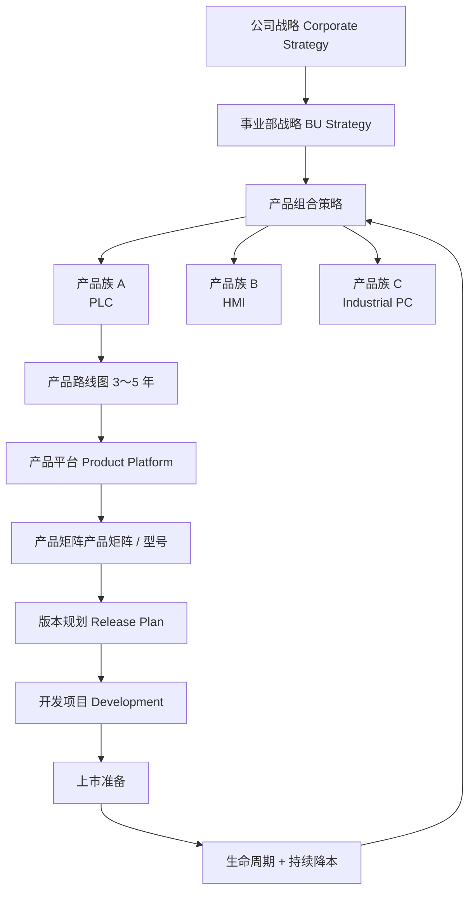

图中色块在部分预览里可点；若点了没跳转（GitHub 和不少预览会关掉图内点击），用下面这张目录，这是标准 Markdown 链接，预览里一定能用。

| 图中块 | 本层说明 | 细节 / 示例 |
|---|---|---|
| 公司战略 | 方向与资源配置 | [第 6 章](#sec-ch6) |
| 事业部战略 | 给经营结果，不给功能清单 | [3.2](#sec-32) |
| 产品组合 | 投 / 停 / 保持 / 收割 | [3.3](#sec-33) · 切法示例 [4.3](#sec-43) |
| 产品族 A/B/C | Family 级经营，不是型号 | [3.3](#sec-33) |
| 路线图 | 投资节奏，不是功能清单 | [3.7](#sec-37) |
| 产品平台 | 一次开发、多产品共享 | [3.4](#sec-34) |
| 产品矩阵 / 型号 | 性能轴与价格轴 | [3.5](#sec-35) · 档位隔离示例 [4.4](#sec-44) |
| 版本规划 | 哪一版装哪些功能 | [4.7](#sec-47) |
| 开发项目 | 立项与商业论证 | [3.8](#sec-38) · 写成需求 [5.4](#sec-53) |
| 上市准备 | 认证、培训、可售 | [3.11](#sec-311) |
| 生命周期 + 持续降本 | 换代、重叠、降本 | 换代 [4.6](#sec-46) · 阶段 [3.9](#sec-39) · 持续降本 [3.10](#sec-310) / [4.8](#sec-48) |

两句必须能背下来的话：

- **产品组合决定做哪些产品（投 / 停 / 保持 / 收割）。**
- **路线图决定什么时候做、按什么节奏投钱。**

型号矩阵（CPU1511、1516……）是更下一层，回答「这个产品族内部如何覆盖不同预算和性能」。把三层画在同一张「功能时间表」上，组合决策就会退化成排期讨论。

第 3 章解决的是「这些层为什么存在、和经营系统怎么接」。产品经理手头要画的具体图——组合按什么轴切、某一型号何时换代、某版本加哪几个功能、成熟期如何降本——用第 4 章同一条教学产品线（CX 系列）串起来。读第 4 章时，请对照本节这张总图，不要另起一套产品名。

<a id="sec-32"></a>
### 3.2 事业部战略给的是经营结果，不是功能清单

以下以 **SIMATIC Controller 全球产品经理** 为模拟角色。总部给到 2027～2030 的通常是这类目标（示意）：

| 编号 | 战略目标（示意） | 对产品经营的含义 |
|---|---|---|
| 1 | 软件收入提高 50% | 路线图必须出现可单独计价的软件 / 订阅，销售激励要改 |
| 2 | Edge 产品增长 100% | 需要平台级 Runtime，而不是某个 CPU 的附加 Demo |
| 3 | AI 功能进入所有 Controller | 是平台能力，不是高端型号专属彩蛋 |
| 4 | 中端 PLC 份额 +3pt | 可能要补空档型号、改渠道政策，而不只是加功能 |
| 5 | BOM 成本 −8% | 成熟型号以持续降本为主，停止无效功能叠加 |
| 6 | 云连接率 60% | 默认出厂使能、授权和网络安全要同步 |
| 7 | 服务收入 +30% | 装机量、备件、远程服务产品要进产品组合 |

注意：这里没有一句「增加某某功能」。功能是实现经营目标的手段，必须在立项论证里证明。**不是产品经理自己先想到 AI，而是战略先要求软件和智能化收入结构变化。**

<a id="sec-33"></a>
### 3.3 产品组合：管产品族，不管某个 IO 点数

教学用的 Controller 组合可以画成：

```text
SIMATIC Controller 产品组合
│
├── Basic PLC              例如 S7-1200
├── Mid PLC                例如 S7-1500
├── High-end Controller    例如 S7-1500H / R、S7-410
├── Software Controller    例如 Virtual PLC
└── Safety Controller      例如 F 系列
```

这一层没有 CPU1511、CPU1516。那些属于矩阵。产品组合负责人每天看的是族级经营：

| 产品族 | 收入 | 毛利 | 增长 | 策略含义 |
|---|---|---|---|---|
| Basic PLC | 高 | 中 | 低 | 保持份额 + 持续降本，少做功能加法 |
| Mid PLC | 高 | 高 | 中 | 持续投入，守住基本盘 |
| High-end | 中 | 高 | 高 | 增长，补齐冗余 / 高性能场景 |
| Software PLC | 低 | 很高 | 很高 | 大力投资，服务战略结构 |
| AI Runtime | 低 | 很高 | 很高 | 新增长点，允许短期不盈利 |

讨论的是**钱投到哪个 Family**，不是 CPU1516 增加几个数字量输入。常用动作只有四种：投资、保持、收割（只做持续降本和维稳）、退出（退市）。

岗位上常被混称「产品经理」的，其实至少三层，会议和签字不要坐错人：

| 角色 | 主责 | 主要看哪一章 |
|---|---|---|
| 组合 / 产品线负责人（产品组合） | 族与族之间投 / 停 / 人月 | 第 3.3、3.14 节 |
| 产品经理（Offering / 型号族，本书主角） | 一条线的六张图、AOP 量价、换代和产品需求文档 | 第 4～5 章 |
| 技术 / 系统产品经理 | 平台、固件列车、跨型号兼容 | 第 3.4 节 |

一个人兼两层可以，但组合会不能变成「每个型号自己要预算」。第 1.11 节的产品线签字人，通常是第二层。

**产品组合月度最小数据集：** 各 Family 的收入、毛利、增长、研发投入、生命周期阶段、重大质量事故、失单原因 Top 5。没有这张表，组合会就会变成「谁声音大谁拿到预算」。

产品族内部如何按性能、M1/M2/M3、客户群高低搭配，以及覆盖表怎么画，见第 4.3～4.5 节。

<a id="sec-34"></a>
### 3.4 Platform：产品经理真正管理的是平台，不是一个型号

工业控制器这类产品，如果每个型号各写一套固件，研发费用会按型号线性爆炸，AOP 里「研发费用 −5%」根本做不到。所以真正管理对象是平台：

```text
Controller Common Platform
├── CPU Architecture
├── Firmware Platform
├── Communication Stack
├── Security Framework
├── Motion Runtime
└── AI Runtime Engine
```

一次平台发布，多个产品复用：

```text
Firmware V5.0
├── S7-1200
├── S7-1500
└── Software PLC
```

**原理：** 战略要求「AI 进入所有 Controller」，正确落地是 AI Runtime 进平台，再向各 Family 打开授权；错误落地是给旗舰型号单独做一套演示。后者看起来快，三年后会变成三套无法维护的分叉。

平台决策应进入产品组合评审：新建一条平台能力，等于同时占用多个产品族的研发日历。产品经理要会算「平台投资由哪些产品分摊、各自上市时间差多少」。

<a id="sec-35"></a>
### 3.5 产品矩阵：表面是性能，实际是价格与预算

以 S7-1500 为例，对外宣传常按性能分档。正确画法是**沿对角线摆**：规模变大，性能档一起上台阶。不要把六颗 CPU 画在同一条竖线上——那会读成「同一个机柜规模上的主频排行榜」，横坐标等于没画。

```text
性能
High │                              CPU1518
     │                         CPU1517
     │                    CPU1516
     │               CPU1515
     │          CPU1513
     │     CPU1511
Low  │
     └──────────────────────────────────
        Small        Medium         Large
        （点数 / 机柜规模 / 应用复杂度）
```

| 型号（示意） | 规模重心 | 性能档 |
|---|---|---|
| CPU1511 | Small | 入门 |
| CPU1513 | Small～Medium | 中低 |
| CPU1515 | Medium | 中 |
| CPU1516 | Medium～Large | 中高 |
| CPU1517 | Large | 高 |
| CPU1518 | Large | 旗舰 |

相邻型号会有重叠（1515 也能扛一部分中大型应用），重叠靠第 4.4 节的档位隔离管，不是把所有型号叠在同一个规模点上。

产品经理内部更应看的是**同一组型号在价格 × 客户预算上的落点**，不是另画一张与规模无关的「Premium / Value 标签」：

```text
价格 / 客户愿付
High │                              1518 / 1517
     │                         1516      ← Premium（冗余 / 运动 / 安全 / 品牌）
     │                    1515
     │               1513
     │          1511           ← Value（BOM 敏感的 OEM）
Low  │
     └──────────────────────────────────
        小型设备商 / 小预算          大型设备商 / 项目
```

两张图的点应大致落在同一条对角线上。若某型号在性能图上靠右上、在价格图上靠左下，说明档位和定价拧着——销售会用折扣把旗舰卖成中端。

**原理：** 市场不是按主频购买，而是按项目预算和机柜成本购买。矩阵若只有性能轴、又把型号堆在同一规模上，中间价位和中间规模都会出现假空档或真空档：客户不是「需要一颗更慢的 1516」，而是「300～500€、中等点数这个格子没有刚好的货」。

矩阵设计的三个检查：

1. 相邻型号是否在性能、IO、通信、运动、安全上有清晰的升级理由；
2. 相邻型号价差是否覆盖成本差，并给销售留下升级话术；
3. 是否用软件授权 / 运行时拉开价格，而不是无限增加硬件型号。

完整的高低搭配、档位隔离规则和 CX 系列选型表，见第 4.4 节。盈利视角的矩阵见第 4.5 节。

### 3.6 空档分析：很多新产品不是客户「提出来」的

把己方与主要对手放到同一价格带或同一能力带上，空档会自己出现。教学示意：

```text
价格带 / 能力带     Rockwell    ABB    Schneider    Siemens
低端                ████        ███    ████         ███
中低 300～500€      ████        ███    ████         ░░░   ← 空档
中端                ████        ████   ████         ████
高端                ████        ███    ███          ████
```

发现 300～500€ 没有产品，路线图上可能增加「CPU1514 Lite」一类型号。注意：这仍然要过立项论证——空档只证明「地图上有洞」，不自动证明「洞里有利润」。有的空档是价格战区，正确策略是用配置和渠道覆盖，而不是再开一颗亏损型号。

<a id="sec-37"></a>
### 3.7 路线图：四条线同时规划，本质是投资计划

错误的路线图是功能清单：Q1 功能 A，Q2 功能 B。正确的路线图至少四条线并行，因为客户买到的是「硬件 + 工程软件 + 固件 + 数字化能力」的同步可用。

```text
        2026          2027          2028          2029          2030
硬件现行代        CPU Gen2                     CPU Gen3
固件    V4.0  V4.2    V5.0                         V6.0
软件    TIA19         TIA20         TIA21          TIA22
数字    Cloud / Edge / AI Copilot / 预测维护 / 数字孪生  （按年打开）
```

同时，路线图要标投资，而不仅是功能：

```text
2026  PLC S7          维护 + 持续降本
2027  PLC AI          投入 2,000 万€（示意）
2028  Cloud PLC       投入 5,000 万€（示意）
2029  Digital Twin    投入 8,000 万€（示意）
```

**路线图回答的是：未来几年，公司准备把钱、人和平台节奏投到哪里。** CPU 自己规划、TIA 自己规划、云团队自己规划，上市时一定对不齐，销售只能卖半成品。

销售如何改路线图：看 CRM 的失单统计，而不是听最会叫的销售讲故事。教学示意：

| 失单原因 | 次数（示意） | 产品动作 |
|---|---|---|
| 没有 OPC UA Server | 280 | 评估是否进下一固件，先看目标行业；PubSub 是另一档能力，不要和 Server 混成一条失单 |
| 没有 AI 诊断 | 190 | 若再叠加客户请求和竞品已有，进入立项论证 |
| 没有云平台 | 150 | 区分「真的要云」还是「招标写了云」 |

次数只是入场券。还要看失单金额、行业集中度、是否可用软件方式更快满足。否则路线图会被「出现次数最多的抱怨」绑架。某一型号的功能如何按 V1.0 / V1.1 / V2.0 打包、P0～P3 如何分级，见第 4.7 节。

<a id="sec-38"></a>
### 3.8 立项论证：高级产品经理一半时间在算这件事

新人以为产品经理的主业是写产品需求文档。在这类公司里，高级产品经理大量时间在做可被财务攻击的模型：证明为什么值得开发。研发不是创新驱动，而是 **立项论证驱动**——回不了本，项目不应开始。

一份最低完整度的论证应包括：

```text
市场容量 TAM
  → 可服务市场 SAM
    → 预计销量（分年）
      → 预计价格 / ASP
        → 研发成本 + 认证 + 工装 + 上市
          → 制造成本 / BOM
            → 毛利率
              → ROI / NPV / IRR / Payback
```

教学示例：开发 PLC X500，研发 300 万€，预计卖 2 万台，售价 500€，成本 260€，单台毛利 240€，生命周期 6 年。财务会算 ROI、NPV、IRR、回收期。若回收期 12 年，直接否决，研发不应启动。

**敏感度是必须页，不是加分项。** 至少做：销量 −30%、ASP −5%、研发超期 6 个月、BOM 未达目标四条。很多项目在基准情景好看，在任意一条恶化后即不可投。

功能进路线图的入场信息同样要定量。以 AI Diagnostics 为例（示意）：

| 项 | 示意值 | 含义 |
|---|---|---|
| 失单 | 268 | 有需求信号 |
| Customer Request | 420 | 不只有失单，还有在手客户要 |
| 竞品是否已有 | 是 | 属于资格要素还是差异化，要说清 |
| 相关市场增长 | 38% | 趋势还是一次性招标语言 |
| 开发成本 | 4 M€ | 含认证、工具链、长期维护 |
| 预测收入 | 32 M€ | 分年，且不与其他软件重复计算 |
| 回收期 | 2.4 年 | 通过评审的常用尺度之一 |

过不了这些数，就不进路线图。感觉「很先进」不是理由。

<a id="sec-39"></a>
### 3.9 生命周期：成熟产品的主业是持续降本，不是加功能

西门子一类公司对工业硬件的生命周期管理非常完整，因为一颗 PLC 可能卖十五年。**销售阶段**和**停售后义务**要分开画，不要把持续降本画成成熟之后的下一站——持续降本是成熟期的主业，不是一个独立阶段。


停售之后才进入「只卖备件、只修不卖新机」的服务窗口；导入和成长阶段也可以做供应风险项，但不做大改板持续降本（第 4.8 节）。

CPU1511 一类若已在成熟期，产品经理不应再想着加功能，而应转持续降本、质量、供应安全和替代映射。继续叠功能会增加认证回归成本，却换不来增量收入。

退市不是「不生产了」一句话。必须同步：替代型号、最后购买日期、最后维修日期、备件策略、客户沟通、渠道库存消化。缺任何一项，停售都会变成质量事件或法律纠纷。带日期的换代甘特、重叠期和替代映射，见第 4.6 节。

<a id="sec-310"></a>
### 3.10 持续降本：产品发布以后，利润工作才开始

持续降本（价值工程） 的目标是：**在不破坏客户价值的前提下持续降低成本。** 不是等到竞争降价才被动打折。竞争降价时，正确顺序往往是先启动持续降本，而不是先降价。

先把成本拆开（教学用一台 PLC）：

| 成本项 | 现状 | 目标 | 抓手 |
|---|---|---|---|
| CPU / MCU | 45€ | 42€ | 改型、第二供应商、长约 |
| PCB | 30€ | 27€ | 叠层、面积、拼板 |
| 外壳 | 8€ | 8€ | 可能已无空间 |
| 包装 | 2€ | 1€ | 材料、尺寸、印刷 |
| 人工 | 15€ | 14€ | 工装、节拍 |
| 测试 | 5€ | 4€ | 自动测试、覆盖策略 |
| **合计** | **105€** | **96€** | |

持续降本是项目组合，不是一句「降本 8%」。一个成熟型号一年可能并行十几个小项目：

```text
CPU1511 持续降本组合
├── PCB 优化
├── DDR 替换
├── Flash 升级
├── 包装
├── 组装节拍
├── 测试时间
├── 供应商
└── 散热件
```

每个项目必须有：节省额、目标、负责人、完成日、质量/认证影响、是否需要客户通知。教学汇总：

| 项目 | 单台节省（示意） |
|---|---|
| PCB Redesign | 1.8€ |
| MCU Second Source | 3.5€ |
| 包装优化 | 0.6€ |
| 自动测试 | 1.2€ |

成熟产品线常常出现「研发编制已经很小，持续降本团队却一直在干活」。这是正常的利润机器，不是产品过气的标志。

**持续降本纪律：** 任何省钱若降低安全、认证、长期供应或客户兼容，都不是持续降本，而是把成本转给售后和品牌。跨部门小组（产品经理、采购、研发、制造、供应商、质量）必须同时签字。持续降本如何挂在生命周期窗口上、哪些改板在换代前不做，见第 4.8 节。

<a id="sec-311"></a>
### 3.11 研发完成以后才进入真正费钱的阶段

新人以为研发完成即结束。对工业品，研发完成往往是下一场跨部门项目的开始：

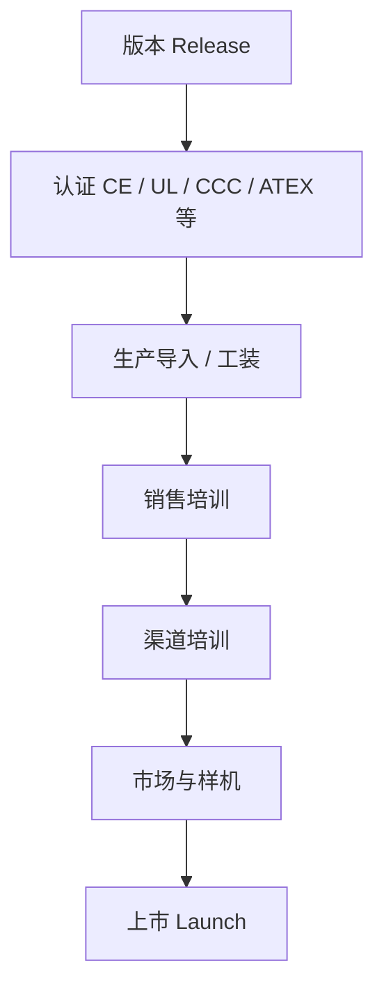

上市准备要产品、销售、市场、供应链、质量、法务共同推进。缺训、缺料、缺认证、缺价格表，都等于没有上市。AOP 里的新品贡献，必须与这条链路的日期锁在一起。

研发如何被驱动，也不是「产品经理一句话」。研发收到的是分层对象：

```text
增加 OPC UA 安全
  → Epic：安全通信能力
    → Feature：支持 TLS 1.3
      → Requirement：必须兼容旧版本
        → Acceptance Criteria：测试与认证要求写清
```

研发通常不直接面对客户。产品经理是翻译器：把「客户要安全、要兼容、要在某认证下出货」翻译成可开发、可测试、可验收的语言。翻译失败有两种：写得太虚，研发自行脑补；写得太死，锁死实现并漏掉真实约束。

### 3.12 产品经理桌上的经营驾驶舱

到这一层，产品经理每天看的已不是需求列表，而是综合仪表盘。教学示意：

```text
产品经理仪表盘
┌──────────────────────────────────────────┐
│ Revenue (YTD)              ████████  92% │
│ 毛利率                       48.5% │
│ Market Share                         31% │
│ Win Rate                             64% │
│ 失单               427  ↑    │
│ 销售机会                         €186 M  │
│ New Product Revenue                  22% │
│ Software Attachment Rate             37% │
│ Edge Attachment Rate                 18% │
│ 持续降本 Savings                      €4.2 M  │
│ Quality (RMA)                      0.18% │
│ NPS                                  56  │
│ Inventory Weeks                      9.2 │
└──────────────────────────────────────────┘
```

其中与「写需求」直接相关的很少。大部分来自销售、供应链、财务、质量和市场。**如果你的周报仍只有需求进度，说明你还在做项目助理，还没有开始做产品经营。**

### 3.13 最接近事业部产品经理头脑的总图

下面这张不是「产品开发流程图」，而是「产品经营系统图」：

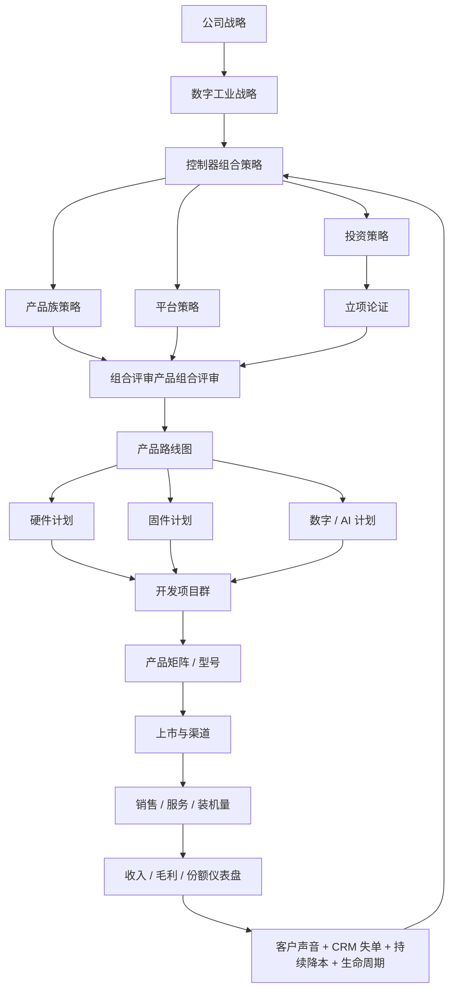

### 3.14 产品组合评审：战略、财务、销售、研发真正碰头的地方

组合评审会是西门子一类公司里产品经理最具挑战的场合。它裁的是**本事业部内部**的产品族和人月；集团在事业部之间分预算总额、点名停投，见第 6.4 节。会上逐族（必要时逐项目）讨论：

- 哪些继续投资，哪些停止开发；
- 哪些转持续降本，哪些提前退市；
- 哪些新品立项；
- 研发预算如何在产品线之间重分。

**建议的会议结构（2～3 小时版）：**

1. 仪表盘：收入、毛利、份额、预测偏差（15 分钟，只讲例外）。
2. 失单与空档：要不要变成项目（20 分钟）。
3. 在研项目通过评审：通过 / 暂缓 / 终止，不接受「再看看」而无日期（40 分钟）。
4. 持续降本与退市：利润和供应风险（20 分钟）。
5. 预算重分：从终止 / 暂缓释放的人月转到通过评审项目（20 分钟）。
6. 决议清单：谁、做什么、到哪天、下一次看什么证据（10 分钟）。

参加人最低集：产品、研发、销售、财务、供应链、质量。缺财务和供应链的组合会，最后都会重新开一次。

### 3.15 本章检查单

- [ ] 团队能用一句话区分产品组合、路线图、型号矩阵
- [ ] 组合负责人、产品经理、平台/技术产品经理的签字范围写清，组合会不按型号各自要预算
- [ ] 事业部战略已翻译成对组合的投资含义，而不是直接变成功能列表
- [ ] 每个产品族有明确策略：投资 / 保持 / 收割 / 退出
- [ ] 平台能力与产品上市节奏画在同一张时间表上
- [ ] 矩阵同时看性能轴和价格 / 预算轴，空档有决策（做 / 不做 / 用软件覆盖）
- [ ] 进路线图的项目都有可挑战的立项论证和敏感度
- [ ] 成熟型号有持续降本组合，停售有替代和日期
- [ ] 组合评审能 Kill 项目，并当场重分人月
- [ ] 已用第 4 章的六张图，把本产品线的组合、换代、功能和降本对上号

---

## 第四章 产品经理要做的事：六张图把组合、换代、功能、降本串起来

第 3 章把产品经营拆成产品组合、平台、矩阵、路线图、生命周期、持续降本等层次。这一章回答更动手的问题：**这些层次落到产品经理桌上，究竟要产出哪些东西？彼此什么顺序？一张图改了，旁边那张该怎么改？**

下面用同一条教学产品线贯穿全章。数字仍是示意，用来把逻辑画清楚。

**教学产品线：CX 系列紧凑型控制器（归属第 3 章的 Mid PLC 产品族）。**

| 型号 | 角色（先记名字，后面每张图都会用到） |
|---|---|
| CX-50 | 入门档，挡住低价对手，主攻 M3 与小型 OEM |
| CX-100 | 现行中端主力，主力赚钱产品，即将被换代 |
| CX-300 | 下一代中端，2026 年中上市，用来接过 CX-100 |
| CX-500 | 高端运动 / 大点数 |
| CX-500S | 安全型，量不大、毛利高 |
| CX-Soft | 软件运行时 / 订阅，挂在硬件上卖 |

市场分层本手册统一用：

| 层级 | 指什么 | 客户主要买什么 |
|---|---|---|
| **M1** | 成熟市场（西欧、北美、日韩等） | 认证全、服务网络、替换与升级、价格韧性相对高 |
| **M2** | 规模成长市场（中国及同类制造大国） | 设备商量大、性价比、本地认证、交期 |
| **M3** | 新兴自动化市场（东南亚、印度、部分中东等） | 首次上自动化、渠道为主、功能「刚好够」、对价格极敏感 |

客户群本手册统一用三类：**设备商（把控制器装进自己机器再出售的厂家，行业里常写 OEM）、项目集成商（按工厂项目组系统的公司，常写 SI）、流程 / 终端工厂（自己用设备的工厂）**。后面表格里仍可能出现 OEM / SI，含义就是这三类。

### 4.1 产品经理要做的事：先给一张完整清单

产品经理的工作可以分成「一块依据 + 六块经营」。依据是市场、客户、竞品；没有它，后面六张图会变成内部看起来完整、对外却讲不清的幻灯片。第一次按什么顺序把图画出来，见第 5.1 节。如何强制收集这些依据、又如何用会议把人推着转，见第 5.2～5.4 节。

| 序号 | 工作块 | 核心问题 | 主要交付物 | 主要看哪张图 |
|---|---|---|---|---|
| 0 | 市场与客户输入 | 凭什么改后面六张图？ | 拜访纪要、失单访谈、竞品对照、行业图层 | 第 5.3 节；第一次怎么做见 [5.1](#sec-51) |
| 1 | 组合架构 | 高低怎么搭配？按性能、按 M1/M2/M3，还是按客户群切？ | 切分原则、覆盖表、档位隔离规则 | 图 1、图 2 |
| 2 | 盈利与投资 | 哪个在赚钱、哪个在战略亏损、钱投哪里？ | 盈利矩阵、投 / 收割 / 退 | 图 3 |
| 3 | 生命周期与换代 | 何时上市、何时停售、旧的由谁补上？ | 生命周期甘特、替代映射 | 图 4 |
| 4 | 功能与版本 | 哪个版本加哪几个功能，为什么是这几个？ | 版本功能表、需求分级 | 图 5 |
| 5 | 降本与供应 | 成熟期利润从哪来，供应会不会先死？ | 持续降本组合、单一供应风险 | 图 6 |
| 6 | 经营与上市 | 明年卖多少、什么价格、渠道会不会卖错型号？ | AOP 量价、定价授权、渠道价目、上市准备、失单 | 第 2 章 + [4.10](#sec-410) |

此外还有几件「不算一张独立大图、但必须有人做」的事：平台对齐（第 3.4 节）、商业论证（第 3.8 节）、质量与认证门槛、退市沟通包、竞争与赢单材料。它们是上面六块的输入或出门条件，不另起炉灶。

**合格标准：** 六块都能指到同一组型号、同一组日期、同一组财务假设。CX-300 的上市月若在功能表里是 2026 年 7 月，生命周期图、AOP 新品贡献、上市准备培训日就不能各写各的。

### 4.2 图 0：六张图的总分关系（后面每张都挂在这里）

先看总图，再看分图。箭头表示「谁改了，谁必须重画」。

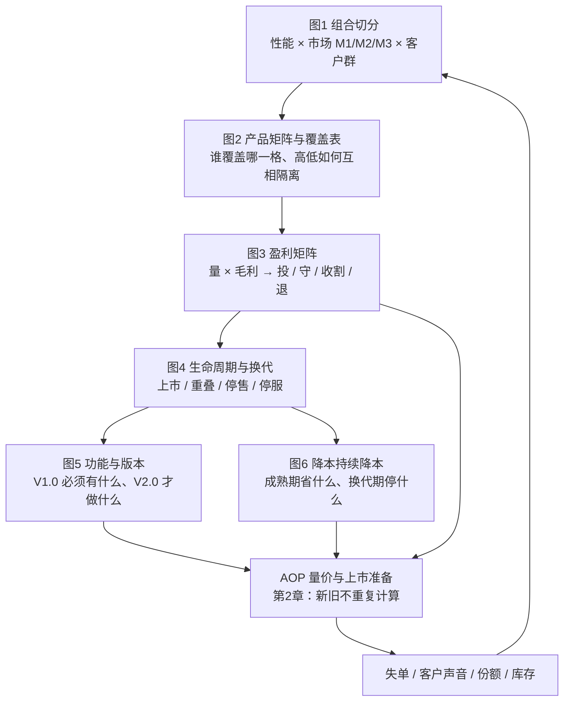

图中色块在部分预览里可点；点不了时用下表（标准链接，一定能跳）。

| 图中块 | 细节章节 |
|---|---|
| 图 1 组合切分 | [4.3](#sec-43) |
| 图 2 矩阵与档位隔离 | [4.4](#sec-44) |
| 图 3 盈利矩阵 | [4.5](#sec-45) |
| 图 4 生命周期与换代 | [4.6](#sec-46) |
| 图 5 功能与版本 | [4.7](#sec-47) |
| 图 6 降本持续降本 | [4.8](#sec-48) |
| AOP 量价与上市准备 | [2.1 AOP](#sec-21) · [2.14 量价表示例](#sec-214) · [3.11 上市](#sec-311) · [4.10 定价与防窜货](#sec-410) |
| 失单 / 客户声音 / 库存 | [5.3 核心判断与拜访](#sec-52) · [4.9 三件事如何改图](#sec-49) · [5.1 上手顺序](#sec-51) |

读图规则：

1. **图 1 先于图 2。** 没决定「用哪把刀切市场」，型号表只是性能排行榜。
2. **图 3 约束图 4。** 主力赚钱产品不能说停就停；量小利薄该退的产品不应再开新版本。
3. **图 4 约束图 5。** 换代重叠期，旧型号只修安全与供应，不加新功能。
4. **图 5 必须能回溯到失单或战略，而不是研发兴趣。**
5. **图 6 挂在生命周期的成熟段，不挂在导入段。**

<a id="sec-43"></a>
### 4.3 图 1：组合按什么切——三把刀，通常只让一把当型号

「产品组合」常被理解成「把现有型号排成一列」。那只是目录。组合要回答的是：**用最少的型号，覆盖该覆盖的市场格子，并且格子之间不要互相残杀。**

工业品常见三把刀：

```text
                    ┌──────────── 切分轴（想清楚用哪一把做型号）────────────┐
                    │                                                      │
              性能 / 能力              市场成熟度              客户群体
           入门 / 中端 / 高端          M1 / M2 / M3           设备商 / 集成商 / 流程
           点数、运动、安全、冗余      认证、价格、服务密度    谁决策、谁在乎交期
                    │                      │                         │
                    └──────────────────────┼─────────────────────────┘
                                           ▼
                         三维都能想，型号不能按 3×3×3 展开
```

**为什么不能三轴都做成型号？** 3 档性能 × 3 个市场 × 3 类客户 = 27 个型号。认证、备件、资料、培训、预测会一起爆炸。正确做法是：

| 轴 | 通常怎么用 | 不要怎么用 |
|---|---|---|
| **性能 / 能力** | **主型号轴**（CX-50 / 100 / 300 / 500） | 不要为每个差 10% 的点数再开一颗硬件 |
| **M1 / M2 / M3** | 认证包、价格带、渠道政策、本地化、成本版本 | 不要为 M3 单独做一套无法维护的分叉固件（除非平台允许同一固件、不同 BOM） |
| **客户群** | 选型指南、销售话术、配置模板、软件包 | 不要 OEM 一颗料号、SI 再一颗完全重复的料号 |

CX 系列的切分决策（教学用，写下来才能被挑战）：

```text
主型号轴 ＝ 性能 / 能力（点数、运动、安全）
辅轴 1   ＝ M1/M2/M3 → 用认证、价格、交期、是否做成本降配来覆盖
辅轴 2   ＝ 客户群   → 用配置模板和软件包覆盖，不新增硬件料号
```

三把刀同时画在一张「覆盖立方」的展开表上，比空想立体图有用：

```text
                 设备商 OEM          项目集成商 SI           流程 / 终端工厂
           M1     M2     M3          M1    M2    M3         M1    M2    M3
入门       CX-50  CX-50  CX-50*     CX-50  CX-50 CX-50*    —     —     —
中端现行   CX-100 CX-100 △          CX-100 CX-100 —        CX-100 ○    —
中端下代   CX-300 CX-300 CX-300**   CX-300 CX-300 ○        CX-300 CX-300 ○
高端       CX-500 CX-500 —          CX-500 CX-500 —        CX-500 ○    —
安全       500S   500S   —          500S   500S  —         500S  500S  —

*  CX-50 在 M3 是主力（首次自动化）
** CX-300 进 M3 用成本降配 + 渠道套装，不新开架构
△  CX-100 在 M3 偏贵，不主推
○  可卖，但不是主攻；靠项目配置而非新型号
—  故意不覆盖（承认空档，或用渠道他牌 / 软件方式）
```

**「故意不覆盖」是组合决策，不是工作疏忽。** 例如 M3 的流程行业可以不做：认证和服务密度撑不起，硬做会亏。空档要写在组合一页纸上，避免销售逼研发「再开一颗」。

怎么选主轴，用下面三问：

1. 客户换型号时，首先比的是能力（我能不能带动这台设备）还是首先比国家政策？能带动设备 → 性能做主轴。
2. 同一能力在 M1 和 M3 的愿意付价差，是否大到必须两套 BOM？价差大 → 同一固件、两套成本；不要两套产品故事。
3. OEM 和 SI 是否真的要不同硬件，还是只要不同的交付（手册、验收、备件包）？多数只要后者。

<a id="sec-44"></a>
### 4.4 图 2：产品矩阵 + 高低搭配（档位隔离）

图 1 决定切法。图 2 把切法画成**对外能选型、对内能定价**的矩阵。CX 系列的性能 × 价格如下（示意）：

```text
价格 / 价值
高 │                         CX-500S 安全
   │                    CX-500 运动高端
   │              CX-300（接班）
   │         CX-100（现行主力赚钱产品）
   │    CX-50 入门档隔离
低 │
   └──────────────────────────────────── 性能 / 能力
        入门     中端     高端
```

只看这一张还不够，因为「高低搭配」的真正风险是**中端被入门打死，高端卖成中端的加价版**。所以必须有档位隔离：每一档少点什么、贵在什么，销售升级时说什么。

| 型号 | 客户「买得到」的能力 | 故意锁住的能力 | 主价格带（示意） | 档位隔离作用 |
|---|---|---|---|---|
| CX-50 | 基本逻辑、小点数、以太网 | 无运动轴、无安全、无冗余、软件运行时只试用 | 180～280€ | 挡住低价对手，防止 CX-100 为抢 M3 而大幅打折 |
| CX-100 | 中点数、常用总线、标准运动 | 无集成安全、无高端运动 | 380～480€ | 现行量；2026 后不再加功能 |
| CX-300 | 覆盖 CX-100 的约 90% 应用 + OPC UA + 更好运动 | 顶级轴数、安全仍走 500S | 420～520€ | 接班；价比 CX-100 略高，用功能和成本结构撑住 |
| CX-500 | 大点数、多轴运动 | 安全仍选配 / 走 500S | 800～1,100€ | 高端形象和利润，不是「更快的 300」 |
| CX-500S | 安全认证、安全 IO | — | 1,100～1,500€ | 利基，不参与价格战 |
| CX-Soft | 诊断、云连接、AI 运行时 | 离开硬件授权无效 | 订阅 / 一次性 | 拉高整单毛利，服务战略结构 |

高低搭配的三条纪律：

1. **入门档是挡低价的隔离档，不是缩小版中端。** CX-50 若不断加功能，设备商会全部改买入门档，CX-100/300 的销量和价格一起塌。
2. **换代型号必须能替下旧中端的主流应用，又要比旧中端多一个「值得换」的理由。** CX-300 相对 CX-100，教学里这个理由是 OPC UA + 运动 + 更低 BOM，而不是改个外观。
3. **高端必须有独立任务（运动、冗余、安全），不能只是中端加内存。** 否则销售只会用折扣把 500 卖成 300。

档位隔离写在选型表上还不够：谁有权把折扣突破价差、渠道货会不会回流砸直销，见第 4.10 节。没有授权阶梯和防窜货，图 2 只是一张给人看的价格海报。

与第 3.5、3.6 节的关系：第 3 章强调「表面是性能、里面是预算」和「空档分析」。图 2 是把那两节落到同一条产品线的选型表；空档若出现在「M2 OEM × 中端 300～400€」，解决办法优先是 CX-300 的定价和成本，而不是再发明一个 CX-200 硬件——除非档位隔离和覆盖表证明中间确实需要一档。

<a id="sec-45"></a>
### 4.5 图 3：盈利矩阵——组合里的钱往哪流

图 2 是「市场上看起来齐不齐」。图 3 是「公司账上看起来值不值」。没有图 3，组合会变成「格子都要填满」的完美主义。

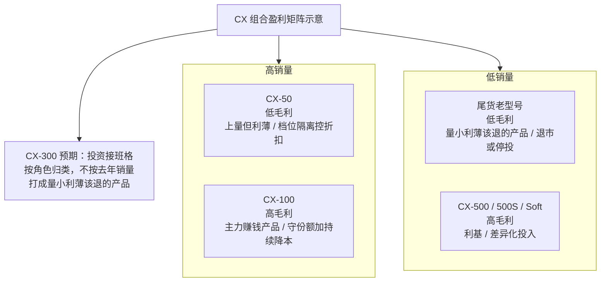

对应动作（写在组合评审纪要里，不要只贴四象限）：

| 象限 | 典型型号 | 产品经理该做什么 | 不该做什么 |
|---|---|---|---|
| 高量高毛利（主力赚钱产品） | CX-100 | 守份额、持续降本、供应安全、准备换代重叠 | 再堆大功能、为单一客户改平台 |
| 高量低毛利 | CX-50 | 控折扣、降 BOM、限制功能外溢 | 按中端标准加认证和运动 |
| 低量高毛利 | CX-500、CX-500S、CX-Soft | 保持差异化、销售培训、附带率 | 为冲量而降价到中端带 |
| 低量低毛利（量小利薄该退的产品） | 尾货老型号 | 退市、替代映射、消化渠道库存 | 再开一个维护版本「顺便改点东西」 |

再补一张「战略拟合」小图，避免只看当年赚钱：CX-300 上市前销量低、投入高，会暂时落在「低量、中毛利」，但它是接班主力赚钱产品的项目，图 3 要把它标成**投资格**，而不是量小利薄该退的产品。**盈利矩阵看的是角色，不是只看去年实际。**

```text
                战略重要度
            低高
     高 │ CX-100 收割+换代    CX-300 投资接班
  盈利  │ CX-50 控亏守门      CX-Soft 结构升级
     低 │ 尾货退出概念机限制投入
```

图 3 对后面的硬约束：

- CX-100 是主力赚钱产品 → 图 4 的停售日不能早于 CX-300 稳定供货；
- 尾货是量小利薄该退的产品 → 图 5 不再给它排功能；
- CX-50 利薄 → 图 6 必须有降本，图 5 不能往里塞 AI。

<a id="sec-46"></a>
### 4.6 图 4：单产品生命周期，以及「旧的退了由谁补上」

第 3.9 节给出阶段名称。产品经理要交付的是**带日期、带替代关系、带库存动作的甘特图**，不是一张阶段单词。

工业品换代的典型约束：客户产线改一次很贵，所以必须有**重叠销售期**；公告要提前；停售后还要停服和备件。下图按产品线从左到右展开时间；虚线把 CX-100 的重叠期接到 CX-300 上市。三个关键日期：**2026-01** CX-100 停售预告，**2026-07** CX-300 上市（重叠开始），**2027-07** CX-100 停售。

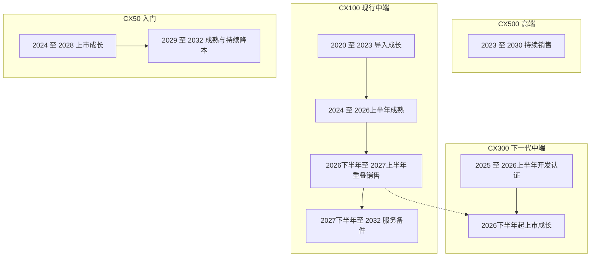

同一套日期按年展开（`·` 表示该年无动作，避免空表）：

| 产品线 | 2020 | 2021 | 2022 | 2023 | 2024 | 2025 | 2026 | 2027 | 2028 | 2029 | 2030 | 2031 | 2032 |
|---|---|---|---|---|---|---|---|---|---|---|---|---|---|
| CX-50 入门 | · | · | · | · | 上市 | 上市 | 上市 | 上市 | 上市 | 持续降本 | 持续降本 | 持续降本 | 持续降本 |
| CX-100 现行中端 | 导入 | 导入 | 导入 | 导入 | 成熟 | 成熟 | 重叠 | 重叠 | 备件 | 备件 | 备件 | 备件 | 备件 |
| CX-300 下一代 | · | · | · | · | · | 开发 | 上市 | 上市 | 成长 | 成熟 | 成熟 | 成熟 | 成熟 |
| CX-500 / 500S | · | · | · | 销售 | 销售 | 销售 | 销售 | 销售 | 销售 | 销售 | 销售 | · | · |
| 里程碑 | · | · | · | · | · | · | 预告+上市 | 停售 | · | · | · | · | · |

把上图翻成产品经理必须锁死的日期表：

| 节点 | CX-100 | CX-300 | 同步动作 |
|---|---|---|---|
| 开发启动 | — | 2025-01 | 立项论证通过评审，平台固件版本锁定 |
| 目标市场认证完成 | 已完成 | 2026-05 | 未完成则上市日后移，AOP 新品贡献打折 |
| **上市 / 可承诺供货** | 2020 | **2026-07** | 销售培训、价格表、配置器、安全库存 |
| 停售预告 | **2026-01**（提前约 18 个月） | — | 替代映射发布，渠道禁止再压 CX-100 库存 |
| **重叠销售** | 2026-07 ～ 2027-06 | 同期 | 激励逐步从 100 切到 300；100 只保交期 |
| **停售停售** | **2027-07** | — | 最后订单日、渠道消化 |
| 停服 EoSupport | 2032-12 | 更晚 | 备件、维修、安全补丁策略 |
| 终止退市 | 2033+ | — | 文档与责任关闭 |

换代不是「新产品出来，旧产品自然没人买」。要显式回答四问：

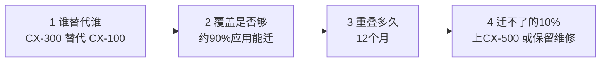

**替代映射表示例（必须发给销售和渠道，不能只放在研发脑中）：**

| 旧型号典型用法 | 首选替代 | 次选 | 迁移动作 | 不能迁时怎么办 |
|---|---|---|---|---|
| 一般 OEM 中点数 | CX-300 | — | 工程升级指南、IO 对照 | — |
| 要 OPC UA 的新招标 | CX-300 | — | 这是换代的「值得换」 | CX-100 不再承诺该功能 |
| 多轴高端运动 | CX-500 | — | 本来就不该用 100 | 避免用 300 硬扛 |
| 安全相关 | CX-500S | — | 安全认证不能「兼容一下」 | 100 安全方案只维护到停服 |
| 极低价 M3 首次自动化 | CX-50 | CX-300 降配套装 | 不要把 300 打到 50 的价 | — |

与第 2 章 AOP 的硬接口（这里最容易造假）：

```text
明年中端收入 ≠ CX-100 明年量 + CX-300 明年量  （会重复计算换机）

正确：
  CX-100 量  = 存量增补 + 重叠期尚未切换的客户 − 主动切换
  CX-300 量  = 新客户 + 从 CX-100 切过来的量 + 抢来的份额
  切换过去的那一截，只能出现在其中一个型号里
```

教学数字：若今年 CX-100 卖 20 万台，明年自然应是约 18 万；其中 4 万台将在重叠期切到 CX-300。则 AOP 应写成 CX-100＝14 万、CX-300＝4 万（切换）＋2 万（新客户），而不是 CX-100＝18 万且 CX-300＝6 万。**第 2.7 节「新品贡献不要与老产品重复计算」，在图 4 上才能检查。**

生命周期阶段与产品经理主业的对应：

| 阶段 | 主业 | 功能规划 | 降本 |
|---|---|---|---|
| 导入 | 上市准备、质量、供应爬坡 | 只修阻塞上市的缺陷 | 不做大额持续降本 |
| 成长 | 份额、附带率、版本节奏 | 按图 5 的 V1.x / V2.0 | 小优化 |
| 成熟 | 守份额、利润 | **功能冻结**（安全 / 法规除外） | **图 6 主战场** |
| 重叠 / 停售 | 替代、渠道库存、客户沟通 | 旧型号不再开新功能包 | 持续降本只做供应风险项 |
| 服务 / 备件 | 承诺兑现、安全补丁 | 无 | 备件成本与最小起订 |

<a id="sec-47"></a>
### 4.7 图 5：某一种具体产品的功能与版本规划

图 4 给出 CX-300「2026-07 必须能卖」。图 5 回答：**卖的那一版里到底有哪几个功能，后面几版再补什么。** 这是产品经理最容易写成「只增不减的想做清单」的一张图，也是研发排期的直接输入。

先看总图：横轴是时间（并和图 4 的换代日期锁在一起），每一列是一个版本，格子里是该版本真正带走的功能。一眼应能读出三件事——**何时发布、这一版解决什么、什么被明确推迟或拒绝。**

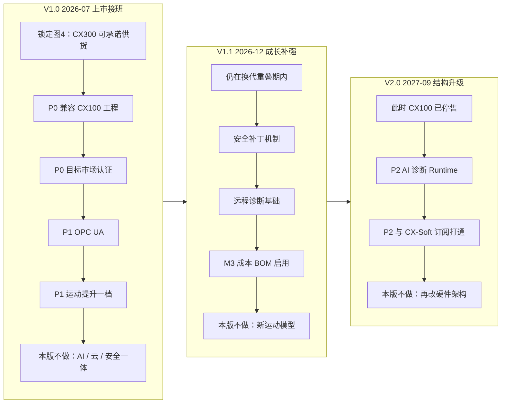

同一张图按「能力轨道 × 版本」再看一遍。这样不会把 OPC UA、运动、AI 挤在同一句话里，研发也知道哪条线在哪一版冻结。


读图时抓住四条纪律：

1. **V1.0 只装接班和赢单。** 没有 OPC UA 会继续丢 M2 OEM；没有兼容和认证则图 4 的换代失败。AI 再热也不能进这一列。
2. **V1.1 发生在与 CX-100 的重叠销售期。** 只允许不破坏 V1.0 认证主路径的补强（补丁、诊断、M3 成本 BOM）。
3. **V2.0 排在 CX-100 停售之后。** 研发容量从「把旧客户迁走」转到「软件和智能化结构」，这时才装 AI 和订阅。
4. **每条轨道都要能写「哪一版冻结」。** 运动模型三次都不改，是刻意的，不是忘了。

功能进上面两张图，只走一条漏斗：

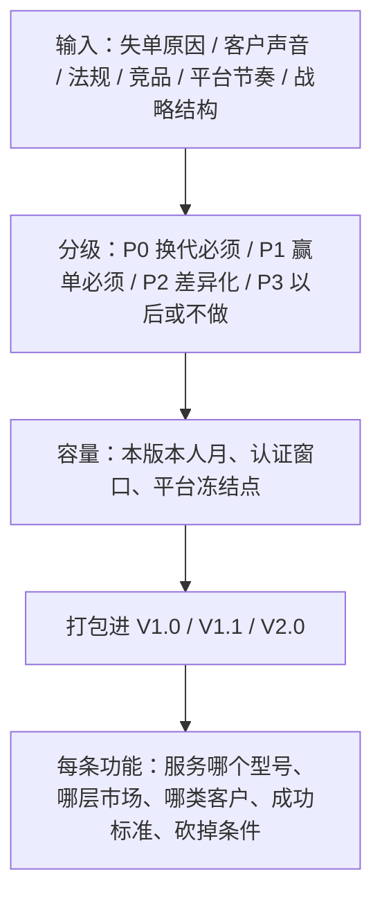

**分级定义（写进团队词典，避免「都重要」）：**

| 级 | 含义 | CX-300 教学例子 | 进哪个版本 |
|---|---|---|---|
| **P0** | 没有它，CX-300 接不成 CX-100 的主流订单 | 对 CX-100 的工程兼容、主流通讯、目标市场认证 | **V1.0 上市必须** |
| **P1** | 没有它，会继续在图 1 的主攻格子里丢单 | M2 OEM 招标要的 OPC UA；交期相关的诊断 | V1.0 或最晚 V1.1（仍在成长年） |
| **P2** | 用来拉开差距或服务战略结构 | AI 诊断、云连接（CX-Soft） | V2.0，不绑死上市 |
| **P3** | 证据不足，或破坏档位隔离 | 把安全做进 CX-50；给 CX-300 上旗舰轴数 | 不做，或推到 CX-500 |

上面两张图负责「一眼看懂」。下面三张表负责把格子写死，方便组合评审和研发拆 Epic。CX-300 的版本功能表（示意）每一行都应能指回图 1 的市场格子或图 4 的换代日期，而不是「听说很热」。

| 版本 | 目标日期 | 纳入的功能 | 为什么是现在 | 明确不做 |
|---|---|---|---|---|
| **V1.0** | 2026-07 | 兼容 CX-100 主流工程；OPC UA；运动提升一档；M1/M2 认证包 | P0+P1：接班 + 停掉「没有 OPC UA」失单 | AI、完整云、安全一体 |
| **V1.1** | 2026-12 | 安全补丁机制；远程诊断基础；M3 成本 BOM 启用 | 成长年补赢单，不破坏 V1.0 认证主路径 | 新运动模型（怕回归） |
| **V2.0** | 2027-09 | AI 诊断（平台 Runtime）；与 CX-Soft 订阅打通 | P2：此时 CX-100 已近停售，研发容量从换代转到结构升级 | 再改硬件架构 |

失单如何改这张表（接第 3.7 节，具体落到版本）：

| 失单原因（示意次数） | 落在哪一格 | 进哪个版本 | 不这么处理的后果 |
|---|---|---|---|
| 没有 OPC UA × 280 | M2 OEM × 中端 | CX-300 V1.0 | 换代后仍丢同一类标 |
| 没有 AI 诊断 × 190 | M1 高端 / 软件 | V2.0 + CX-Soft，不进 V1.0 | V1.0 延期，主力赚钱产品接班失败 |
| 没有云平台 × 150 | 先分清招标语言还是真用 | V2.0 选件，默认不强迫 | 把硬件上市绑上云，上市准备一定乱套 |
| CX-50 要安全一体 × 40 | 会破坏档位隔离 | **不做**，引导 CX-500S | 入门档成本与认证被抬死 |

给研发的不是一句话「做 OPC UA」，而是分层对象（与第 3.11 节一致）：

```text
P1 功能：OPC UA Server（M2 OEM 赢单）
  → Epic：控制器作为 OPC UA Server 可用于产线集成
    → Feature：Server 端点 + 用户名口令 + 节点映射（不是 PubSub，也不是 Client）
      → Requirement：兼容既有工程；掉线恢复时间 ≤ Xs
        → Acceptance：测试用例、认证、目标 CPU 负荷上限

完整写成可验收的需求见第 5.4 节 PRD-CX300-OPC-V1。PubSub / Client 在该产品需求文档里明确范围外，与这里必须一致，不能在图 5 写 Server、给研发的分解里又写成 PubSub。
```

**版本规划的容量纪律：** V1.0 的人月先被 P0 占满。P2 再重要，也是「上市之后的版本」，不能和换代抢窗口。产品经理在这里的职业判断，就是敢于把 AI 写成 2027，而不是写进 2026 年 7 月。

<a id="sec-48"></a>
### 4.8 图 6：降本规划——挂在成熟期，服务于图 3

第 3.10 节讲了持续降本是什么。这里补产品经理必须画的**时间与对象**：谁在降、降多少、会不会和换代打架。

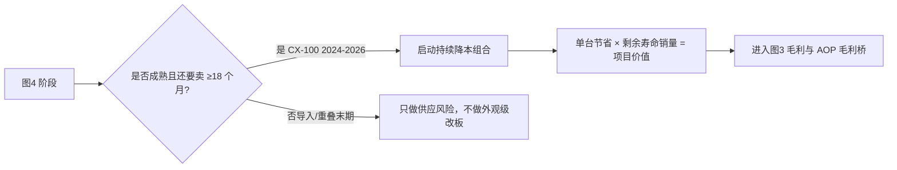

CX-100 的降本计划（示意）只发生在成熟期，重叠期以后只保留「芯片停产」这类供应项目：

| 窗口 | 项目 | 单台节省 | 剩余可销量（示意） | 项目逻辑 |
|---|---|---|---|---|
| 2024 | PCB 改版 | 1.8€ | 35 万台 | 主力赚钱产品，改版认证来得及 |
| 2024～2025 | MCU 第二源 | 3.5€ | 30 万台 | 既降本又去单一供应 |
| 2025 | 包装与测试 | 1.8€ | 20 万台 | 不改客户接口 |
| 2026 H1 | 再改主板？ | — | 剩余寿命短 | **不做**：认证成本回收不了，且 CX-300 将上市 |
| 2026～2027 重叠 | 只处理停产物料 | — | 重叠量 | 保证能出货到停售 |

CX-50 因为落在「高量低毛利」，持续降本是生存条件，不是锦上添花。CX-300 在导入年不做大额持续降本，先把工艺打稳；V1.1 的「M3 成本 BOM」属于**设计阶段就留下的降配选项**，不是成熟期再拆。

和功能规划的边界：成熟期的 CX-100 **不加 OPC UA**（那是 CX-300 P1），只做持续降本与安全补丁。把新功能堆到即将停售的主力赚钱产品上，是最贵的一种浪费。

<a id="sec-49"></a>
### 4.9 六张图怎样互相改写（用三件事演示）

下面三件事说明「不是六张独立幻灯片」。

**事件 A：M2 汽车 OEM 资本开支下降。**  
图 1 的中端 OEM 格子变小 → 图 3 里 CX-100/300 的量假设下调 → 图 4 的 CX-300 爬坡变缓，但停售日不一定延（除非 CX-300 供货失败）→ 图 5 的 V2.0 AI 可按情景推迟 → 图 6 的持续降本更重要（量少更要保毛利）。AOP 按第 2 章改滚动预测。

**事件 B：竞品在 300～400€ 打下 M2。**  
图 2 出现价格空档 → 先问档位隔离：是 CX-300 定价过高，还是 CX-50 功能外溢不够挡？ → 优先调 ASP、配置和 BOM，而不是立刻开 CX-200 → 若立项论证证明必须有一档，才改图 1 覆盖表并单独立项。

**事件 C：CX-300 认证延期 6 个月。**  
图 4 上市日 → 2027-01，重叠缩短或 CX-100 停售后移 → 图 5 V1.0 砍 P2（本来就不该在 V1.0）→ 图 6 给 CX-100 补一轮供应保障 → AOP 新品贡献按第 2.7 节打折。**功能表不许靠「再塞两个卖点」补偿延期。**

<a id="sec-410"></a>
### 4.10 定价例外的授权阶梯，以及渠道价与直销价如何防窜货

图 2 给出价差和「故意锁住的能力」。把档位隔离守住的不是再画一张更漂亮的矩阵，而是两件硬装置：

1. **授权阶梯：** 谁可以把折扣打到哪一层；突破相邻型号价差时谁签字、有效期多久。
2. **渠道价与直销价的缝：** 分销要赚得走，又不能把货倒回直销客户的门口。

没有这两件，第 1.11 节「本国要大幅折扣、事业部要守档位隔离」只是一句原则，日常仍在微信里「这次特殊」。模板见附录 B.10。

**1. 价格不是一个数，至少要分四层**

| 层 | 谁看见 | 它约束什么 |
|---|---|---|
| **目录价 List** | 对外价目、配置器起点 | 锚。一年改不了几次；改目录价等于改图 2，要过组合会 |
| **目标成交价 Target** | 销售激励、AOP 的 ASP 中枢 | 「正常单」应落在这附近。第 2.8 节整单 ASP 从这里来 |
| **底价 Floor** | 内部，按型号 × 市场（M1/M2/M3） | 打到这层要升级审批；突破底价或突破相邻型号价差，再升一级 |
| **渠道出货价 Transfer** | 分销进货 | 必须低于直销目标价，让渠道有毛利；但渠道终端成交不得长期低于直销底价 |

CX 教学（数字示意，与图 2 价带对齐）：

| 型号 | 目录价 | 直销目标 | 直销底价 | 渠道出货价 | 折扣打进下一档的标志 |
|---|---|---|---|---|---|
| CX-50 | 280€ | 230€ | 190€ | 175€ | 折进「比竞品入门还低」且功能开始外溢 |
| CX-100 | 480€ | 430€ | 390€ | 360€ | 净价落到 CX-50 目标带（≤230€） |
| CX-300 | 520€ | 470€ | 420€ | 390€ | 净价落到 CX-100 目标带（≤430€），接班故事破产 |
| CX-500 | 1,100€ | 950€ | 820€ | 780€ | 净价落到 CX-300 带（≤520€），高端变加价中端 |
| CX-500S | 1,500€ | 1,300€ | 1,150€ | 1,080€ | 为冲量参与价格战（图 3 禁止） |

读表时抓住一句：**折扣百分比本身不重要，落到哪一条价带才重要。** CX-300 折 15% 仍在自己的带里；折到 400€ 就是在打 CX-100，授权阶梯必须把这件事标成「折扣打进下一档」，不能只显示「−23%」。

**2. 授权阶梯：例外按层走，不按人情走**

教学阶梯（各国可平移百分比，但层的含义不要改）：

| 相对目录价 | 谁可以批 | 必须附带的证据 | 明确不许 |
|---|---|---|---|
| 目标价以上（浅折） | 销售自己 | 标准配置，走配置器 | 不得手工改料号、拆软件许可白送 |
| 目标价 → 底价 | 销售经理 | 失单编码或竞品成交价；本客户本季例外次数 | 不得把 CX-500 批进 CX-300 带；不得连续三单都走这档却不改 AOP 的 ASP |
| 底价，或一次性项目 | 国家公司 定价 / 财务 | 书面例外：客户、数量、有效期、对毛利桥的影响 | 不得写成「本年度该客户一律按此价」（那是改框架，要回事业部） |
| **突破底价，或突破相邻型号价差** | **产品线产品经理 + 财务（事业部）** | 第 1.11 节矩阵：国家公司 提，事业部批；截止日期；是否改图 2 | 不得改目录价「先赢了再说」；不得让配置器外的口头价生效 |

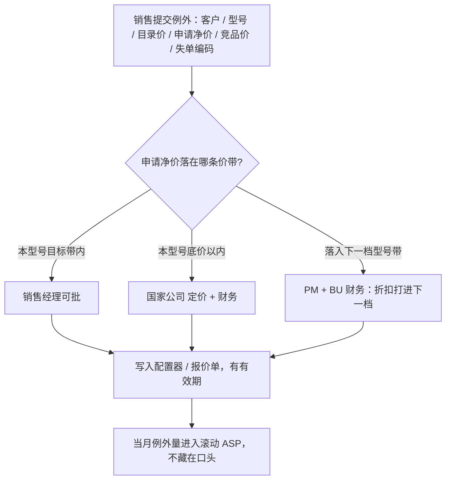

三条纪律：

1. **例外是一张单，不是一个客户的永久政策。** 有效期（教学：90 天或该项目开标日后 30 天）到期自动回到目标价。要续，重新走阶梯。
2. **配置器是唯一合法出口。** 配置器外的微信价、口头价，供应链和财务视为未报价。否则第 1.11 节「国家公司不得私自改价目」是空话。
3. **例外改变量的，要改预测。** 一个月里 CX-300 有 20% 的量走了底价，AOP 仍按目标价报 ASP，毛利桥必炸。销售经理档若被连用，财务有权要求下调该客户或该区域的 ASP 假设。

**3. 直销价和渠道价：缝要在，货不能倒回来**

工业品常见两种卖法同时存在：大 OEM / 大项目直销，中小 OEM 和 M3 走分销。价差处理错，会出现两种病——

| 病 | 怎么发生 | 谁受伤 |
|---|---|---|
| 渠道不赚钱 | 出货价贴近甚至高于直销目标价 | 分销不推，M3 覆盖表是假的 |
| **窜货** | 渠道出货价过低，或某国/某区特价货回流到另一国直销客户 | 直销被砸，档位隔离塌，AOP 的 ASP 和区域收入一起失真 |

防窜货不是一句「禁止跨区销售」，而是让**倒货不划算**，并让**倒货能被发现**：

```text
渠道出货价  <  直销目标价     → 分销有毛利，肯备货
渠道终端成交  ≥  直销底价     → 直销客户不会从黄牛买到更低价
（直销目标 − 渠道出货）≈ 渠道资金/库存成本 + 合理毛利
倒货成本（运费 + 税 + 失去本区质保 + 被取消返点）> 价差  → 回流不划算
```

CX 教学：CX-300 直销目标 470€、渠道出货 390€，价差 80€。若从 M3 回流到 M2 还要付运费、关税、失去中国区质保，通常就不划算。若某国为冲量把出货价打到 320€，回流就开始有账可算——这是定价例外突破渠道层，必须走事业部，不能由一个国家的渠道经理单独批。

操作上固定五条（产品经理要会查，不一定自己执行每一条）：

| 规则 | 做什么 | 不做会怎样 |
|---|---|---|
| **项目报备** | OEM / 大项目由直销或一家分销先报备，保护期教学 90 天；保护期内另一家不得用更大幅折扣抢同一终端 | 两家渠道 + 直销对同一家 OEM 各报一个价，最深的那个成为市场价 |
| **价目分开** | 直销净价表和渠道出货表两套；软件许可不随渠道货「免费搭」 | 渠道用硬件低价换软件白送，AOP 软件行落空 |
| **料号 / 认证隔离** | M3 成本降配（图 5 V1.1 的 M3 BOM）用可区分料号或包装，保修只在售出国 | 同一料号全球乱飞，降配货出现在 M1 招标 |
| **换代期禁压货** | 图 4：CX-100 停售预告后，渠道不得再压旧型号库存 | 重叠期旧货低价砸 CX-300 爬坡 |
| **序列号与保修** | 保修注册国 ≠ 出货国，进窜货清单 | 只有政策、没有证据，渠道不怕 |

**4. 窜货和乱折怎么被发现、有什么后果**

没有后果的阶梯，一周后形同虚设。最低监测（月度，销售运营 + 产品线一起看）：

- 配置器里「底价档 / 折扣打进下一档」的单数、金额、客户重复率；
- 跨区保修、跨区序列号激活；
- 同一终端客户被直销和渠道各报一次价（报备冲突）；
- 网上/黄牛出现低于直销底价的 CX 现货。

合法后果对准资源，不对准口号：取消该单返点或价差补回、削减下一季渠道配额、取消项目保护、国家公司 当季折扣权降一档。只在年会上批评「价格纪律差」，阶梯不会自己生效。

**5. 和六张图、经营日历怎么接**

| 对象 | 本节怎么接 |
|---|---|
| 图 2 档位隔离 | 价带就是阶梯的「突破」判据；改目录价 = 改图 2 |
| 图 3 | CX-50、CX-500S 默认不准进突破档；主力赚钱产品大幅折扣要先问持续降本和结构，不先问「再便宜一点」 |
| 图 4 | 重叠期旧型号只保交期，不新开大幅折扣政策去清库存（清库存用报备后的定向消化，不面向全市场） |
| 图 1 M3 | 渠道套装合法；用更低出货价换覆盖，但料号隔离，防止回流 M2 |
| AOP / 第 2.8 节 | ASP 用目标成交价；例外量单独一行。例外太多就改假设，不假装还在目标价 |
| 第 1.11 节矩阵 | 国家公司提例外，折扣打进下一档由事业部产品经理 + 财务批；两套预测对表时，价差必须用同一套净价 |

做到什么算合格：能拿出一页授权阶梯（谁、折到哪、突破谁批）；配置器能挡住配置器外的价；直销和渠道两套价目能对上上面的不等式；当季例外清单和窜货清单能在季度经营会上翻出来。做不到这四件，图 2 的档位隔离只是选型海报。

### 4.11 其它必须由产品经理牵头、但不另起一套体系的事

这些事第 2、3 章已有方法，这里只写**和六张图的接口**，避免漏项。

| 工作 | 和六张图怎么接 | 做到什么算合格 |
|---|---|---|
| 定价与折扣授权 | 图 2 价带即档位隔离；例外走第 4.10 节阶梯 | 书面阶梯 + 配置器唯一出口 + 当季例外可翻 |
| 软件 / 订阅附带 | 图 1 战略格；图 5 V2.0；图 3 高毛利低量 | 硬件价目与软件价目分开，AOP 里单独一行 |
| 平台对齐 | 图 5 的功能尽量来自第 3.4 节平台，而不是型号私货 | 固件大版本与 CX-50/300/500 同一日历 |
| 商业论证 | 新开型号、新开版本包、大额持续降本改板都要 Case | 回收期和敏感度通过评审，见第 3.8 节 |
| 上市准备 | 图 4 上市日锁培训 / 物料 / 认证 | 用附录 B.4，AOP 起始月一致 |
| 失单与客户声音 | 回流改图 1 覆盖和图 5 分级 | 编码见附录 B.3，每季决定是否立案 |
| 质量与法规 | 法规是 P0，可插队但不许悄悄扩大范围 | 安全 / 认证变更走变更控制 |
| 竞争材料 | 图 2 选型、图 5 差异化 | 销售有「能承诺 / 不能承诺」 |

### 4.12 产品经理的年度经营包：把图放进固定文件夹

建议每个主力产品族一个文件夹（或一册幻灯片），顺序固定，便于组合评审（第 3.14 节）按页翻：

0. 知识图 + 未知清单 + 主力型号三句话卡片（第 5.1 节、附录 B.12；经营决策看后面六张图，知识图当附录）  
1. 图 1 切分原则 + 覆盖表  
2. 图 2 矩阵与档位隔离  
3. 图 3 盈利矩阵与投资角色  
4. 图 4 生命周期与替代映射  
5. 图 5 未来 24 个月版本功能  
6. 图 6 持续降本组合  
7. 本族 AOP 量价（第 2.14 节那张表）  
8. 本季市场与客户依据：失单 Top 10、拜访纪要摘要、竞品一页纸  
9. 风险：认证、供应、换代延迟、价格战  
10. 定价授权阶梯 + 直销/渠道价目 + 本季例外与窜货清单（第 4.10 节）

第一次把这一包从空白填到可以定稿，走第 5.1 节。之后第 5.6 节的年 / 季 / 月节奏是在**更新**这一包，而不是另写一套周报文学。

### 4.13 本章检查单

- [ ] 写得清主型号轴是性能、市场还是客户；另外两轴用政策 / 配置覆盖，而不是型号爆炸
- [ ] 覆盖表里有「故意不覆盖」的格子，并有理由
- [ ] 高低档有档位隔离：入门不能变成第二中端，高端有独立任务
- [ ] 盈利矩阵给每个型号写了投 / 守 / 收割 / 退，换代产品按角色而不是按去年销量归类
- [ ] 生命周期有上市、预告、重叠、停售、停服日期，以及替代映射
- [ ] AOP 里旧型号下降与新型号上升能对上，没有双边重复计算
- [ ] 版本功能表每条能回溯到 P0～P3，V1.0 不被 P2 挤爆
- [ ] 成熟期型号以持续降本和供应为主，不再开大功能包
- [ ] 六张图的日期、型号、价格假设互相一致
- [ ] 改图有客户 / 失单 / 竞品证据，而不是内部讨论自洽；第一次怎么凑齐见第 5.1 节，机制见第 5.2 节
- [ ] 折扣有书面授权阶梯；突破相邻型号价带必须产品经理 + 财务批，配置器外口头价无效
- [ ] 直销目标价、底价、渠道出货价能对上「分销赚钱、回流不划算」；有项目报备和窜货监测

---

## 第五章 产品经理如何被驱动、接到客户、写出需求

第 4 章把「要交付哪些图」写清楚了。本章先回答**第一次怎么上手**，再回答另外三问：

1. 接手之后先读什么（手册、场景、竞品从哪来），怎样画出**知识图**，再怎样一步步变成第 4 章的图和需求？
2. 这么多事，**靠什么机制让人做起来**，而不是写在岗位说明书里等自觉？
3. **客户、市场、竞品**怎样变成改图的合法输入？有了图，**能不能直接写产品需求**？

接手一条产品线、或公司第一次建立产品经营时，走本节。走完一遍之后，改用后面的日历、队列和年 / 季 / 月循环去**更新**，不要每个季度都从零再「上手」一次。

<a id="sec-51"></a>
### 5.1 上手：先吃透产品和竞品，画出知识图，再变成第 4 章的六张图

一个人接手产品经理，第一件事不是画图 1，也不是写产品需求文档。第一件事是：**自己能讲清「我们卖的是什么、卖给谁、在什么场景里怎么用」，并且知道对手在同一场景里卖什么。** 这些知识大多已经写在产品手册、选型指南、认证清单和竞品公开材料里，只是没人按产品经理的读法抽出来。抽出来之后，先画一张**知识图**（本节第 3 步）；第 4 章的六张图是知识图加上量、利、日期、失单之后的经营翻译，不是从空白里「设计」出来的。

常见失败有三种。第一种：关起门画六张「完整」经营图，自己却讲不清 CX-100 和 CX-50 在现场差在哪——图只是好看的幻灯片。第二种：天天回销售消息、补研发补丁，三个月后手册没读完，竞品只停留在「听说很便宜」。第三种：把手册目录抄进图 5，把官网口号抄进竞品表。正确顺序是：

```text
读自己的手册 / 选型 / 场景
        +
按渠道读竞品（网站、手册、展会、失单报价）
        ↓
知识图（能力 × 场景 × 客户 × 对手对照）
        +
内部盘点（量、利、在研、价目、换代日期）
        ↓
带着知识图里的假设出门验证
        ↓
翻译成第 4 章图 1～图 6，再写一条已通过评审产品需求文档
```

完整度只用四档，避免「差不多齐了」这种无法检查的话：

| 符号 | 含义 | 允许上什么会 |
|---|---|---|
| ○ | 空白 | 什么会都不要带这张图 |
| △ | 草稿：只有内部盘点，允许写「未知」 | 一对一对表，不上组合会决策 |
| ● | 可挑战：有证据，别人能反对 | 组合评审可以讨论投 / 停 |
| ■ | 可以定稿：日期、范围、验收能锁 | 版本冻结或写产品需求文档 |

**不要追求六张图同一天变成 ■。** 上手结束时，图 1～图 4 应到 ●，图 5 的 V1.0 到 ● 或 ■，图 6 对主力赚钱产品到 ●，产品需求文档最多完成 **一条**（证明翻译链通了）。V1.0 全部写成需求，会把上手拖死。

```mermaid
flowchart LR
    A["0 读自己的产品<br/>手册 / 选型 / 场景"] --> K["知识图"]
    B["0 读竞品<br/>网站 / 手册 / 展会 / 失单"] --> K
    K --> C["1 内部盘点<br/>量 / 利 / 在研 / 价目"]
    C --> D["2 问钱和日期"]
    D --> E["3 带判断出门验证"]
    E --> F["4 翻译成第4章六张图"]
    F --> G["5 一份已通过评审的产品需求文档"]
    G --> H["6 稳态日历"]
```

教学仍用 CX 线。换产品只换名字，步骤不要换。第 0 步大约 1～2 周，与第 1 步可以交叉，但**知识图没画出来之前，不要宣称图 1 已经有了**——那时候你还不知道格子里装的是什么场景。

**第 0 步上半：从自己的产品材料里把「功能、客户、场景」抽出来**

产品经理读手册，不是当研发把规格背完，而是抽四列。手册、样本、选型指南、应用笔记、认证清单、工程软件帮助、培训幻灯片，都算「产品材料」。应用工程和销售手里的「能承诺 / 不能承诺」口头说法，也要写成字，和书面材料对上。

| 抽什么 | 在材料的哪一类里找 | 抽出来写成什么 | 还不是第 4 章的哪张图 |
|---|---|---|---|
| **能力** | 手册功能章、订货数据、许可证表 | 每个型号「有 / 没有 / 选配」：点数、运动、安全、总线、OPC UA、冗余 | 还不是图 5。图 5 要分级和版本，这里只登记事实 |
| **客户** | 样本封面、选型「适用于」、销售培训里的典型买家 | OEM / SI / 终端；行业（包装、机床、锂电…）；M1/M2/M3 线索（认证、语言、渠道） | 还不是图 1。图 1 要决定覆盖和故意不覆盖 |
| **场景** | 应用笔记、系统手册里的接线图、案例页 | 谁在哪个工步用：调试、产线联网、安全联锁、多轴同步 | 还不是产品需求文档。产品需求文档要验收；这里只要能复述工步 |
| **边界** | 「不支持」、订货排除项、安全须另购 | 手册明确不做的：CX-50 无安全、无运动 | 还不是档位隔离。档位隔离要加价格带；这里先记下「故意锁住的能力」 |
| **替代 / 寿命** | 停产公告、替代型号表、服务年限 | 旧型号指向谁、还卖不卖备件 | 还不是图 4。图 4 要锁日期和库存动作 |

读法（每天 2～3 小时，主力型号先读，尾货翻目录即可）：

1. **先读选型指南和订货数据，再读厚手册。** 选型告诉你公司自己怎么切档；厚手册用来核对「宣传有、订货没有」。
2. **每个主力型号写一张「三句话卡片」：** 它是给谁的、典型机台/产线是什么、没有它客户会拿什么凑合（旧型号、竞品、还是不做自动化）。写不出第三句，说明还没读懂，不要开始画图 2。
3. **自己走一遍最小工步。** 工业品至少：用工程软件建一个空项目、下载、看诊断。不必成为应用专家，但必须知道客户骂「程序迁不过去」时指的是哪一层。
4. **把手册和销售话术打架的地方单列。** 样本写「中端标配 OPC UA」，价目却要另买许可——这是后面图 2、图 5 和 AOP 软件行的种子，不是笔误。

CX 教学：读完后你应能不看幻灯片说出——CX-50 挡低价、无运动无安全；CX-100 是现行中端主力赚钱产品；CX-300 要接班，手册/规划里已经出现 OPC UA；CX-500/500S 是运动和安全的独立任务。说不清这四句，后面的覆盖表是抄的。

**第 0 步下半：竞品从哪些渠道来，各用来填知识图的哪一格**

「了解竞品」不是刷一遍官网首页。渠道不同，得到的东西不同，上手期要有意搭配，不要只走最省事的一种。

| 渠道 | 能得到什么 | 得不到什么 | 上手期怎么用 | 频率（上手） |
|---|---|---|---|---|
| **对手官网 / 样本 PDF / 选型表** | 型号命名、能力档、认证清单、公开系统架构 | 真实成交价、是否招标必选 | 按「能力 / 场景 / 客户」三列和自己的知识图对拍 | 第 0 步集中做完主力对手 2～3 家 |
| **对手手册 / 帮助（能下就下）** | 有没有 OPC UA Server 还是只写「支持 OPC」；迁移是否真的容易 | 现场是否好用 | 专治官网含糊词；为图 5「资格要素 vs 口号」备证据 | 对标中端那一档精读 |
| **经销商 / 电商公开价、渠道打听** | 价格带、交期、有没有货 | 大项目净价 | 画图 2 空档；第 4.10 节底价对照 | 上手做一次切片，以后每季更新 |
| **失单里的对手报价和评标表** | 这次到底输在价、功能、认证还是关系 | 对手全国策略 | 知识图上「输给谁」要落到具体型号，不要写「输给西门子」这种公司名 | 有失单就收，第 3 步访谈时核对 |
| **展会（工博会、SPS、IAS、行业展）** | 真机、新版本、销售口径、能否上手点几下 | 会后故事会膨胀 | 上手期若赶上展会必须去；去之前带知识图缺口清单，回来只补格子，不写观后感 | 一年可能只有 1～2 次，当补丁不是主渠道 |
| **拆机 / 借用渠道样机 / 应用拆 BOM** | 真实成本、做工、接口 | 软件许可策略 | 服务图 3、图 6 和定价，不服务「功能愿望」 | 对主力赚钱产品和对标中端各做一次粗估即可 |
| **行业媒体、认证库、招标网公开技术规格** | 某行业开始把哪条写成必选 | 单个客户的真因 | 用来形成第 3 步的判断草稿（例如 OPC UA 是否已成资格） | 上手扫一遍目标行业近 12 个月 |
| **自己的销售和应用转述** | 现场口头对照、谁好卖 | 被夸大的「客户都要」 | 必须回标到手册或失单，不能单独成为图 5 的 P0 | 每周听，不当唯一来源 |

纪律：官网只能告诉你「他们声称有什么」；展会能摸到真机，但销售口径会比手册满；**能改图 5 分级的，是失单「会不会改判」加上竞品是否标配**，不是展台演示。第 5.3 节把竞品写成市场与客户依据；第 0 步只要先把对照表搭起来。

对手不必扫全世界。上手先定 **2～3 个对标对象**（教学：同价格带的中端 PLC 两家 + 一家低价挡门的）。每个对标对象写清「相当于我们的哪一档」，禁止只写公司名。

**第 0 步结束必须交出：知识图（还不是第 4 章的经营图）**

知识图回答的是「世界长什么样」，六张图回答的是「我们把钱投在哪」。先有前者，后者才不是空想。模板见附录 B.12。一张知识图至少有四块：

```text
                    场景（工步）
              调试工程产线联网安全 / 运动
客户 OEM-M2    CX-100      CX-100？     上 500 / 500S
               竞品 A 中端竞品 A 已标配
               竞品 B 更便宜我们手册写选配
客户 SI-M1     CX-100/300   要认证包      500S
终端工厂可卖不主攻要诊断       —
```

用一张表也行，比空想立体图有用：

| 场景 / 工步 | 典型客户 | 我们用谁 | 手册里的关键能力 | 对标竞品型号 | 对手公开能力 | 我还不知道的 |
|---|---|---|---|---|---|---|
| 包装机逻辑 + 中点数 | M2 离散 OEM | CX-100（在售）、CX-300（在研） | 常用总线；OPC UA 在规划/选配 | 竞品 A 中端 | 官网写 Server 标配 | 没有会不会丢标？（→ J1） |
| 工程从旧型号迁走 | 同上，已有装机 | CX-100 → CX-300 | 迁移指南有没有、差几页 | 竞品 A 宣传「一键」 | 未验证 | 迁一次要几天？（→ J2） |
| 产线把数据给 MES | OEM 电气 + 工厂 IT | CX-300 规划中 | Server 还是只写「支持 OPC」 | 竞品 A | Server | 许可是否另卖？ |
| 多轴同步 | 高端 OEM | CX-500 | 轴数、周期 | 竞品运动型 | 标配更多轴 | 我们 300 能不能硬扛？（档位隔离） |
| 安全联锁 | 有 CE/UL 要求的产线 | CX-500S | 安全 IO、认证 | 竞品安全型 | 一体机 | 50/100 会不会被要求「顺便做安全」 |
| 首次自动化、极低价 | M3 小 OEM | CX-50 | 刚好够的逻辑 | 竞品低价 | 更便宜、认证少 | 渠道能不能挡住回流 |

知识图旁边必须有一页 **「未知清单」**。上面例子里右列那些问号，就是第 3 步核心判断的来源。没有未知清单的知识图，只是把手册抄成了表。

本步合格：你能对着知识图，不看手册，讲 20 分钟「我们的档怎么切、典型场景谁在用、对标型号各赢在哪、哪三件事我还不知道」。讲不出来，继续读，不要跳到图 1。

**第 1 步（约第 1 周，可与第 0 步后半重叠）：内部盘点，让知识图接上「谁在卖、谁赚钱」**

向别人要现成的数，不要自己发明型号。知识图是「能卖什么」，盘点是「实际在卖什么、钱在哪」。

| 向谁要 | 要什么 | 接到知识图的哪 | 开始萌芽的第 4 章图 |
|---|---|---|---|
| 销售运营 / CRM | 去年分型号收入、前 20 客户、失单表 | 哪些场景格子真的出货；「输给谁」落到对标型号 | 图 1 草稿 |
| 财务 | 分型号毛利；没有就 ASP − 粗 BOM | 哪个场景在养公司 | 图 3 草稿 |
| 研发 | 在研清单、平台列车、认证缺口 | 知识图里「规划中」是否真有人在做 | 图 5 在研堆叠 |
| 供应链 | 单一供应、停产、交期 | 手册还在卖的，供应是否先死 | 图 4 / 图 6 风险 |
| 销售 / 渠道 | 价目、折扣习惯、渠道出货价 | 知识图能力档对上价格带 | 图 2、第 4.10 节 |

本步结束：型号名单齐；知识图每行补上「去年有没有量」；图 1 主轴草稿（先写「按性能切，市场和客户用政策/配置覆盖」）；图 2 按第 3.5 节对角线把型号点上去。允许写「未知」。**不写产品需求文档，不改路线图故事。**

CX 教学：盘点后通常立刻看见 CX-100 量大、CX-50 价低、CX-300 在研——经营图的轮廓已经在知识图上，只是日期和替代还空着。

**第 2 步（约第 2 周）：问钱和日期，图 3、图 4 从空白变成草稿**

带着型号表去找财务和供应，只问能改图的问题：

- 哪个型号贡献了大部分毛利？（几乎一定是 CX-100 一类主力赚钱产品 → 图 3 主力赚钱产品格）
- 有没有已经对外说过的换代、停售、替代？（有 → 抄进图 4；没有 → 图 4 标「未锁」，这本身就是风险）
- 哪些物料会在 18 个月内停产？（进图 6 风险，不是进图 5 加功能）

本周结束：图 3 每个主力型号有一个角色猜测（投 / 守 / 收割 / 退）；图 4 有「已知日期」和「缺失日期」两列。仍不要写产品需求文档。

**第 3 步（约第 3～6 周）：带着知识图上的未知出门，假设变成证据**

核心判断从知识图的「我还不知道」来，不是从会议室拍。写法见第 5.3 节。CX 上手的 J1～J4，其实就是知识图表里那些问号：没有 OPC UA 会不会丢标、换代障碍是不是迁移、AI 会不会改判、300～400€ 空档是不是真在吃单。

出门仍按第 5.3 节三件事，但每件都要**改知识图的一格**，再改第 4 章的图：

| 动作 | 最低量（可按规模缩小） | 先改知识图 | 再改第 4 章 |
|---|---|---|---|
| 失单编码 + 金额最大的「会不会改判」访谈 | ≥ 3 家 | 「对手公开能力」改成「这次评标是否必选」 | 图 5 分级 |
| 有效拜访（带着三句话卡片和场景列） | ≥ 6 次，两类客户、两层市场 | 场景工步是否写对；迁移要几天 | 图 1 权重；图 5 的 P0 是否含兼容 |
| 把第 0 步竞品表补到「标配 / 选配 / 成交价」 | 对标 2～3 家的中端档 | 官网含糊词改成可核对的一句 | 图 2 空档；资格要素 vs 差异化 |

这一步结束：知识图右列问号减少；图 5 能看出 V1.0 / V1.1 / V2.0 的草稿漏斗。还没有验收标准，**仍然不是产品需求文档**。

**第 4 步（约第 7～8 周）：把知识图翻译成第 4 章六张图，上第一次组合会**

这是上手里最容易跳步的地方。知识图是「事实和对照」，六张图是「决策」。对照如下，缺左边就不要硬填右边：

| 知识图上已有的 | 翻译成第 4 章 | 翻译时多问的一句 |
|---|---|---|
| 场景 × 客户 × 我们用谁 | **图 1 覆盖表** | 哪一格故意不覆盖？手册写了「适用于流程」但我们服务密度不够，就要写成「—」 |
| 能力档 + 手册边界 + 竞品价格带 | **图 2 矩阵和档位隔离** | 入门档会不会靠功能外溢变成第二中端？对角线摆了没有（第 3.5 节） |
| 谁在出货、谁毛利高、谁在研 | **图 3 盈利角色** | CX-300 去年没量，按角色是投资格，不是量小利薄该退的产品 |
| 替代表、停产公告、对外承诺 | **图 4 日期和映射** | 三个关键日期锁了没有？切换量有没有双边计算 |
| 场景缺口 + 判断成立的功能 + 在研 | **图 5 版本与 P0～P3** | V1.0 的「明确不做」写了没有？手册目录不是功能清单 |
| 还要卖很久的主力赚钱产品 + 停产物料 | **图 6 持续降本** | 导入年的 CX-300 不要做大改板 |
| 价目、渠道价、知识图里的档 | **第 4.10 节授权阶梯** | 突破相邻价带谁批 |

把第 4.12 节那一包按页补齐。允许标「待验证」（● 上有「待验证」），不允许再带 ○。收口顺序：

1. 图 1 写出「故意不覆盖」；
2. 图 2 档位隔离：入门不能变成第二中端；
3. 图 3 把 CX-300 标成投资格，不要按去年销量打成量小利薄该退的产品；
4. 图 4 锁三个日期或明确写「未锁、AOP 新品贡献须打折」；
5. 图 5 V1.0 写出「明确不做」；
6. 图 6 只给还要卖 ≥18 个月的主力赚钱产品立项，导入年的 CX-300 不做大改板；
7. 定价阶梯按图 2 价带填一版草稿（第 4.10 节）。

第一次组合会的合格材料：知识图作附录 + 六张图 + 本季判断 J1～J4 的成立 / 推翻 / 仍不清 + 失单 Top 10。会后只允许改图，不允许会后直接开写一叠产品需求文档。

**第 5 步（约第 9～10 周）：只写一条已通过评审功能的需求**

挑图 5 里已经到 ■ 或刚被组合会立案的 **一条** P0/P1（教学：OPC UA Server），按第 5.4 节和附录 B.9 写满十项。发现不够的退回「再发现」，不要边做边写。

上手阶段写这一条的目的，是打通「判断 → 图 5 → 场景 → 验收 → 研发」整条链，不是把 CX-300 V1.0 一次写完。兼容、运动、认证包各是独立需求，排在这条链被证明能走通之后。

**第 6 步：转入稳态**

入口队列开始每周转（第 5.2 节），拜访配额按季度走，图的更新走第 5.6 节的年 / 季 / 月。此后禁止「再上手一次、把图推倒重画」，除非五年战略或换代失败触发第 4.9 节那种事件。

知识图、六张图和产品需求文档随步骤变齐（CX 教学）：

| 步骤 | 知识图 | 图 1 | 图 2 | 图 3 | 图 4 | 图 5 | 图 6 | 产品需求文档 |
|---|---|---|---|---|---|---|---|---|
| 0 读产品和竞品 | △→● 场景/能力/对标 | ○ | ○ | ○ | ○ | ○ | ○ | ○ |
| 1 内部盘点 | 补上「谁在卖」 | △ | △ 落点 | ○～△ | ○～△ | △ 在研 | ○ | ○ |
| 2 钱和日期 | — | △ | △ 价带 | △ 角色 | △ 日期 | △ | △ 停产 | ○ |
| 3 出门验证 | 问号减少 | ● | ● 空档 | △ | △ 迁移 | ● 漏斗 | △ | ○ 发现笔记 |
| 4 翻译成经营图 | 当附录，不再当决策页 | ● | ● 档位隔离 | ● | ● | ● 不做清单 | ● | ○ |
| 5 一条需求 | 该场景写进产品需求文档 | ● | ● | ● | ■ | ■ 该行 | ● | ■ **一条** |
| 6 稳态 | 展会/手册改版时补 | 按季 | 价格战 | 按季 | 换代年 | 按发布 | 滚动 | 每个通过评审功能一份 |

**什么叫这一段走完、可以算「合格上手的产品经理」（约 10～12 周；中小企业可压到 7 周）：**

1. **能讲产品。** 不看幻灯片，能用三句话卡片讲清每个主力型号：给谁、什么场景、没有它客户怎么凑合。
2. **有一张知识图。** 场景 × 客户 × 我方型号 × 对标型号齐；未知清单还在，但主力格子不是空的。竞品来自网站/手册/价带/失单（展会能赶上就补），不是只听销售一句「他们很便宜」。
3. **知识图已经翻译成第 4 章的图。** 图 1 有主轴和至少一格故意不覆盖；图 2 有档位隔离；图 4 有三个日期或书面未锁风险；图 5 的 V1.0 有明确不做，加项有判断编号。
4. **证明自己会翻译成需求。** 有一份完整产品需求文档，**或**书面写明「本季没有通过评审功能，故不写」——这也算完成。
5. **不再靠微信加需求。** 入口队列每周在转（第 5.2 节）。

做不到这五条，不要宣称「我已经是这条线的产品经理」。后面的日历和计分卡，是防止走完上手又滑回去。知识图以后还要更新（手册改版、对手新样本、展会），但它不再代替组合会——经营决策看六张图。

### 5.2 驱动机制：日历、入口队列、评审证据，而不是觉悟

职责写得再全，没有外部拉力，产品经理会自然滑向两件「看起来像在工作」的事：回复销售即时消息、给研发补需求补丁。真正把第 4 章那一包图转起来的，是三件硬装置。少任何一件，组织就回到只靠个别能力强的人。

这三件装置不是产品部自创的文化，而是第 1.11 节**公司经营驱动**在产品线上的嵌套：公司日历问「这块收入和毛利怎么补」；产品日历用上市门、范围冻结、入口队列和证据规则来回答。公司层改的是资源与预测，产品层改的是图 4～图 6 和能否升 P0。

```mermaid
flowchart TB
    CAL["锁定日历：AOP / 组合评审 / 滚动预测 / 上市门"] --> PACK["到期必须交的经营包"]
    Q["入口队列：失单 / 拜访 / 竞品 / 质量 / 供应"] --> DISP["每条必须处置：立案 / 拒绝 / 再发现"]
    GATE["评审证据：没有客户和竞品材料就不能进入下一阶段"] --> PACK
    DISP --> PACK
    PACK --> SCORE["PM 计分卡：收入 / 毛利 / 新品 / 赢单 / 拜访配额 / 持续降本"]
    SCORE --> CAL
```

**装置一：锁定日历（Pull）。** 会期写进公司经营日历，不由产品经理自己约。缺席或交不出规定材料，后果落在预算和上市权上，而不是落在「年底考核扣分」。

| 会议 | 频率 | 谁召集 | 产品经理必须带上的东西 | 带不齐会怎样 |
|---|---|---|---|---|
| 组合评审产品组合评审 | 每季 | 事业部 / 产品线负责人 | 第 4 章六张图 + 本季失单 Top 10 + 拜访纪要摘要 | 新项目不立项，人月不重分 |
| AOP / 滚动预测 | 年一次 + 每月 | 财务 + 事业部 | 量价表、切换量、证据包（第 2 章） | 预测不被接受，备料按财务保守数走 |
| 版本范围冻结 | 每个发布前 | 产品经理 + 研发负责人 | 图 5 本版功能、不做清单、变更影响 | 研发不排期 |
| 上市门 | 每个上市 | 质量 / 运营 | 附录 B.4 关门清单 | 不得宣布可售，AOP 新品贡献冻结 |
| 需求入口会 Intake | 每周或双周 | 产品经理 | 队列处置表：新请求的去向 | 销售请求不得绕过队列私加研发 |

**装置二：入口队列（Push）。** 工作不能只存在于邮件和聊天里。失单、客户请求、拜访发现、竞品动作、质量事故、停产物料，全部进同一张表，每条在规定时间内必须落到四种处置之一：

| 处置 | 含义 | 典型下文 |
|---|---|---|
| 立案 | 进入图 5 某版本或持续降本 / 退市 | 写进路线图，有版本和负责人 |
| 拒绝 | 永久或本周期不做 | 书面理由发给销售（档位隔离、容量、无证据） |
| 再发现 | 证据不够 | 指定拜访哪类客户、何时带回 |
| 转交 | 不是本品线 | 转到 CX-Soft、服务、其他 Family |

没有队列，产品经理的工作量由「谁最近找过我」决定。有了队列，销售总监可以问：「上月 40 条失单，多少条已处置？」这是外部拉力。

**装置三：通过评审必须带证据（Gate）。** 组合评审和立项会只接受三种证据改图 5，不接受「我觉得」：

1. 结构化失单或赢单（附录 B.3），最好带客户访谈；
2. 拜访纪要，标到图 1 的格子（哪类客户、哪层市场）；
3. 竞品对照（价格带、功能、认证）或法规文件。

财务否决没有点名客户的新品量，已经在第 2.10 节写过。这里补一条产品侧规则：**想把功能从 P2 升到 P0，必须附上失单次数或拜访结论；否则维持原分级。** 证据规则比岗位觉悟硬。

**装置四：计分卡（让拉力对准经营，而不是对准忙碌）。** 产品经理个人或产品线的考核应能从第 3.12 节仪表盘里直接取，而不是「需求文档写了几份」。教学用一组：

| 指标 | 为什么能驱动正确行为 | 错误指标 |
|---|---|---|
| 产品线收入与毛利（相对 AOP） | 逼人经营量价和持续降本 | 需求条数、开会次数 |
| 新品收入占比 / 软件附带率 | 逼人真做结构，而不是只守老型号 | 立项个数 |
| 赢单率、重点失单主题关闭率 | 逼人处理队列，而不是当失单是销售的事 | 客户满意度问卷分数本身 |
| 季度有效拜访数（见 5.3） | 逼人出门，而不是只看 CRM 报表 | 「参加了客户大会」 |
| 持续降本实际节省 | 逼人在成熟期干活 | 「降本项目立项数」 |

**装置五：输入不全由产品经理自己生产。** 若市场研究、失单编码、竞品拆机都要产品经理亲手做，日历会把他压成研究员，六张图反而停摆。最低分工：

| 输入 | 主责生产 | 产品经理的责任 |
|---|---|---|
| 失单原因编码 | 销售在 CRM 必填，销售运营抽查 | 每季把 Top 主题变成图 5 的立案/拒绝 |
| 行业增速图层 | 市场部 / 第三方 | 用来改 AOP 和图 1 格子大小 |
| 竞品价格与功能 | 市场情报 + 应用工程拆机 | 用来改图 2 空档和图 5 差异化 |
| 客户拜访纪要 | 产品经理 **必须自己出一部分**，应用/销售陪同 | 标格子、提假设、带回「再发现」项 |
| 质量 / RMA | 质量体系 | 决定是否 P0 插队，还是只进持续降本 |

产品经理可以少写两份行业报告，但不能把「见客户」全部外包。外包之后，版本规划会重新变成销售转述。

做到什么算机制已经立住：一个普通勤奋、但并不「特别有主人翁精神」的产品经理，只要按日历交包、按队列处置、按计分卡被问责，六张图仍会按季度更新。这才叫驱动，不叫文化宣传。公司层对事业部负责人的同一条原则，见第 1.11 节。

<a id="sec-52"></a>
### 5.3 客户、市场、竞品：同一套机制里的三类依据

六张图要回答的是投资问题，投资问题的证据在工厂和招标现场，不在会议室。三类依据要分开采、一起用，避免「拜访了等于做了市场研究」。

**先把主线说死：失单分析、客户拜访、竞品对照，都是围着去验证（或推翻）少数几条核心判断，不是去收集意见。** 核心判断就是「如果为真，我们就会改图 1～图 5 或 AOP」的那句话。验证前它只是假设；验证后才变成可以通过评审的证据。没有判断的拜访只是走访，算不上调研；没有判断的失单统计只是一堆形容词。

一条合格的核心判断必须同时满足：

1. **可证伪。** 能想象出什么样的客户回答会让它垮掉。例如「M2 OEM 没有 OPC UA 就会丢标」可以被「没有也不会改判」推翻。
2. **会改资源配置。** 证实或推翻之后，P0/P1、版本窗口、价格带或换代节奏至少改一处。改不了任何图的「洞察」不必出门验证。
3. **一次只带少量。** 一季真正要验证的核心判断通常 3～5 条，对应组合评审的加项/减项。十条以上等于没有重点。

```mermaid
flowchart LR
    J["写出核心判断<br/>如果为真就改哪张图"] --> Q["设计问题<br/>失单问改判 / 拜访问场景"]
    Q --> E["取证：失单编码 / 访谈 / 拜访 / 竞品"]
    E --> V{"成立 / 推翻 / 仍不清"}
    V -->|成立| FIGS["改图5分级、图2空档、图4节奏"]
    V -->|推翻| KILL["维持原图或降级写入拒绝理由"]
    V -->|仍不清| MORE["再发现：指定下一批客户"]
    FIGS --> J
    KILL --> J
```

核心判断从哪来：不是拜访现场才想，而是从图 5 待立案项、AOP 里偏软的假设、空档和换代风险里提前写下来。CX-300 教学里，一季真正要验证的可以是这四条，而不是「去听听客户要什么」：

| 编号 | 核心判断（出门前写在纸上） | 若成立 | 若推翻 | 主要用什么去验证 |
|---|---|---|---|---|
| J1 | M2 离散 OEM 的招标已把 OPC UA Server 当成资格要素，没有就会丢标 | 图 5：V1.0 P1，产品需求文档按产线集成写 | 降为 P2 或只做选配 | 失单访谈：「没有会不会改判」+ 竞品是否标配 |
| J2 | 换代的真正障碍是工程迁移成本，不是新功能清单 | 图 5：V1.0 P0 必须含兼容；产品需求文档写迁移 | 兼容降级，把人月给新功能 | 拜访 OEM 电气：迁一次工程要几天、卡在哪 |
| J3 | 「没有 AI 诊断」次数虽高，但多数还不会因此丢标 | AI 留在 V2.0 / P2 | 若多数说会改判，再评估是否挤进 V1.1（仍不进 V1.0 换代包） | 失单次数只是入场券；必须补「改判」访谈 |
| J4 | 300～400€ 价格带的空档在吃掉中端赢单 | 先调 CX-300 定价/BOM，而不是开 CX-200 | 空档存在但客户不在这带买，维持矩阵 | 失单里价格原因占比 + 竞品成交价 + 拜访预算带 |

注意 J3：CRM 里「没有 AI」出现 190 次，**还不是核心判断成立**。次数只说明客户会把这句话写进失单原因；核心判断是「这句话会不会改变采购决定」。失单分析若停在词频，就会把口号做进 V1.0，把换代窗口挤爆。

**失单分析和拜访分工不同，但围的是同一批判断：**

| | 失单分析 | 客户拜访 / 失单访谈 |
|---|---|---|
| 擅长 | 哪句话出现得多、金额大、集中在哪类客户 | 这句话是不是真因、场景和迁移、怎样才算验收 |
| 回答 | 「可能是什么问题」 | 「是不是我们以为的那个问题」 |
| 问法 | 编码、分层、Top 主题（附录 B.3） | 「若有 X，这次会不会改判？」「现在怎么凑合？」「不解决还买谁？」 |
| 失败形态 | 只做词云，把高频当 P0 | 只做关系维护，纪要里全是「客户希望更强」 |

两者必须咬合：先用失单选出候选判断（例如 OPC UA vs AI vs 价格），再用访谈和拜访去证伪。没有失单结构，拜访对象会随机；没有拜访，失单原因会是销售图省事勾的选项。

问法对照（同一条 J1）：

| 差的问法（收集愿望） | 好的问法（验证判断） |
|---|---|
| 你们还希望我们加什么功能？ | 这次丢给我们，主要卡在哪一件：价格、交期、OPC UA、迁移，还是关系？ |
| 你们要不要 AI？ | 若今年还没有 AI 诊断，这个标还会不会给我们？为什么？ |
| 感觉怎么样？ | 若 CX-300 能迁走现有工程、并作为 OPC UA Server，你们会不会把该标改判给我们？ |

**市场 / 竞品同样是验证判断，不是另写两篇报告。** 市场验证的是「格子变大还是变小」（行业资本开支）；竞品验证的是「这是资格要素还是差异化、空档里有没有利润」。三类依据都要标回图 1 的格子，再进 5.2 的会。

```mermaid
flowchart LR
    MKT["市场：行业资本开支 / TAM / 渠道库存"] --> CELL["标到图1 的格子"]
    COMP["竞品：价格带 / 功能 / 认证 / 拆机"] --> CELL
    CUST["客户：拜访 / 失单访谈 / 顾问团 / 装机量"] --> CELL
    CELL --> MEET["进入 5.2 的会：组合评审 / 入口会 / AOP"]
    MEET --> FIGS["改图2 空档、图5 分级、图4 换代节奏"]
```

**市场咨询（看行业，不看单个客户）。** 解决的是格子会变大还是变小。例如汽车资本开支下降，图 1 里「OEM × 中端」的量假设要下调（第 4.9 节事件 A）。来源可以是协会、第三方、自己的行业收入结构。合格产出是一页「本产品线收入的行业分布 + 明年增速假设」，进 AOP 证据包，而不是一篇万字综述。

**竞品分析（看对手，不对着空气设计）。** 解决的是空档、档位隔离和「资格要素 vs 差异化」。CX-300 把 OPC UA 放进 V1.0，是因为失单和竞品已经把它变成资格要素；AI 放 V2.0，是因为多数招标尚未把它写成必选。最低动作：

- 每季更新一张价格带对照（图 2 / 第 3.6 节空档）；
- 每个准备立案的功能，写清竞品是否已有、是标配还是选配；
- 对关键硬件做拆机或 BOM 粗估，否则持续降本和定价是猜的。

**客户工作（看具体的人怎么买、怎么用）。** 这是目前前文着墨最少、却最不能省的一块。CRM 失单给的是「什么功能没有」；拜访给的是「谁在什么场景下为何要、现在怎么凑合、不解决会不会真的不买」。没有后半句，图 5 会装满功能名词，写不出验收标准。

教学用的客户工作配额（可按产品线规模缩小，不可为零）：

| 动作 | 频率（示意） | 必须留下的东西 |
|---|---|---|
| 有效拜访（到现场或到 OEM 研发） | 产品经理每季 ≥ 6 次，覆盖至少两类客户（如 OEM + SI）和至少两层市场（如 M1 + M2） | 纪要：场景、决策链、现行方案、成功标准、未满足点、是否愿意试点（附录 B.8） |
| 失单访谈 | 金额最大的失单当季至少访 3 家 | 「若有某功能是否会改判」而不是「希望你们更好」 |
| 装机量回访 | 成熟期主力赚钱产品每年抽样 | 用于持续降本和停售沟通，而不是加功能 |
| 客户顾问团 / 重点 OEM 日 | 每半年 | 只讨论已通过评审方向的用法，防止变成现场定制会 |

拜访不是收集只增不减的想做清单。出门前必须带上本季核心判断的编号（J1、J2…），回来只填：成立 / 推翻 / 仍不清。没有判断编号的拜访，不计入 5.2 的配额。

**和 5.2 如何结合：** 组合评审材料清单里应规定——本季若有效拜访不足配额，或 Top 失单主题没有访谈，图 5 只允许做减项（砍范围），不允许做加项（新功能升级为 P0）。这是把客户工作嵌进通过评审，而不是写成「请多去客户那里」。

**三类依据如何改六张图（CX-300 教学）：**

| 市场与客户依据 | 观察到的事实（示意） | 改哪张图 |
|---|---|---|
| 市场 | M2 离散 OEM 仍增长，汽车减速 | 图 1 格子权重；AOP 行业图层 |
| 竞品 | 300～400€ 带对手已有 OPC UA 标配 | 图 2 空档；图 5 把 OPC UA 定为 V1.0 P1 |
| 客户拜访 | 三家 OEM 说「程序迁移成本高于新功能」 | 图 5 V1.0 的 P0 必须含工程兼容；产品需求文档要写迁移而不仅写新协议 |
| 失单访谈 | 「没有 AI」出现 190 次，但问「没有会不会丢标」多数说不会 | AI 保持 P2 / V2.0，不进 V1.0 |

最后一句：产品经理做组合、换代、版本规划，**本来就应该是市场咨询、竞品分析和客户拜访的融合决策**，不是先画完图再「抽空见客户」。机制上的做法是：市场与客户依据进队列 → 标到格子 → 带着证据上会 → 只允许改图，不允许跳过证据直接写需求。

<a id="sec-53"></a>
### 5.4 有了这些，还不能直接写产品需求——还缺一层翻译

**不能。** 第 4 章的六张图加上第 5.3 节的市场与客户依据，足够做**投资与范围决策**（做什么、何时做、故意不做什么、卖给谁）。它们还不是产品需求。产品需求回答的是：**在什么场景下、对谁、系统必须怎样表现才算完成，以及怎样验收。**

中间至少还缺三跳：

```mermaid
flowchart LR
    A["市场与客户依据：拜访 / 失单 / 竞品 / 市场"] --> B["图5：V1.0 要 OPC UA"]
    B --> C["发现：谁用、哪种子站、什么失败不可接受"]
    C --> D["需求：功能 + 非功能 + 兼容 + 验收"]
    D --> E["研发：设计 / 实现 / 测试"]
```

「V1.0 做 OPC UA」只走到 B。没有 C，写出来的需求要么是协议名词堆砌，要么是研发自己脑补。

**写需求之前还缺的输入（在图 5 立案之后补齐）：**

| 还缺什么 | 为什么六张图不够 | 不补会怎样 |
|---|---|---|
| 角色与场景 | 图 5 写功能名，不写是 OEM 编程工程师、现场维护还是 SI 在用 | 做成演示功能，真实工步用不上 |
| 现行方案与迁移 | 拜访才知道客户用旧工程、旧总线「凑合」 | 新功能很好，切换成本让人继续买 CX-100 |
| 范围内 / 范围外 | 图 5 的「不做」要落到需求级（例如不含安全一体、不含旗舰轴数） | 研发或销售把 CX-500 的能力做进 300 |
| 非功能约束 | 温度、周期时间、CPU 负荷、掉线恢复、认证条款 | 功能有了，过不了认证或现场抖动 |
| 兼容矩阵 | TIA 版本、旧项目、硬件替换、第三方从站 | 上市后第一周就被「程序打不开」打回 |
| 验收标准 | 可测试的通过/失败，而不是「支持某某」 | 永远做不完、永远扯皮 |
| 工程软件 / 诊断体验 | 工业品一半体验在 TIA、报文、故障码 | 只写控制器行为，客户仍觉得难用 |
| 许可与变体 | 哪个型号、哪档运行时、是否订阅 | 硬件做了，CX-Soft 对不上，AOP 软件收入落空 |
| 依赖与平台 | 固件大版本、云、安全组件是否同一发布列车 | 单型号私货，三年后无法维护 |
| 试点客户与发布限制 | 先在哪几家 OEM 验证，哪些国家因认证不能卖 | 全球宣布可售，然后局部违法或大规模召回 |
| 文档、培训、服务 | 上市关门项 | 研发完成 ≠ 可销售（第 3.11 节） |
| 未决问题与假设 | 哪条还没被拜访验证 | 把假设写成承诺 |

**因此产品需求文档的最低完整度**不是「把图 5 的功能抄成列表」，而是至少六章（模板见附录 B.9）：

1. 背景与决策溯源：指向图 5 哪一版、哪条失单或拜访、为什么是现在；
2. 用户、场景、成功标准；
3. 范围内 / 范围外（含对 CX-50 / CX-500 的档位隔离）；
4. 功能需求 + 非功能 + 兼容；
5. 验收与测试要点；
6. 发布、依赖、开放问题。

给研发仍按第 3.11 节分层：需求包 → 功能 → 需求条目 → 验收标准。图 5 只提供需求包这一级的「这一版装哪些包」。

**弄清问题和真正做出来，不要混在一次会里。** 入口会可以决定「再去现场把问题看清楚」；版本冻结会只讨论已经看清楚、能写验收的项。还没看清楚的功能，正确处置是留在队列里，而不是先写进产品需求文档再边做边想。

**还有几块常被漏、但不另起体系：** 对外怎么讲（必须对应已发布版本）、销售培训与「能承诺 / 不能承诺」、试点与应用笔记、生态（从站、合作伙伴）。它们是上市准备和发布的一部分，不是第三套战略。

下面用 **一条** 已通过评审功能，把附录 B.9 的十项全部写满。这是教学用最小集合：不覆盖 CX-300 V1.0 的全部范围（兼容、运动、认证包另有独立需求），但每一项都写到可评审、可测试。数字为示意。

#### 示例：CX-300 V1.0「OPC UA Server 用于产线集成」（PRD-CX300-OPC-V1）

**0. 文档头**

| 项 | 内容 |
|---|---|
| 编号 | PRD-CX300-OPC-V1 |
| 产品 / 版本 | CX-300 固件 V1.0，随 2026-07 上市包发布 |
| 作者 / 状态 | SIMATIC Controller 产品经理 / 版本冻结会已过，待研发拆 Sprint |
| 关联 | 图 5 V1.0 P1；队列 ID L-2025-OPC-014；平台固件列车 FW-5.0 |

**1. 溯源（为什么现在做）**

- **图 5：** CX-300 V1.0，分级 P1（赢单必须）。不做则换代后仍丢同一类 M2 OEM 标。
- **失单：** 近 12 个月「没有 OPC UA」280 次，其中可点名的 M2 离散 OEM 招标 46 次、合计管道金额约 1,800 万€（示意）。金额最大的 3 家已做失单访谈。
- **拜访假设（已验证）：** 「若 CX-300 能作为 OPC UA Server 把工艺数据给 MES/SCADA，且旧工程可迁移，该类 OEM 会把失单改判。」3 家中 2 家明确说会改判；1 家还要求安全策略，已记入开放问题 O-02。
- **竞品：** 同价格带两家主力对手已将 OPC UA Server 作为中端标配（非选配）。属于资格要素，不是差异化卖点。
- **故意不升 P0：** 没有 OPC UA 仍能接走只跑本地逻辑的 CX-100 客户；P0 留给工程兼容与认证（另份产品需求文档）。本需求失败会丢新招标，但不会让图 4 换代整体停摆。

**2. 角色、场景、成功标准**

| 角色 | 在哪出现 | 要完成的工步 | 怎样算成功 |
|---|---|---|---|
| OEM 电气工程师 | 设备厂调试间 | 在工程软件里勾选启用 Server、选节点集、把关键工艺变量暴露给客户的 MES | 30 分钟内用随附示例工程连上，无需手写 XML |
| 终端工厂 IT / MES 工程师 | 产线联网 | 用标准 OPC UA 客户端订阅读数，不改设备厂私有协议 | 按附录节点集读到约定变量，延迟满足 NFR |
| 现场维护 | 产线边 | 看连接状态和故障码，判断是网线、地址还是许可证 | 控制器面板或工程软件上有明确状态，不只有英文日志 |
| SI | 项目现场 | 把多台 CX-300 接入同一 SCADA | 本版本只保证单控制器 Server；多控制器编排不在范围（见第 3 节） |

**主场景（必须通过）：** 包装机 OEM 将 CX-100 工程迁到 CX-300 后，把「速度、计数、故障位」三个变量经 OPC UA 送给客户现有 SCADA。客户 IT 用常见客户端（教学指定：UaExpert 或同等）订阅成功，产线节拍不受影响。

**反场景（必须失败得清楚）：** 许可证未激活时，Server 不得静默部分可用；应拒绝启动并给出可检索的故障码。

**3. 范围（内 / 外与档位隔离）**

**范围内（V1.0）**

- CX-300 作为 **OPC UA Server**（不是 Client，不是 PubSub 完整产线总线）。
- 支持 TCP 二进制；用户名/口令；预置「工艺数据」节点集（速度、计数、故障、运行状态），允许 OEM 再映射最多 50 个应用变量。
- 工程软件中的启用向导、连接状态、故障码、示例工程。
- 仅 CX-300 硬件型号；随 FW-5.0 发布。

**范围外（写进销售「不能承诺」）**

| 不做 | 原因 | 引导到 |
|---|---|---|
| OPC UA Client、完整 PubSub 现场总线 | 容量；竞品中端也多半是 Server 先落地 | 记入图 5 V1.1 再发现，不写进本产品需求文档 |
| 安全一体 / 安全 OPC UA | 档位隔离：安全走 CX-500S | CX-500S |
| 把 AI 诊断经 OPC UA 外发 | 图 5：AI 属 V2.0 | V2.0 + CX-Soft |
| CX-50 启用同一 Server | 档位隔离：入门档不加认证负担 | 不开放许可证 |
| 多控制器聚合、云网关 | 不是本版本产线集成最小集 | 项目型方案 / 后续版本 |

**4. 功能需求（Epic → Feature → Requirement）**

**Epic EP-OPC-01：** 设备侧以标准 OPC UA Server 向产线 MES/SCADA 提供工艺数据，且 CX-100 迁移工程可继续使用。

| ID | Feature | Requirement（必须可测） |
|---|---|---|
| FE-01 | 启用与许可 | REQ-01 出厂默认关闭。须在工程软件中激活「OPC UA Server」许可证后才监听。无许可时 REQ-02 不得打开端口。 |
| FE-02 | 会话与端点 | REQ-03 提供至少一个 opc.tcp 端点。REQ-04 同时在线会话数 ≥ 5。REQ-05 支持用户名口令；匿名访问默认关闭，可由 OEM 显式打开并记入工程告警。 |
| FE-03 | 节点与映射 | REQ-06 预置节点：Speed、Count、Fault、RunState。REQ-07 OEM 可映射最多 50 个应用变量到自定义节点，断电保持。REQ-08 映射超限时拒绝保存并提示。 |
| FE-04 | 订阅 | REQ-09 支持 DataChange 订阅。REQ-10 最小发布间隔 100 ms（见 NFR-02）。 |
| FE-05 | 工程软件 | REQ-11 向导含：许可、网口、端口、采样、节点映射。REQ-12 提供可导入的示例工程，对应主场景三个变量。 |
| FE-06 | 诊断 | REQ-13 故障码分：许可、地址冲突、会话满、认证失败、从站侧映射无效。REQ-14 状态可在工程软件在线查看。 |
| FE-07 | 迁移 | REQ-15 CX-100 工程导入 CX-300 后，未启用本功能时行为与无 OPC 的旧机一致。REQ-16 启用本功能不要求重写原有逻辑块，只增加映射配置。 |

**5. 非功能（NFR）**

| ID | 指标 | 目标（示意） | 不达标则 |
|---|---|---|---|
| NFR-01 | 对 PLC 主周期的影响 | 本功能启用且 5 会话、50 节点、100 ms 订阅时，主周期增加 ≤ 10%，且不超过该型号手册承诺的最大周期 | 版本不能冻结 |
| NFR-02 | 订阅时效 | 100 ms 设定下，测量端到端（控制器值变化 → 客户端收到）P95 ≤ 150 ms，同网段、无风暴 | 不得宣传「实时」 |
| NFR-03 | 掉线恢复 | 网线拔插后 ≤ 5 s 恢复订阅，无需重启控制器 | 记缺陷，阻断上市 |
| NFR-04 | 资源 | CPU 负荷增加 ≤ 15 个百分点（相对未启用）；不得导致看门狗复位 | 阻断 |
| NFR-05 | 环境 | 与 CX-300 硬件规格相同（温度、EMC），不另开派生型号 | — |
| NFR-06 | 安全底线 | 默认关闭匿名；出厂口令必须修改后工程才允许下载到现场模式 | 安全审查不能进入下一阶段 |
| NFR-07 | 语言 | 工程软件与故障码提供中文、英文 | 文档未完成 ≠ 研发完成 |

**6. 兼容与迁移**

| 项 | 要求 |
|---|---|
| 工程软件 | 指定版本 TIA x（与 FW-5.0 同一列车）；旧一版工程导入须给出明确不兼容清单，不得静默丢失映射 |
| 旧项目 | 仅 CX-100 → CX-300 官方迁移路径；CX-50 工程不在本需求 |
| 硬件 | 仅 CX-300；不要求外加通讯卡 |
| 客户端 | 上市测试指定 2 类：UaExpert（内部验收）、客户侧常见 SCADA 各 1 个（试点名单指定） |
| 从站 / 现场总线 | 本功能不改变既有 PROFINET IO 行为；两者同时运行必须满足 NFR-01 |

**7. 变体与许可**

- **型号：** 全部 CX-300 硬件可运行；**默认不带运行许可**（保护 ASP 与软件收入）。
- **许可：** 「OPC UA Server Runtime」可随货或后激活；AOP 中计入软件附件，不计入硬件清单价。
- **CX-Soft：** 本版本不捆绑订阅。诊断数据不上云。
- **销售话术：** 可说「中端标配能力、许可激活」；不可说「免费开放给 CX-50」或「已含 AI 外发」。

**8. 验收（通过 / 失败）**

研发完成 ≠ 本需求完成。以下全部通过才允许进入上市门的「功能已交付」勾选。

| 编号 | 步骤 | 通过 | 失败 |
|---|---|---|---|
| AC-01 | 无许可上电，端口扫描 | 无 opc.tcp 监听，故障码=许可未激活 | 端口开着或无码 |
| AC-02 | 激活许可 + 示例工程 + UaExpert 订阅三预置节点 | 主场景三个变量可读、可订阅 | 连不上或节点缺失 |
| AC-03 | 映射第 51 个变量 | 拒绝保存并提示 | 保存成功或控制器异常 |
| AC-04 | 5 个客户端同时订阅 50 节点 / 100 ms | 满足 NFR-01～04，无复位 | 周期或看门狗超标 |
| AC-05 | 拔插网线 | NFR-03 内恢复 | 需重启或订阅丢失后不回 |
| AC-06 | CX-100 工程迁移后不启用本功能 | 原逻辑周期与 IO 与迁移指南一致 | 原程序行为改变 |
| AC-07 | 匿名默认 | 默认拒绝匿名会话 | 出厂可匿名读 |
| AC-08 | 中文故障码与示例工程随安装包提供 | 文档清单打勾 | 仅有英文或无示例 |

测试要点：实验室用例 AC-01～07；试点 OEM 现场复测 AC-02、AC-04、AC-06。认证实验室不测 OPC UA 符合性全套（本版本不宣称完整认证），但 EMC 与安全仍走 CX-300 整机认证，本功能不得引入超标。

**9. 依赖与发布**

| 项 | 内容 |
|---|---|
| 平台 | 必须随 FW-5.0；禁止 CX-300 私有协议栈分叉（第 3.4 节） |
| 工程软件列车 | 与图 5 软件线同一发布窗；软件晚于硬件则上市日整体后移（图 4 规则） |
| 试点 | 失单访谈中愿意试点的 2 家 M2 OEM，须在 2026-04 前完成 AC-02/04/06 |
| 可售国家 | 随 CX-300 V1.0 认证包：先 M1/M2 已取证市场；M3 等 V1.1 成本 BOM 与资料包 |
| 上市准备 | 培训页必须含「不能承诺」表（第 3 节）；配置器中许可为独立行 |
| 文档 | 启用指南、节点集附录、迁移说明；缺一则上市门不开 |

**10. 开放问题与假设（未验证的不写成承诺）**

| ID | 内容 | 当前处理 | 关闭条件 |
|---|---|---|---|
| O-01 | 50 个映射变量对最大型包装机是否够用 | 按拜访 3 家够用写入 REQ-07 | 若试点第 1 家不够，只允许在 V1.1 扩上限，V1.0 不改 |
| O-02 | 1 家客户要证书/安全策略，超出用户名口令 | **不进入 V1.0 承诺**；记入队列「再发现」 | 有 5 家以上同类招标再评估 V1.1 |
| O-03 | 客户 SCADA 品牌长尾 | 上市只测 1 个指定 SCADA + UaExpert | 其他品牌现场问题走应用支持，不自动升级为本需求缺陷 |
| 假设 H-01 | 主周期 10% 余量在 CX-300 中端程序下成立 | 以 NFR-01 实验室数据为准 | 不成立则砍订阅间隔或砍会话数，并改销售话术，不得 silently 超标出货 |

**给研发的一句话：** 本需求交付的是「可许可启用的 OPC UA Server + 可迁移 + 可诊断 + 可验收」，不是「协议栈能 ping 通」。设计选型若要改节点模型或默认安全策略，必须回版本冻结会，不能在 Sprint 里悄悄扩大或缩小第 3 节范围。

---

### 5.5 时间花在哪里，说明你真正对什么负责

国内不少团队把产品经理定义成「写需求的人」。西门子一类工业产品经理的时间结构更接近经营岗位。下面是教学用分配，用来对照，不是考勤标准：

| 工作块 | 大约占比 | 产出 | 对接谁 |
|---|---|---|---|
| 市场与竞争分析 | 25% | 行业结构、份额、空档、竞品动作 | 市场、销售、第三方 |
| 客户（含重点行业 / OEM） | 20% | 客户声音、场景、验收标准的现实约束 | 销售、应用、最终用户 |
| 路线图与组合 | 20% | 三年投资图、通过评审材料 | 事业部、财务、研发 |
| 研发沟通 | 15% | Epic / 需求 / 验收、变更控制 | 研发、质量、测试 |
| 销售支持 | 10% | 赢单材料、定价例外、替代方案 | 销售、渠道 |
| 持续降本与生命周期 | 10% | 降本项目、退市、供应风险 | 采购、制造、质量 |
上表已合计约 100%。写产品需求文档算在「研发沟通」里，不另占一块；若「写需求」单独超过一半时间，通常有两种原因：组织没有组合和经营流程，产品经理只能做研发接口；或者产品经理还没有把市场、财务、失单数据当成自己的主业。

### 5.6 一年、一季、一月、一周分别干什么

若是第一次建体系，不要从本节的「年度重画」起跳，先走完第 5.1 节。本节是稳态：图已经齐了，按日历更新。

**年度（与 AOP / 战略对齐）**

- 重画第 4 章图 1～图 4：切分原则、覆盖表、档位隔离、盈利角色、换代日期；
- 更新三年路线图与平台节奏；
- 提交产品线 AOP 证据包（新旧产品切换量单独一行）；
- 完成一次完整的生命周期与退市审视；
- 与销售共同确认明年必须上市的「承诺级」新品（对应图 5 的 V1.0）；
- 更新竞品价格带与拆机结论；制定明年拜访配额（客户类型 × 市场层级）。

**季度（与组合评审对齐）**

- 产品组合评审：投 / 停 / 持续降本 / 退市（翻第 4 章那一包图，不另开叙事）；
- 用季度失单、拜访纪要和份额验证图 1 覆盖与图 5 分级是否要微调；拜访不足配额则本季图 5 只减不加；
- 检查上市准备关键路径：认证、工装、培训、物料；
- 复核毛利桥和持续降本实际节省（图 3、图 6）。

**月度（与滚动预测对齐）**

- 对收入、ASP、库存、销售机会的偏差写原因，不写形容词；
- 与供应链对未来 3～6 个月的量；
- 关闭或升级风险清单上的项；
- 完成配额内的拜访 / 失单访谈，纪要进队列。

**一周（保持翻译器在线）**

- 开入口会：本周新请求必须立案 / 拒绝 / 再发现 / 转交，禁止聊天私加；
- 处理研发阻塞与范围变更（变更必须记录对日期 / 成本 / 承诺的影响）；
- 看新增失单原因是否集中爆发；
- 为重点商机提供产品边界：能承诺什么，不能承诺什么。

### 5.7 和各角色的接口：输入、输出、冲突怎么裁

| 对方 | 你要他们的输入 | 你给他们的输出 | 典型冲突 | 裁断原则 |
|---|---|---|---|---|
| 销售 | 销售机会、失单、折扣、客户场景 | 可承诺范围、替代型号、上市日期、定价例外回执 | 「这个功能下周就要」；「这次特殊价」 | 承诺级只来自已通过评审路线图；价格走第 4.10 节阶梯，配置器外口头价无效 |
| 研发 | 可行性、工作量、技术风险 | 优先级、验收、不做清单 | 「再加一个很小」 | 很小也要进入变更；平台分叉必须升级到组合会 |
| 财务 | 资本成本、毛利门槛、汇率 | 立项论证、量价、持续降本 | 「模型太乐观」 | 承诺用保守情景；上行单独列 |
| 供应链 | 产能、L/T、单一供应风险 | 分月预测、退市计划、设计冻结点 | 「预测每周变」 | 冻结窗口内只允许带补偿的变更 |
| 质量 / 认证 | 法规、紧急停止、RMA | 发布门槛、是否允许带已知限制出货 | 「先上市后补证」 | 目标市场法规未完成 = 未上市 |
| 市场 | 行业增速、战役主题、竞品价格带 | 产品故事、差异化、禁止承诺清单 | 「宣传超前于能力」 | 对外句子必须能映射到已发布版本 |
| 最终客户 / OEM | 场景、决策链、现行凑合方案、试点意愿 | 版本承诺边界、迁移路径、试用策略 | 「按我们产线定制一版」 | 定制升到组合会；默认用配置和软件包，不新开型号 |
| 应用工程 | 拆机、现场问题、从站兼容 | 验收场景、应用笔记需求 | 「先做一个 Demo 再说」 | Demo 不进可售范围，除非通过评审 |

### 5.8 产品经理的交付物目录

不必一次做齐，但团队应知道「这些东西各自回答什么问题」：

| 交付物 | 回答的问题 | 更新频率 | 对应 |
|---|---|---|---|
| 切分原则 + 覆盖表 | 按性能、M1/M2/M3 还是客户群切？哪一格故意不覆盖？ | 每年，竞争突变时 | 第 4 章图 1 |
| 产品矩阵与档位隔离 | 高低如何搭配、销售升级话术是什么 | 每半年或价格战 | 第 4 章图 2 |
| 定价授权 + 渠道价目 | 谁可以折到哪？直销和渠道会不会互砸？ | 价目半年；例外清单每月 | 第 4.10 节、附录 B.10 |
| 盈利矩阵 | 投 / 守 / 收割 / 退 | 每季 | 第 4 章图 3 |
| 生命周期与替代映射 | 何时上市、重叠、停售、谁补上 | 每年，换代年每季 | 第 4 章图 4 |
| 版本功能表 | 哪一版加哪几个功能、明确不做的是什么 | 每季，失单爆发时 | 第 4 章图 5 |
| 持续降本组合 | 成熟期利润从哪来 | 滚动 | 第 4 章图 6 |
| 产品族策略一页纸 | 这个 Family 投还是收 | 每季 | 附录 B.1 |
| 路线图（四条线 + 投资） | 钱和人投向哪、何时同步 | 每季 | 第 3.7 节 |
| 立项论证 | 为什么值得做 | 立项时；通过评审时重算 | 第 3.8 节 |
| 知识图 + 三句话卡片 | 场景、客户、我方、对标、未知 | 上手先齐；手册/展会改版时补 | 第 5.1 节、附录 B.12 |
| 上手完整度表 | 知识图和六张图现在是草稿还是可以定稿 | 上手期每周 | 第 5.1 节 |
| 入口队列处置表 | 本周请求去哪了 | 周 | 第 5.2 节 |
| 拜访 / 失单访谈纪要 | 谁、什么场景、验证了哪条假设 | 每次拜访 | 附录 B.8 |
| 竞品对照一页纸 | 价格带、功能、认证差在哪 | 每季 | 第 5.3 节 |
| 需求与验收（产品需求文档） | 场景里怎样算做完 | 每个发布 | 第 5.4 节、附录 B.9 |
| 上市准备清单 | 能否真正开卖 | 每个上市项目 | 附录 B.4 |
| 退市包 | 如何体面退出 | 停售前 12～24 个月 | 图 4 |
| 产品经理仪表盘 | 是否在经营这个产品 | 周 / 月 | 第 3.12 节 |

### 5.9 国内团队最常见的失败

1. **用需求清单代替产品组合。** 人人有项目，没有停投，研发永远忙，结构指标永远完不成。
2. **用个别大客户代替失单统计。** 路线图变成最大客户的私人定制，产品族毛利被掏空。
3. **上市日等于研发完成日。** AOP 里的新品收入在培训和认证完成前就开始计提预期。
4. **降价代替持续降本。** 价格打下去容易，BOM 和制造十年爬不回来。
5. **预测与备料两张皮。** 会上一个数，ERP 里另一个数，库存和缺货同时发生。
6. **三轴都成型号。** 性能、市场、客户群各切一刀，型号爆炸。正确做法见第 4.3 节。
7. **只写职责、不装日历和队列。** 六张图停留在启动会材料上，日常仍由微信驱动。
8. **用销售转述代替拜访。** 图 5 装满功能名词，产品需求文档写不出场景和验收。
9. **把图 5 直接当成产品需求文档。** 「V1.0 做 OPC UA」没有角色、迁移、非功能和兼容矩阵，研发只能脑补。
10. **档位隔离写在选型表上，折扣在微信里批。** 没有授权阶梯和窜货监测，CX-300 会被折进 CX-100 的价带，渠道货回流砸直销。
11. **先关起门画六张完整图，再抽空见客户。** 或反过来：三个月只回微信，图仍是空白。上手必须按第 5.1 节先盘点、再出门、再收口，最后只写一份产品需求文档。

### 5.10 本章检查单

- [ ] 接手时先读完自己的手册/选型和 2～3 家对标竞品，能不看幻灯片讲清每个主力型号的三句话卡片
- [ ] 有一张知识图（场景 × 客户 × 我方 × 对标）和未知清单；竞品来自网站/手册/价带/失单，不是只听销售一句
- [ ] 知识图已按第 5.1 节第 4 步翻译成第 4 章六张图，没有用手册目录代替图 5
- [ ] 接手产品线时走过第 5.1 节：吃透产品与竞品 → 知识图 → 盘点 → 出门验证 → 翻译经营图 → 一份产品需求文档 → 稳态
- [ ] 六张图能标出完整度（空白 / 草稿 / 可挑战 / 可以定稿），没有把草稿当成可以定稿
- [ ] 上手期没有把 V1.0 全部写成产品需求文档；最多一条已通过评审功能写满十项，或书面写明本季不写
- [ ] 组合评审、入口会、上市门写进经营日历，缺材料的后果是不能进入下一阶段，而不是口头批评
- [ ] 失单 / 拜访 / 竞品 / 质量请求进同一入口队列，每条有立案、拒绝、再发现或转交
- [ ] 改图 5 的加项必须附失单、拜访或竞品证据；拜访不足配额时本季只减不加
- [ ] 产品经理计分卡能从收入、毛利、新品、赢单、拜访、持续降本取数，而不是需求条数
- [ ] 本季拜访覆盖至少两类客户、两层市场，纪要标了图 1 格子和待验证假设
- [ ] 能指出图 5 的某一功能在写产品需求文档前还缺场景、非功能、兼容或验收中的哪一项
- [ ] 个人周报里经营指标不少于需求进度
- [ ] 对销售有书面的「能承诺 / 不能承诺」
- [ ] 至少有一个 Kill 或退市的决策记录，说明组合会不是只批准新项目
- [ ] 第 4 章那一包六张图按年 / 季节奏在更新，而不是另写一套周报
- [ ] 定价例外走授权阶梯，配置器外口头价无效；当季例外和窜货清单能翻出来

---

<a id="sec-ch6"></a>
## 第六章 战略如何生成

### 6.1 战略不是目标清单，是资源配置

无论是国家的五年规划，还是西门子这类公司的五年战略，成熟组织都不是「领导想一个数、下面执行」。共同逻辑是：

```mermaid
flowchart TD
    P["过去发生了什么"] --> F["未来可能发生什么"]
    F --> C["我们有哪些能力"]
    C --> O["哪些机会值得投入"]
    O --> R["投入会得到什么"]
    R --> K["风险是什么"]
    K --> S["形成战略 = 把钱、人、时间投到哪里"]
```

战略回答的不是「我们想成为什么」这一句愿景，而是：**在资源有限时，先做什么、后做什么、故意不做什么。** 一句常用的检验是——*Everything is important = Nothing is important.* 一百个重点等于没有重点。

### 6.2 好战略会先问这六个问题

中小企业战略会常问「我们应该做什么」。成熟组织更常问：

1. 未来会发生什么？（滚动预测）
2. 哪些变化几乎是确定的？（趋势）
3. 哪些变化高度不确定？（情景）
4. 我们真正的优势是什么？（能力）
5. 竞争对手会怎么应对？（互动）
6. 如果只能投三个方向，是哪三个？（配置）

收成三个问题：

```text
未来会怎样？
    ↓
我们准备成为什么？
    ↓
今天的钱、人、时间应该投到哪里？
```

### 6.3 国家与企业共用的六步（方法相似，目标函数不同）

**第一步：分析现在（Where are we?）**

国家看 GDP、就业、财政、产业、科技、人口、能源、贸易、区域等，可能得到：芯片对外依赖、新能源汽车开始领先、房地产放缓、人口老龄化、制造业升级压力、AI 兴起。企业看收入结构、PLC 是否成熟、软件是否起来、毛利是否被硬件价格战侵蚀——问题类型相同：先承认约束，再谈愿望。

**第二步：预测未来（滚动预测）**

不是猜一年热点，而是用模型看五年：经济、人口、产业、能源、贸易；企业侧则是 PLC +3%、软件 +20%、工业 AI +40% 这类分品类预测（示意）。预测会错，所以必须写下假设，才能在假设破裂时修正，而不是假装当初算对了。

**第三步：找到最大瓶颈（Constraint）**

真正厉害的规划先找约束，再找机会。国家可能是芯片、能源、人口、地方债、外部竞争；企业可能是软件收入过低、中端空档、单一供应商、认证周期。**瓶颈决定战略主攻，机会决定故事好不好听。** 西门子若判断软件太少，五年就会全公司推向云、订阅、工业 AI，而不是再加一款常规硬件。

**第四步：问资源到底有多少**

战略不是「我想」，而是「我有多少钱、人、产业基础」。全国铺开量子计算但人才只有几百人，就只能逐步；产品经理想做 10 个产品而研发预算只够 3 个，产品组合必须删。不删的战略是只增不减的想做清单。

**第五步：排序**

国家不会一百个产业同时「重点」；企业也不会所有产品线同等加预算。典型做法是：少数方向加大，基本盘保持，明确停止投资的老产品。排序本身就是战略。

**第六步：变成可执行的计划体系**

```text
国家：目标 → 政策 → 预算 → 项目 → 考核
企业：战略 → 产品组合 → 路线图 → Budget → KPI
```

没有最后这一跳，规划只是文件。总部这一跳怎么切到各事业部，见下一节。

<a id="sec-64"></a>
### 6.4 总部如何把五年战略切成各事业部的投资上限、停投名单和当年自上而下目标

第 3 章的组合评审是**一个事业部内部**决定投哪条产品线。这一节是上一层：**集团 / 总部在事业部之间分钱。** 五年战略若不停在口号上，必须同时交出三样东西，缺一样就还是只增不减的想做清单：

1. **各事业部的投资上限**（研发费用、资本开支、净增编制）——饼是固定的，加给谁必须向谁要；
2. **停投名单**——点名平台、产品族或市场，不是「优化组合」四个字；
3. **当年自上而下目标**——把五年结构切成这一年必须回答的收入、毛利、软件占比，交给第 2.3 节去对证。

```text
五年战略（只投三个方向，两个基本盘，一份停投名单）
        ↓ 每年切一刀
总部可分配预算总额：研发包 + 资本开支 + 净增编制
        ↓ 事业部之间分，不是各事业部去年数 × (1+通胀)
各事业部一页纸：角色、上限、停投、当年自上而下目标
        ↓
第 2 章 AOP：自下而上证明或证伪；证伪则改行动或改承诺
```

**1. 先锁预算总额，再往下分，不要先听各事业部要多少**

总部财务按五年战略和现金流先给出**当年可分配总量**。教学示意（数字不是任何公司的真实预算）：

| 预算总额 | 2027 总量（示意） | 五年战略对它的含义 |
|---|---|---|
| 研发费用 | 100 | 软件和工业 AI 加大，硬件基本盘少做功能加法 |
| 资本开支 | 40 | 优先认证、软件工具链和换代工装，不优先新开低端产线 |
| 净增编制 | +80 人 | 其中软件 / 数字至少 +60；硬件事业部编制持平或减 |

没有这张总表，后面的事业部表只是各事业部愿望的拼盘。预算总额不够时，正确做法是删停投名单上的项，不是把每个事业部各削 10%——一刀切等于没有战略。

**2. 事业部之间分钱：角色不同，上限和自上而下目标就不同**

四个动作与第 3.3 节相同，只是对象从产品族换成事业部：**加大 / 保持 / 收割 / 退出**。教学用四个事业部（与本书产品线对照，可按本公司改名）：

| 事业部 | 五年角色 | 当年收入自上而下目标 | 毛利 | 软件占比 | 研发上限（占预算总额） | 净增编制 | 停投 / 不做（必须点名） | 当年必须回答的问题 |
|---|---|---|---|---|---|---|---|---|
| **Controller**（本书 CX / Mid PLC） | 守基本盘 + 换代 | +5%（低于公司 +8%） | +1.5pt | 硬件为主，附件率 +4pt | 28（比今年 −3） | 0 | CX-100 不再开功能包；禁止再分叉一套固件 | 换代切换量不重复计算；OPC UA 是否仍丢标 |
| **Drive** | 保持 | +6% | 持平 | — | 22 | 0 | 低端柜体定制项目 | 份额是否低于市场；长周期物料是否卡死 +6% |
| **HMI / IPC** | 收割硬件、转向软件附带 | +2% | +1pt | 附带率必须写进 AOP | 12（−4） | −10（转给 Software） | 新开一颗纯低端屏 | 没附带的硬件量是否在掉 |
| **Software / Digital** | 加大 | +18% | 维持高毛利 | 订阅单独一行 | 38（+7） | +70（含从 HMI 转入） | 演示级 App 不进平台列车 | 前 20 名可点名客户；回收期通过评审 |
| **合计 / 公司** | — | **+8%** | **+2pt** | **软件 +15%** | **100** | **+80** | 见下表总名单 | 多出来的 2 个点来自份额还是结构 |

读表时抓住四句：

1. **公司 +8% 不是每个事业部都 +8%。** Controller 是主力赚钱产品，自上而下目标可以低于公司；Software 高于公司。各事业部都摊到 +8%，总部就没有配置。
2. **给钱必须带结构。** Software 拿到 38 和 +70 人，同时必须交出可点名订阅，不能用「生态建设」把上限花完。
3. **收割的编制要写到接收方。** HMI −10 和 Software +70 是同一笔人事，不是两个部门各报各的。
4. **研发上限是天花板，不是目标。** 花不满且交得出结果，比「把包用完」更接近战略；花满但停投项还在做，算违规。

**3. 停投名单单独成页，不能埋在段落里**

加大名单人人爱写。战略是否真的，看停投是否点名、是否有日期：

| 停投对象（教学） | 所属 | 停止什么 | 截止 | 释放到哪 |
|---|---|---|---|---|
| CX-100 新功能包 | Controller | 只保留安全 / 供应，见第 4.6～4.8 节 | 立即 | 人月给 CX-300 V1.0 |
| 第二套私有云演示 | Software | 并入平台列车或 Kill | 本财年 Q2 门 | 编制给订阅交付 |
| M3 流程行业自建渠道 | Controller | 图 1 故意不覆盖，不新开型号 | 写入覆盖表 | 费用给 M2 OEM |
| 低端柜体一对一定制 | Drive | 项目型只接标准柜 | 新报价起 | 研发还给标准机 |

通过评审标准：组合会或总部战略会上能指着这一页说「这四项今年不进预算」。说不清停什么，投资上限就是假的。

**4. 当年自上而下目标是五年的第一刀，不是另起一套数**

五年战略写「软件收入五年 +50%」，2027 的自上而下目标不能写成「大家注意软件」。要切成上面这张表里能对 AOP 的格子：公司软件 +15%、Controller 附件率 +4pt、Software 事业部 +18% 且客户可点名。第 2.3 节的市场 +6%、公司 +8%，必须能被这张表解释——多出的 2 个点来自 Software 和份额，不是来自把主力赚钱产品再压一遍出货。

国家公司 的数由 **事业部 × 国家** 再切一刀（第 1.11 节矩阵），不是总部把 +8% 直接摊到中国区。中国区 Controller +4%、Software +20%，加总才接近本国承诺。

**5. 总部战略配置会（建议排在 AOP 启动前，约 T−7～T−6 个月）**

和季度经营会分开。本会只分预算总额和停投，不审某个 OPC UA 的验收。建议 90 分钟：

1. 五年假设还在不在（15 分钟）：哪条趋势变了，哪条情景开关要拨（下一节）。
2. 预算总额（10 分钟）：研发 / 资本开支 / 编制总量，对上现金。
3. 事业部表（40 分钟）：逐行过角色、上限、自上而下目标；有人必须失去资源。
4. 停投名单（15 分钟）：逐条确认日期和接收方。
5. 决议（10 分钟）：书面发给各事业部负责人，作为第 2 章自上而下目标的附件。无日期的「再平衡一下」不许写入。

做到什么算总部真的在配置：能拿出一页事业部表，研发列加总等于预算总额，有点名停投，且各事业部的收入自上而下目标 **不相等**。拿不出这一页，第 2.3 节的 +8% 就仍是摊派。

### 6.5 情景规划：不要只准备一个未来

很多国内企业只做「一个官方未来」。更稳妥的做法是至少三套：

| 情景 | 工业 AI 例子（示意） | 对路线图的含义 |
|---|---|---|
| 乐观 Best | AI 全面普及，软件收入翻倍 | 预留平台与人才，但投入分阶段释放 |
| 基准 Normal | AI 逐步进入中高端 | 按 AOP 承诺节奏 |
| 悲观 Worst | 法规紧、客户接受慢 | 保证硬件基本盘与持续降本，AI 以选件存在 |

不是三套完全不同的公司，而是：**基准承诺可交付，乐观有加速开关，悲观有收缩顺序。** 这样环境变化时改的是情景权重，不是从零争论「我们还做不做 AI」。

西门子 DI 总部制定五年战略的工作流，教学上可以写成：

```mermaid
flowchart TD
    MI["市场情报"] --> CA["竞争分析<br/>ABB / Rockwell / Schneider"]
    CA --> TT["技术趋势"]
    TT --> VOC["客户声音"]
    VOC --> FA["财务与结构分析"]
    FA --> SP["情景规划"]
    SP --> WS["战略工作坊"]
    WS --> PD["组合决策"]
    PD --> FY["五年战略"]
```

每一步都是多人、多轮，不是一把手闭门写十页幻灯片。

### 6.6 产品经理其实天天在做「小五年规划」

PLC 产品经理收集 CRM 失单、客户声音、市场报告、竞品、技术趋势、售后、质量、销售预测，可能得到：对手已上 AI / Edge / Cloud，客户要诊断，算力成本在下降。于是对 2030 形成判断：Edge 与云连接成为主流，AI 成为标配。路线图据此按年打开：2027 AI，2028 Cloud Native，2029 数字孪生，2030 Agent——这就是产品层的五年规划。它必须能被事业部五年战略解释，也不能比 AOP 里的承诺超前到无法交付。

### 6.7 看趋势，不为一时事件改五年计划

某 AI 模型发布，优秀团队不会立刻改五年规划，而会问：这是事件还是趋势？若意味着推理成本持续下降、工业场景开始规模化，战略才调整。国家看人口也是如此：一年少生几十万不是改规划的理由；连续十年才是趋势。

**纪律：** 战略评审定期做（通常每年），事件响应用政策工具或路线图微调；只有趋势的方向变了，才改五年主航道。否则组织会变成新闻驱动。

### 6.8 国家五年规划与企业 AOP：像，但不是同一个东西

中国的「十四五」「十五五」更接近企业的**五年战略**，不是 AOP。更接近 AOP 的是年度政府工作报告和年度预算。下面是管理学上的对照，只借用「超大型复杂系统如何分解目标」，不把国家治理等同于企业经营。

| 国家体系 | 更接近的企业对象 |
|---|---|
| 2035 远景目标 | Vision |
| 五年规划 | Five-Year Strategy |
| 年度政府工作报告 | AOP |
| 各部委专项规划 | 职能战略 Functional Strategy |
| 地方政府目标 | 区域 KPI |
| 年度预算 | Annual Budget |
| 重大工程 | 投资组合投资组合 |
| 统计局指标体系 | KPI Dashboard |
| 专项行动 / 政策调整 | 路线图与资源的年中修正 |

分解方式也像：五年规划提出发展新能源 → 工信、能源等部委形成专项 → 省、市、园区落到产业和项目 → 企业调整研发与投资。企业则是 HQ → 事业部 → 国家 / 区域 → 销售与产品组合 → 财务审核 → CEO 批准。

关键差异在目标函数：

| | 企业 | 国家 |
|---|---|---|
| 目标 | 相对集中：盈利、现金、长期竞争力 | 多目标：增长、就业、科技、安全、民生、环境、区域、对外竞争力 |
| 决策 | 董事会 / CEO 可在授权内拍板 | 重大规划经法定程序，不是「一个人一句话」 |
| 调整频率 | 月度滚动预测很常见 | 五年文本稳定，用专项政策、财政货币工具做过程调节 |
| 失败含义 | 利润、份额、生存 | 就业、安全、社会稳定等，代价类型不同 |

因此：企业研究国家规划是合理的——许多行业未来五年的需求方向已经写在里面，产品组合负责人据此提前三年布局 PLC、Edge、AI、工业软件。但把「国家规划」直接当成自己的 AOP，或把公司治理想象成政府治理，都会用错工具。

国家规划也不是拍脑袋。制定过程通常是：现状与约束研究 → 模型预测 → 部委、地方、行业、企业、专家多轮征求 → 草案、讨论、修改、发布。依据是数据、瓶颈、可动员的财政与人才、以及必须守住的安全与民生底线。企业五年战略的依据则是市场与竞争、技术、客户声音、财务结构和情景。**两边都是「预测未来 → 分析能力 → 选择方向 → 配置资源 → 反复论证」。**

对照表只说明「像在哪」。真正把中国这套超大型系统推着转的，不是纲要封面，而是下一节的规划叠层、条块配合和考核督察。**十五五规划起不起驱动作用？起，但主要驱动的是方向和硬约束，不是每月经营；年度真正硬的是政府工作报告、预算、项目和专项债。**

<a id="sec-68"></a>
### 6.9 中国国家规划如何运转、如何驱动（条块与央地）

这一节只从**公共管理 / 复杂系统**的角度写：规划文本怎样变成部门动作和地方项目。不把国家治理等同于企业经营，但可以用第 1.11 节同一套问题来对照——谁签字、靠什么日历、完不成有什么后果、数字是否同一套。

**1. 先回答：十五五（以及历个五年规划）到底驱不驱动？**

驱动，但不是企业 AOP 那种「全年锁定三个数、每月改预测」的驱动。更准确的说法是三层：

| 层 | 典型文件 | 硬不硬 | 实际驱动什么 |
|---|---|---|---|
| 方向层 | 五年规划《纲要》、中央关于制定规划的建议 | 政治上硬、指标上软硬掺半 | 今后五年国家把资源往哪类产业、哪类安全、哪类民生上堆 |
| 约束层 | 纲要里的**约束性指标**、红线、督察事项 | 硬 | 能耗/碳排放、耕地、环境质量、粮食安全等，可分解、可督察、可追责 |
| 年度经营层 | 政府工作报告、预算、专项债、中央预算内投资、部委年度工作要点 | 最硬 | 今年 GDP 预期、就业、赤字、发多少债、上哪些项目 |

所以：**十五五《纲要》会驱动**「未来五年要安全发展、产业升级、绿色转型」这类航道，也会把约束性指标嵌进地方考核；**它不会替代** 2026、2027 年的政府工作报告去规定今年增长多少、专项债发多少。把十五五读成「全国 AOP」，会高估纲要段落、低估预算和项目清单。

十四五已经验证过这种结构：数字经济、碳达峰碳中和、科技自立自强写进纲要之后，真正推动部门和地方的是随后的双碳「1+N」、专项规划、产业目录、能耗双控/碳排放管理、以及中央生态环境保护督察——不是每季度重念一遍纲要全文。十五五周期（2026–2030）仍沿用同一套「纲要定航道 → 专项和行动方案变成部门任务 → 项目和资金变成地方动作 → 考核督察变成后果」。

两类指标必须分开看，否则会误判「规划有没有用」：

| | 约束性指标 | 预期性指标 |
|---|---|---|
| 含义 | 政府必须完成、可分解、可考核 | 期望达到，主要靠市场主体，政府创造条件 |
| 例子（类型） | 耕地保有、减排、环境质量、城镇棚改等曾列入约束的事项 | 经济增长、城镇化率等常见预期性表述 |
| 驱动方式 | 分解到省、纳入考核和督察，完不成要说明和追责 | 不宜层层加码；中央多次要求地方不要把预期性指标当成命令层层加码 |
| 对企业的含义 | 构成合规与产能约束（能耗、排放、用地） | 构成需求方向，但不是订单 |

**2. 规划是一套叠层文件，不是一本《纲要》**

```mermaid
flowchart TB
    SUG["中央关于五年规划的建议"] --> OUT["全国人大审议批准的规划纲要"]
    OUT --> SP["国务院及部委专项规划 / 区域规划"]
    OUT --> ACT["行动方案、实施方案、年度工作要点"]
    SP --> PROV["省级规划纲要"]
    PROV --> CITY["设区市 / 县规划与项目"]
    ACT --> BUD["年度预算、专项债、中央预算内投资"]
    CITY --> BUD
    BUD --> PRJ["具体项目：工程、园区、技改、设备更新"]
    PRJ --> EVAL["统计监测 + 审计 + 督察 + 综合考核"]
    EVAL --> ACT
```

**建议（中央全会）不是十五五规划本身，而是制定规划的上游文件。**

关系可以记成三句话：

1. **十五五规划**通常指 2026–2030 年的《国民经济和社会发展第十五个五年规划纲要》（由国务院编制、全国人大审议批准）。这才是法律程序上的「规划」。
2. **建议**全称是《中共中央关于制定国民经济和社会发展第十五个五年规划的建议》（文件名以当年公布为准）。由中央全会通过，解决的是**党对未来五年的方向、原则、重点任务**——先定「往哪走」，再写「怎么写成可执行的纲要」。
3. 因此：**建议 → 纲要**。没有建议，纲要缺少政治方向；只有建议、没有全国人大批准的纲要，还不能叫规划已经完成法定程序。部委专项规划、省级规划，对的是《纲要》，同时必须体现建议里的方向。

时间顺序（与十四五相同结构，十五五只是换了一轮）：

```text
中央全会通过《建议》     定方向、原则、重点（党的主张）
        ↓
国务院组织编制《纲要》草案发改委综合平衡，部委和地方参与
        ↓
全国人大审议批准《纲要》     成为国家规划（十五五规划正文）
        ↓
部委专项规划、省级规划纲要把纲要翻译成部门任务和地方项目
```

类比企业（只帮助记忆，性质不同）：建议更接近董事会通过的「五年战略决议」；《纲要》更接近据此写成、并经法定机构批准的「五年战略文本」；政府工作报告和预算才是每年的 AOP。读文件时不要把全会新闻稿当成已经批准的规划全文。

时间上大致是：建议（中央全会）→ 纲要草案征求意见 → 全国人代会批准纲要 → 部委和地方在一年内出台专项规划和省级纲要 → **每一年**再用政府工作报告和预算做一次「年度切片」。五年文本稳定，年度切片才是第 1.11 节意义上的经营日历。

**3. 部门之间如何配合（横向上的「条」）**

国家不像企业有一个产品经理把产品组合收口到一个人。综合平衡的枢纽是**发展规划和投资**（国家发展改革委系统）加上**预算和债务**（财政），产业、科技、环保、交通、住建等部门各管一块。配合主要靠四种装置，而不是靠自觉会商：

| 装置 | 做什么 | 类似企业里的 |
|---|---|---|
| 规划衔接 | 专项规划必须对得上纲要的方向和约束性指标，不能各写各的「百年目标」 | 职能战略必须能被五年战略解释 |
| 部际联席 / 领导小组 | 跨部门事项（双碳、制造强国、数据要素、设备更新等）有牵头单位和成员单位 | 跨部门分阶段评审与项目指导委员会 |
| 项目与资金闸门 | 进国家重大项目盘子、要中央预算内投资或专项债，需符合规划方向并过发改、财政等关口 | 立项论证 + 预算通过评审 |
| 标准、目录、牌照 | 工信、市场监管、生态环境用准入和标准把「鼓励/限制/淘汰」写进日常审批 | 产品档位隔离与认证门槛 |

典型分工（以「工业升级 / 智能制造」为例，便于对照本书产品线）：

- **发改：** 规划综合、产业结构调整目录、重大项目、固定资产投资。
- **工信：** 制造业、工业互联网、具体行业技改和装备。
- **科技：** 研发部署、重大专项、实验室。
- **财政：** 资金渠道、税收优惠、专项债用途是否合规。
- **生态环境：** 排放和产能的环境约束，可能一票否决某个重项目。
- **地方：** 落地、配套、招商、要素保障。

横向上最常见的摩擦是「九龙治水」：同一件事多个部门都有政策，企业要跑多头。对策不是再写一份总规划，而是明确**牵头部门 + 联合发文 + 一个项目只进一个资金盘子**。这和企业里禁止两个事业部对同一客户各报一套折扣，是同一类纪律。

**4. 中央—省—市如何配合（纵向上的「块」）**

中国行政运行同时有「条」（部门条线）和「块」（属地政府）。五年规划和年度目标的分解，走的是块为主、条来督导：

```text
中央（方向、约束性指标、转移支付和债务限额、督察）
    ↓ 分解与备案，不是简单摊派 GDP
省（省级纲要、把约束性指标分解到市、组织重大项目、对上争取额度）
    ↓ 项目化、要素化
设区市 / 县（招商、供地、配套、施工、稳就业、化解具体矛盾）
    ↓
园区 / 企业 / 工程（真正形成投资、就业和产能）
```

配合靠五条管道，缺一条规划就会停在纸上：

**（1）规划对表。** 省级纲要要对齐国家纲要；市县规划再对齐省。不是逐字复制，而是把国家方向翻译成本地产业和项目（例如国家写「智能制造」，某市写成具体的工业软件、机器人园区和技改清单）。翻译错了会出现两种病：国家有方向、本地无项目；或本地大上项目、与国家约束性指标打架（未批先建、能耗空间不够）。

**（2）指标分解。** 约束性指标可以、也必须分解到省并考核；预期性指标（尤其是经济增长）中央要求不要层层加码。现实里，地方仍会感受到增长和就业压力——压力更多来自**年度**的稳增长、保就业、保基层运转，而不是来自五年纲要里某一句「经济保持在合理区间」。

**（3）项目与资金。** 这是比纲要段落更硬的驱动。地方要把想法变成可开工项目：可研、用地、环评、资金来源。中央通过中央预算内投资、专项债额度、转移支付、产业基金引导方向。地方通过配套财政、土地、园区政策落地。没有资金管道的规划句，驱动很弱；进了专项债和重大工程清单的，驱动很强。

**（4）考核。** 对地方党政领导的综合考核、高质量发展绩效，把增长、民生、环保、安全、债务风险等放在一起——这就是国家版的「多目标计分卡」。它比五年规划文本更直接地决定市长、书记把精力放在哪。近年的变化是：不再唯 GDP，但增长和就业仍在；环保、安全、统计造假、隐性债务进入强约束。这很像第 1.11 节：计分卡改了，行为才改。

**（5）督察与审计。** 规划执行的「后果装置」经常不是规划中期评估本身，而是生态环境保护督察、审计、统计执法、巡视、安全生产考核。约束性事项完不成，会被点名、约谈、问责；预期性事项没达到，更多是调整宏观政策和地方稳增长措施，而不是按完不成五年 GDP 去撤职。

**5. 用一条产业链把条块走通（教学：工业升级，不是具体公司数据）**

国家纲要写「推进新型工业化 / 智能制造」（十五五周期仍会落在产业升级这条航道上）之后，实际运转接近：

1. 工信、发改出台专项规划或实施方案，列出重点领域和重点工程；
2. 财政和金融给出技改、设备更新、专项债或贴息等渠道；
3. 省把任务分解成重点产业链和园区，向国家申报项目进盘子；
4. 市县做要素：地、能耗指标、配套电网和人才，招商把企业引进园区；
5. 企业做投资和产品（本书的 PLC / 工业软件需求往往从这里起来）；
6. 统计监测进度；督察查环保和安全；审计查资金；考核看地方是否真落地。

对企业产品经理：要读的不只是纲要口号，而是**专项规划 + 当年设备更新/技改政策 + 地方项目清单**——后两层才接近「今年会不会有订单」。

**6. 和公司经营驱动的对照（用，但不要画等号）**

| 问题 | 企业（第 1.11 节） | 国家规划体系 |
|---|---|---|
| 五年文本 | 五年战略 | 五年规划纲要 |
| 年度硬驱动 | AOP + 预算 | 政府工作报告 + 四本预算 + 专项债 |
| 跨部门协同 | 组合评审、上市门 | 领导小组、部际联席、规划衔接 |
| 区域分解 | 国家公司 / Region KPI | 省—市规划与约束性指标分解 |
| 滚动修正 | 月度滚动预测 | 宏观调控、专项行动、年中政策，而不是每月改五年纲要 |
| 完不成的后果 | 改资源、改预测、影响奖金编制 | 约束性事项：督察问责；预期性事项：调政策、稳就业，逻辑不同 |

**7. 这一套常见的失灵——读规划时要防的**

- **规划很长、资金很短：** 纲要什么都写了，预算和专项债进不了，等于没驱动。
- **部门政策打架：** 产业要上、环保要停、金融要控债，企业夹在中间。要用牵头部门裁定，不能让产品经理自己猜。
- **市县只接口号、不接项目：** 汇报对齐中央，要素和资金没对齐，最后只有会议。
- **把预期性指标当命令层层加码：** 中央不要的，地方若仍加码，会扭曲投资（这正是近年反复纠正的）。
- **企业把纲当订单：** 十五五写了工业互联网，不等于你的产品明年已经有量；要看地方项目和当年政策窗口。

做到什么算「读懂了国家驱动」：能指出一条国家方向，对应哪类约束性指标、哪类专项规划、哪类资金渠道、哪一级政府在做项目、哪类考核或督察会逼它落地——而不是只会引用纲要标题。

读完中国这一套之后，下一个自然问题是：欧美有没有一本类似的十五五？政府怎么转？见第 6.10 节。对照的目的不是比高低，而是避免把「西门子有五年战略」误读成「德国有一本全国五年总纲」。

<a id="sec-69"></a>
### 6.10 欧美有没有「十五五」？政府运转和中国差在哪

先给结论，再展开：

1. **没有和中国「十五五」同一性质的东西。** 欧美也做中长期规划，但大多是多年度预算、产业法案或政党执政协议，不是一份经法定程序批准、再沿「中央—部委—省—市」往下拆指标的国民经济和社会发展总纲。
2. **他们不是没有国家意志，而是国家意志很少写成一本全国五年总账。** 驱动主要靠立法、拨款和监管，不靠一本纲要加条块考核。
3. 对企业读政策：在中国要找专项规划、地方项目和当年资金窗口；在欧美要找**已经立法的法案、已批准的预算科目、监管截止日期**。口号文件两边都有，两边都不能当订单。

**1. 他们有的是「像规划」的碎片，不是「一本规划」**

| 工具 | 典型例子 | 和十五五《纲要》的差别 |
|---|---|---|
| 多年度预算 | 欧盟七年财政框架（MFF）、英国 Spending Review | 先锁钱和支出上限，不先锁全国产业指标 |
| 产业 / 气候法案 | 美国近年的芯片与清洁能源补贴立法（名称和力度随国会改，教学上可对照一度实施的 CHIPS、IRA）；欧盟绿色协议及相关立法 | 用立法、补贴、关税、监管去推，不是一张全国指标表 |
| 执政协议 | 德国联合执政协议 | 本届内阁的政治合同，换政府就可能重写 |
| 部门战略 | 美国各部按绩效法做的战略规划、国防 / 能源路线图 | 部门自己的，横向协调弱，联邦没有一本总账往下拆 |
| 指示性计划（历史） | 战后法国计划署、日韩早期五年计划 | 更接近「引导投资」，约束力仍远低于中国的纲要 + 专项 + 地方规划 |

日本、韩国、法国历史上最像，也仍是「指导 + 财政工具」。美国最不像：没有全国五年经济计划，**国会拨款才是硬约束**。西门子、ABB 这类公司自己有五年战略和 AOP，那是企业操作系统（第 1～2 章），不能反推成「德国政府也有一本十五五」。

```text
中国：建议（全会）→ 纲要（人大）→ 专项 / 省级规划 → 年度预算与项目 → 考核督察
欧美：选举产生议程 → 议会立法 + 拨款 → 部门 / 州各自执行 → 法院与下次选举纠偏
```

**2. 政府怎么转：差别不在「有没有计划」，而在权力怎么集中、任务怎么下达**

**(1) 谁拍板。** 中国是党管方向，全会建议定航道，国务院编纲要，人大批准，然后条块往下拆（第 6.9 节）。欧美多数是选举产生的行政当局提出议程，议会立法和拨款，法院和独立监管机构可以挡。一件大事要过好几道否决点，所以很少出现「一本纲要全国对齐」。

**(2) 靠什么驱动。** 中国主要靠规划指标、专项、项目库、地方考核、预算和产业政策捆在一起。欧美主要靠法律、年度 / 多年度预算、税收优惠、监管标准和法院执行。部委不能单靠「分解十五五指标」让企业或州政府照做。

**(3) 中央和地方。** 中国是统一规划下的条块：部委定行业规则，省市政府既接指标又上项目。美国是联邦制，州权很大，联邦常用拨款附加条件，不能直接给州长下 GDP 或产业指标。德国、欧盟更是多层治理：布鲁塞尔定框架和钱，成员国自己立法执行，进度参差很正常。

**(4) 时间节奏。** 中国五年文本相对稳，每年用政府工作报告和预算做切片，换届也不轻易推翻纲要主线。欧美跟选举周期绑得更紧：总统 / 议会一换，产业战略、气候目标、关税可以大改。连续性靠文官系统和已立法的项目，不靠一本跨五年的总规划。

**(5) 和市场、企业的关系。** 两边都干预市场，方式不同。中国可以把规划、国企、产业基金、准入、地方招商做成一条链。欧美更多是「立法定规则 + 补贴改相对价格」，私营企业可以不接项目；政府很难像对地方国企那样下经营任务。

**(6) 纠偏方式。** 中国常见的是督察、考核、中期评估、调整专项。欧美常见的是议会听证、审计、媒体、法院诉讼、下一次选举。所以他们显得「吵、慢、散」，但单一文件推不动全国。

**3. 对照表（帮助记忆，不要画等号）**

| | 中国规划体系 | 欧美常见运转 |
|---|---|---|
| 全国总账 | 有：五年规划《纲要》 | 通常没有同等文件 |
| 年度硬驱动 | 政府工作报告 + 预算 + 专项债 + 项目 | 议会拨款 + 已立法项目 + 监管截止日 |
| 纵向分解 | 约束性指标可到省，项目到市县 | 联邦 / 欧盟用钱和条件引导，不能直接下经营指标 |
| 横向协同 | 发改综合平衡、领导小组、部际联席 | 议会讨价还价、部门各管一摊、独立机构否决 |
| 换届连续性 | 纲要主线相对稳 | 选举可能推翻未立法的战略 |
| 对企业 | 读专项 + 地方项目 + 当年资金窗口 | 读法案文本、预算科目、认证和关税时间表 |

一句话：**中国是「规划治国」——先有总纲，再拆成部门和地方的任务；欧美是「立法 + 预算治国」——先争权力和拨款，再由各部门、各州、各公司各干各的。**

**4. 产品经理读两边政策时各看哪一层**

- **读中国：** 纲要只定航道；订单更接近专项规划、设备更新 / 技改政策、地方项目清单和当年资金（第 6.9 节第 5 点）。
- **读欧美：** 白宫 / 欧委会新闻稿只定气氛；订单更接近已通过的补贴规则、采购目录、能效 / 网络安全法规生效日，以及州 / 成员国是否真的配套拨款。
- **两边共同的错：** 把战略口号当成明年收入。第 6.8 节已经说过：研究国家方向合理，把国家规划直接当成自己的 AOP 会用错工具。换到欧美，把总统演讲当成自己的路线图，错法相同。

**5. 西门子一类公司的中国产品经理：要同时读两套，不能选一套**

本书的参照公司总部在欧洲，中国区却活在十五五和部委专项里。两套都真实，错在只读一套：

| 只读哪套 | 典型失误 |
|---|---|
| 只读总部五年战略 | 按全球软件订阅和 AI Runtime 排路线图，却看不见当年国内技改、设备更新和地方项目窗口，AOP 里的 M2 量对不上现场招标 |
| 只读十五五 / 工信专项 | 把「智能制造」「工业互联网」写成明年收入，却过不了总部的立项论证、平台冻结和全球认证列车（第 3.4、3.8 节） |

正确读法是**两张日历对表**，不是写一篇「中国政策综述」：

```text
总部五年战略 / 全球路线图决定平台、认证列车、哪些功能全球统一
        ×
十五五纲要 → 工信/发改专项 → 地方项目和当年资金
        ↓
中国区 AOP：哪些格子（图1）今年真有量；哪些只能做准备、不能进承诺
```

裁断原则与第 1.11 节矩阵相同：全球平台和档位隔离由事业部定；本国项目节奏、折扣例外、先卖哪国认证包由 国家公司 定。中国区产品经理的合格产出不是「解读了十五五」，而是：**指出 1～2 条专项/资金窗口，对应到图 1 的哪一格、图 5 的哪一版、AOP 里承诺还是上行。** 对不上这三处的政策阅读，不算工作完成。

做到什么算合格：能用一段话说明「十五五」为何在美国找不到对应物；能指出德国联合执政协议、欧盟 MFF、美国产业法案各自替代了规划体系里的哪一层（方向、钱、还是部门任务），以及为什么替代不了整本纲要；若你在跨国公司中国区，还能说出总部战略和国内专项各约束你的哪一张图。

高水平战略工作的本质，不是一次预测正确，而是：**基于证据和假设，为不同可能的未来提前配置资源；预测出错时，能改假设、改配置，而不是改叙事。** 国家侧改的是政策工具和项目；企业侧改的是产品组合、路线图和 AOP。两边都不是五年写一次便束之高阁。

### 6.11 本章检查单

- [ ] 战略文件里有明确的「不做什么」
- [ ] 有一页总部事业部配置表：研发上限加总等于预算总额，各事业部收入自上而下目标不相等，停投点名到产品族或平台
- [ ] 每条战略优先级能指向预算和编制，而不是只指向口号
- [ ] 写下了关键假设，并规定假设破裂时谁有权启动重审
- [ ] 至少有基准 / 乐观 / 悲观三套资源开关
- [ ] 产品路线图能被事业部战略解释，也能被年度 AOP 约束
- [ ] 区分了事件与趋势，没有把新闻当战略
- [ ] 能分清五年规划（航道）与政府工作报告/预算/专项债（年度硬驱动）
- [ ] 能指出约束性指标和预期性指标对地方行为的不同含义
- [ ] 能把一条国家方向对应到部委专项、省—市项目和资金渠道，而不是停在口号
- [ ] 能说明欧美为何没有一本「十五五」式全国总纲，以及他们主要靠立法和预算驱动
- [ ] 没有把西门子的五年战略误读成德国政府的五年规划
- [ ] 若在跨国公司中国区：能把一条国内专项/资金窗口对到图 1 格子、图 5 版本和 AOP 承诺/上行，而不是停在政策综述

---

## 附录 A 术语表

正文优先用左列中文。右列是行业里常见的英文写法，方便和原厂材料、外企同事对表。

| 中文（正文用法） | 常见英文 / 缩写 | 一句话 |
|---|---|---|
| 年度经营计划 | AOP | 全年收入、毛利、现金、投入的基准；不是一句增长率 |
| 平均成交价 | ASP | 扣完折扣、算进配置结构之后，真正卖出去的均价 |
| 物料清单 | BOM | 一台机器里有哪些零件、各值多少钱 |
| 立项论证 | Business Case | 立项前算清楚：值不值得做、多久回本、错了会怎样 |
| 持续降本 | CVE | 不降低客户价值的前提下，把成本持续做下来 |
| 经营利润 | EBIT | 还没扣利息和所得税之前的利润 |
| 退市 / 停售 | EOL / EOS | 不再卖新机 / 生命周期结束；停服是不再提供维修和补丁 |
| 滚动预测 | Forecast | 根据在手商机，对未来几个月收入或销量的最新估计 |
| 分阶段评审 | Stage-Gate | 上一阶段没评过，就不能进入下一阶段 |
| 上市准备 | GTM | 认证、价格表、培训、物料齐了，才能宣布可卖 |
| 毛利率 | Gross Margin | （收入 − 销售成本）÷ 收入 |
| 装机量 | Installed Base | 已经装到客户现场、还在用的设备数量 |
| 失单 | Lost Opportunity | 没拿下的单，以及没拿下的原因；用来改路线图 |
| 按时交付 | OTD | 答应的交期有没有做到 |
| 销售机会 | Pipeline | 还没成交、但已经在跟的商机集合 |
| 平台 | Platform | 多款产品共用的硬件或软件底座 |
| 产品 / 研发 / 资源 / 制造 / 客户系统 | PLM / ALM / ERP / MES / CRM | 各管产品定义、研发任务、账务库存、工厂、客户商机 |
| 产品组合 | Portfolio | 决定投哪些产品、停哪些产品 |
| 路线图 | Roadmap | 决定什么时候投、几条线如何对齐 |
| 总体市场 / 可服务市场 | TAM / SAM | 理论上有多大 / 我们够得着的有多大 |
| 客户声音 | VOC | 客户怎么说、现场怎么用，不是销售转述的愿望 |
| 产品需求文档 | PRD | 写清场景、范围、验收标准，研发据此开发和测试 |
| 成熟 / 成长 / 新兴市场 | M1 / M2 / M3 | 西欧北美等 / 中国等制造大国 / 首次上自动化的市场 |
| 设备商 / 项目集成商 / 终端工厂 | OEM / SI / End user | 做机器的厂家 / 按项目组系统的公司 / 自己用设备的工厂 |
| 档位隔离 | Fencing（旧称「篱笆」） | 高低档用功能和价格带分开，避免入门档抢走中端生意 |
| 授权阶梯 | — | 折扣打到哪一层、由谁批；打进下一档价格带必须升级 |
| 目录价 / 目标价 / 底价 / 渠道出货价 | List / Target / Floor / Channel | 对外报价锚、经营计划中枢、内部最低价、分销进货价 |
| 窜货 | Diversion | 低价区的货回流到高价区或直销客户，把价格档砸掉 |
| 项目报备 | Project registration | 同一终端项目先登记的一家，在保护期内别人不能再报更深折扣 |
| 功能分级 | P0 / P1 / P2 / P3 | 换代必须有 / 赢单必须有 / 用来差异化 / 以后做或不做 |
| 季度经营会 | QBR | 对照年度计划看偏差，并决定人、钱、物料怎么改 |
| 承诺 / 可控 / 管道 | Commit / Upside / Pipeline | 能进年度计划必成的 / 有路径但不进必成的 / 只检查覆盖够不够 |
| 核心判断 | Hypothesis | 出门前写明的那句话：成立或被推翻后，必须改某一张图或年度计划 |
| 事业部 / 国家公司 | BU / Country | 对全球产品线负责 / 对本国订单、折扣和库存负责 |
| 条 / 块 | — | 中国行政：部门条线 vs 属地政府 |
| 约束性 / 预期性指标 | — | 规划里必须完成、可考核的 / 希望达到、不宜层层加码的 |
| 建议 / 纲要 | — | 中央全会定方向的建议 / 全国人大批准的规划文本 |

---

## 附录 B 可直接套用的最小模板

### B.1 产品族一页纸

- 产品族名称、负责人、生命周期阶段
- 今年收入 / 毛利 / 份额（实际）
- 明年量价假设（三行：基准 / 上行 / 下行）
- 策略：投资 / 保持 / 收割 / 退出
- 平台依赖与关键认证
- 前三大风险与应对

### B.2 立项论证最低字段

- 问题：客户买不到什么，或我们因什么丢单
- TAM / SAM / 分年销量 / ASP
- 成本：研发、认证、工装、上市、BOM、维护
- 毛利、回收期、NPV（或公司规定的口径）
- 敏感度四条
- 证据：客户名单、类比产品、竞品、PO/LOI
- 不做的后果；做了但延迟的后果
- 请求的决策：通过 / 暂缓 / 终止

### B.3 失单原因编码（避免自由文本）

建议固定枚举，例如：价格、交期、缺功能（再二级到功能域）、缺认证、生态 / 软件、服务网络、关系 / 商务、其他。每月出 Top 10，每季决定是否立案。

### B.4 上市准备关门清单

- [ ] 目标市场认证完成或明确限制销售地
- [ ] 价格表、折扣授权阶梯、配置器可用（直销与渠道两套价目，见第 4.10 节）
- [ ] 可承诺交期与安全库存策略
- [ ] 销售与渠道培训完成，禁止承诺清单已发布
- [ ] 样机、资料、选型工具可用
- [ ] 质量放行与已知问题清单
- [ ] AOP 中的收入起始月与上述日期一致

### B.5 组合覆盖表（对应第 4 章图 1）

先写主型号轴（性能 / 市场 / 客户三选一），再填格子：主力 / 可卖 / 不主推 / 故意不覆盖。

| 能力档 \ 客户 | OEM-M1 | OEM-M2 | OEM-M3 | SI-M1 | SI-M2 | SI-M3 |
|---|---|---|---|---|---|---|
| 入门 | | | | | | |
| 中端现行 | | | | | | |
| 中端下代 | | | | | | |
| 高端 | | | | | | |

附：档位隔离——每档「故意没有」的能力；相邻档价差；谁有权把折扣突破价差。

### B.6 生命周期与替代映射（对应第 4 章图 4）

| 节点 | 日期 | 负责人 | 同步动作 |
|---|---|---|---|
| 上市 / 可承诺供货 | | | 认证、价格表、培训、安全库存 |
| 停售预告 | | | 提前 12～18 个月，发布替代表 |
| 重叠销售起止 | | | 激励切换、旧型号功能冻结 |
| 停售停售 | | | 最后订单日、渠道消化 |
| 停服 | | | 备件、维修、安全补丁 |
| 终止退市 | | | 责任关闭 |

替代映射：旧用法 → 首选 / 次选 → 工程迁移 → 迁不了怎么办。AOP：切换量只记在一个型号上。

### B.7 版本功能表（对应第 4 章图 5）

| 版本 | 日期 | 功能 | 分级 P0～P3 | 服务的型号 / 市场 / 客户 | 证据（失单或法规） | 本版明确不做 |
|---|---|---|---|---|---|---|
| V1.0 | | | | | | |
| V1.1 | | | | | | |
| V2.0 | | | | | | |

### B.8 拜访 / 失单访谈纪要（对应第 5.3 节）

出门前先写本季要验证的**核心判断编号**（如 J1），判断必须可证伪、且成立后会改某一张图。例：J1「M2 OEM 没有 OPC UA 就会丢标」。没有编号的拜访不计配额。

- 日期、同行销售 / 应用、客户名称与类型（OEM / SI / 终端）、市场层级（M1 / M2 / M3）
- 对应图 1 哪一格
- 决策链：谁选型、谁定价、谁用
- 场景与现行凑合方案
- 本次验证的核心判断：成立 / 推翻 / 仍不清（不要写「客户希望更好」）
- 关键问句记录：「若有 X，这次会不会改判？」——要问到是/否
- 未满足点：功能、交期、认证、迁移、价格（尽量分开，好对上判断而不是只增不减的想做清单）
- 是否愿意试点；跟进项与日期
- 建议对图 5 的处置：立案 / 拒绝 / 再发现

### B.9 产品需求最低完整度（对应第 5.4 节）

图 5 立案之后才能动笔。缺场景或验收的，退回「再发现」，不要开写。

1. **溯源：** 图 5 版本、P0～P3、失单/拜访/竞品/法规编号
2. **角色与场景：** 谁、在哪、要完成什么工步、怎样算成功
3. **范围：** 内 / 外；对 CX-50 / CX-500 的档位隔离
4. **功能需求：** Epic → Feature → Requirement
5. **非功能：** 性能、环境、安全、负荷、恢复时间等可测指标
6. **兼容与迁移：** 工程软件版本、旧项目、硬件替换、从站
7. **变体与许可：** 型号、运行时、订阅
8. **验收：** 通过/失败标准、测试要点、认证条款
9. **依赖与发布：** 平台版本、试点客户、可售国家
10. **开放问题与假设：** 未验证的不写成承诺

完整填法见第 5.4 节示例 **PRD-CX300-OPC-V1**（只写一条已通过评审功能，但十项都写满）。把图 5 的功能名抄进第 4 项、其余项留空，不算需求文档。

### B.10 定价例外与防窜货（对应第 4.10 节）

**授权阶梯（一页，按本公司百分比改数字，层的含义不要改）**

| 申请净价落在 | 审批人 | 证据 | 有效期 |
|---|---|---|---|
| 本型号目标带内 | 销售经理 | 配置器报价 | — |
| 本型号底价以内 | 国家公司 定价 / 财务 | 失单编码或竞品价；本季该客户例外次数 | 90 天或开标后 30 天 |
| 下一档型号价带（折扣打进下一档） | 产品线产品经理 + 事业部财务 | 国家公司 提报；是否改图 2；对毛利桥影响 | 单项目，到期恢复 |

**例外单最低字段：** 客户、型号、目录价、申请净价、落入哪条价带、竞品成交价、失单编码、数量、有效期、是否渠道单。配置器外口头价视为未报价。

**直销 / 渠道不等式（写上本产品线的四个数）：**

```text
渠道出货价  <  直销目标价
渠道终端成交  ≥  直销底价
倒货成本  >  价差
```

**本月必看：** 底价档/突破档单数与重复客户；报备冲突；跨区保修/序列号；网上低于底价的现货。后果：扣返点、砍配额、取消保护、折扣权降档——写进纪要，不写进年会口号。

### B.11 总部事业部配置表（对应第 6.4 节）

先写当年预算总额：研发包 ___ ／ 资本开支 ___ ／ 净增编制 ___。再填表。研发列必须加总等于预算总额。

| 事业部 | 五年角色（加大/保持/收割/退出） | 收入自上而下目标 | 毛利 | 结构指标 | 研发上限 | 净增编制 | 停投（点名） | 当年必须回答 |
|---|---|---|---|---|---|---|---|---|
| | | | | | | | | |
| | | | | | | | | |
| 公司合计 | — | | | | =预算总额 | | 见停投页 | 各事业部增长率不相等 |

停投页：对象、所属事业部、停止什么、截止日期、释放到哪。说不清停什么，上限作废。本页是第 2.3 节自上而下目标的附件，不是会后纪要摘要。

### B.12 产品知识图（对应第 5.1 节）

先填这一张，再画第 4 章的图。经营决策不看本页，本页是「世界长什么样」。

**主力型号三句话卡片（每型一张）**

| 型号 | 给谁 | 典型场景 / 机台 | 没有它客户怎么凑合 |
|---|---|---|---|
| | | | |

**对照表**

| 场景 / 工步 | 典型客户（类型 × M1/M2/M3） | 我们用谁 | 手册里的关键能力（有/无/选配） | 对标竞品型号 | 对手公开能力（渠道：官网/手册/价/失单/展会） | 我还不知道 → 判断编号 |
|---|---|---|---|---|---|---|
| | | | | | | |
| | | | | | | |

**未知清单：** 列 3～5 条可证伪的问题，出门验证后改对照表，再翻译成图 1 / 图 2 / 图 5。

---

## 附录 C 中小企业如何裁剪，而不是照抄西门子

先用正文前「先定位置」判断自己在哪一段。还在「活下来 / 开始重复」就不要把第 1 章的全套日历和门都搬过来；下面是同一套决策逻辑的轻量替代，不是另一套哲学。

没有 Salesforce、PLM 全家桶，也可以先建立同样的决策逻辑，只是工具变轻：

| 西门子级做法 | 30～200 人团队的最小替代 |
|---|---|
| 完整 AOP 模型 | 一张量价表 + 一张毛利桥 + 月度复盘 |
| CRM 加权预测 | 表格维护前 30 个商机：金额、概率、月、失单原因 |
| 产品组合评审 | 每季半天：在研项目必须有一个被终止或延期的讨论 |
| 平台战略 | 先规定「公共库 / 公共协议不准分叉」 |
| 多套信息系统 | 先保证「预测、BOM、订单」三个数出在同一来源 |
| 情景规划 | 至少写清：主计划失败时先砍哪两个项目 |
| 第 6.4 节总部事业部表 | 两条产品线也要写清：谁加预算、谁只做持续降本、今年收入目标不必相同 |
| 第 4 章六张图 | 至少保留：覆盖表、换代甘特、版本功能表（各一页） |
| 第 4.10 节定价阶梯 | 一页：谁可以折到哪、突破谁批；直销底价和渠道出货价两个数写死 |
| 第 5 章驱动机制 | 每两周一次入口会 + 每季一次组合会；失单进表；产品经理每季至少 4 次有效拜访 |
| 第 6 章国家规划 | 国内团队：读专项和当年资金窗口，不把纲要当 AOP；外企中国区：再加一条总部平台约束 |

裁剪时有六件事不要省：量价分开、失单结构化、立项要回收期、换代切换量不重复计算、请求进队列、写需求前有场景和验收。省掉这些，手册其余部分都会变成作文。

---

## 附录 D 一张图回顾全书

```mermaid
flowchart TD
    Board["董事会 / CEO"] --> FY["3～5 年公司战略"]
    FY --> MS["市场 / 技术 / 财务 / 区域战略"]
    MS --> AOP["年度经营计划 AOP"]
    AOP --> Port["产品组合"]
    Port --> RM["产品路线图"]
    RM --> BC["立项论证 + 分阶段评审"]
    BC --> BLD["产品经理 → 研发 → 质量 → 制造"]
    BLD --> GTM["上市准备"]
    GTM --> CRM["订单 CRM"]
    CRM --> ERP["供应 / 工厂 / 交付"]
    ERP --> PNL["收入 + 毛利 + 现金"]
    PNL --> DASH["经营仪表盘"]
    DASH --> VOC["失单 / 客户声音 / 售后 / 市场变化"]
    VOC --> Port
```

全书若只记这几句即可：

1. 公司长大换的不是主角，是「能做、能卖、该投」打架时由谁裁：创始人 → 产品经理翻译 → 经营系统。
2. 大公司靠经营系统运转，不靠单个英雄部门。
3. 顶层只有收入、利润、现金流；其余指标是为了提前看见它们。
4. AOP 是假设模型，不是拍出来的增长率；滚动预测才是日常经营。
5. 产品组合决定做哪些，路线图决定何时做；型号矩阵是更下一层。产品经理把这三层画成六张互相对得上的图：切分、覆盖与档位隔离、盈利、换代、版本功能、降本。
6. 战略是资源配置。预测会错，但假设、证据和修正机制可以一直在。
7. 目标分解完不会自动发生：公司靠日历、签字和后果驱动（第 1.11 节），产品靠入口队列和评审证据驱动（第 5.2 节）。第一次把图画齐，靠第 5.1 节那条盘点→出门→收口→一份产品需求文档的链。国家五年规划不是企业 AOP，欧美也没有一本「十五五」。

---

*本手册由问答摘录重写而成，图示按手册阅读方式重绘。原摘录中的示意数字予以保留并标明用途，便于对照方法，不作为任何公司的真实经营数据。*
